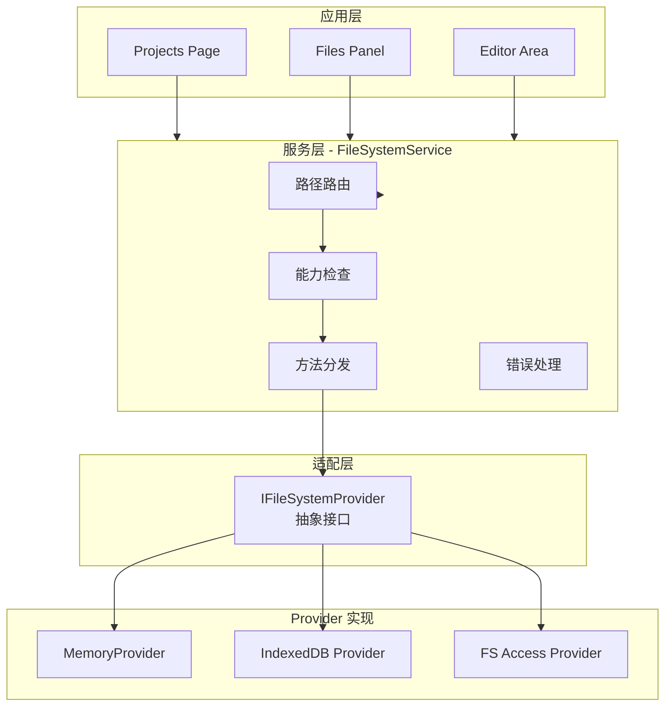
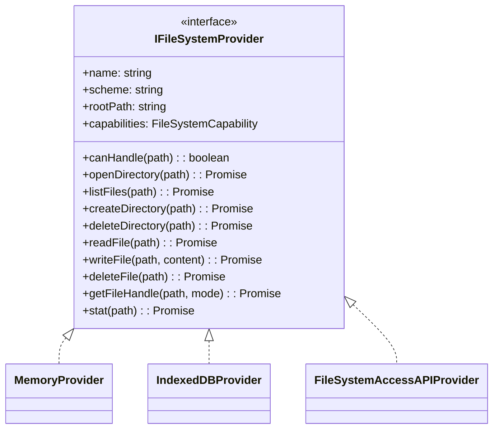
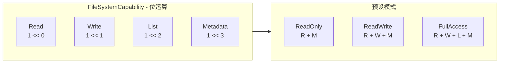
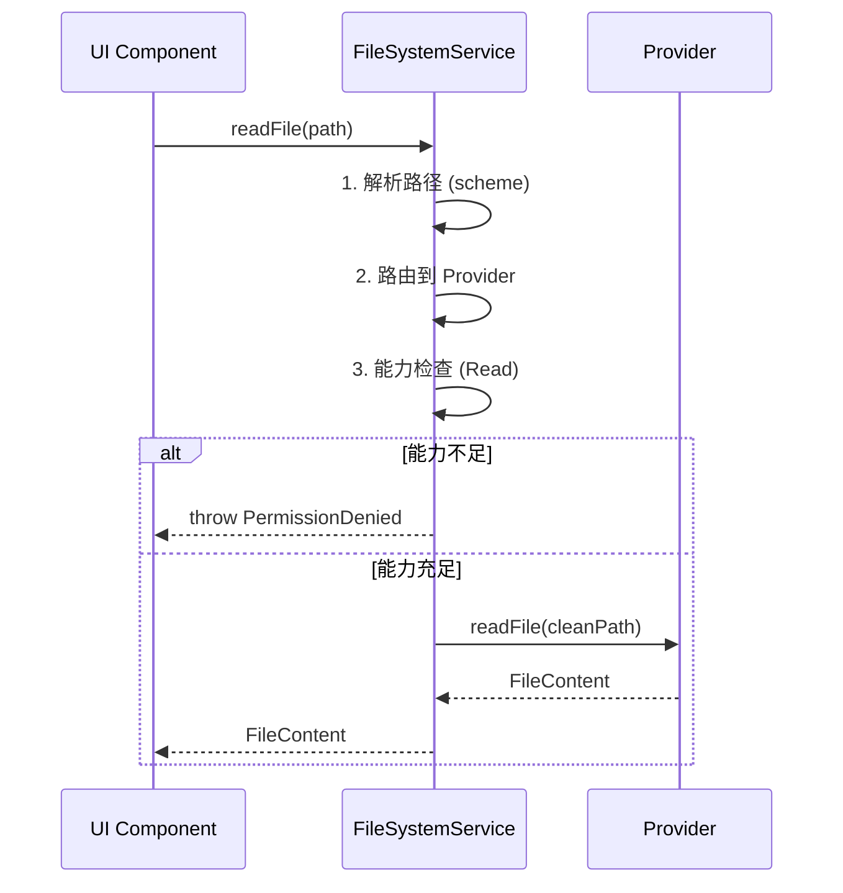
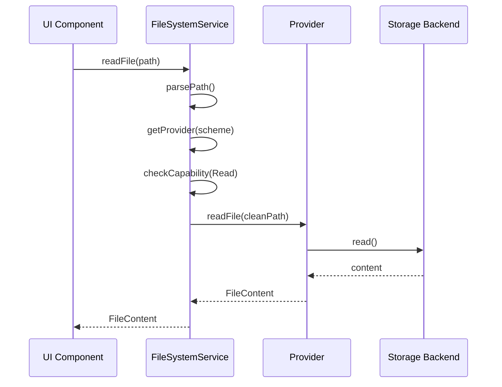
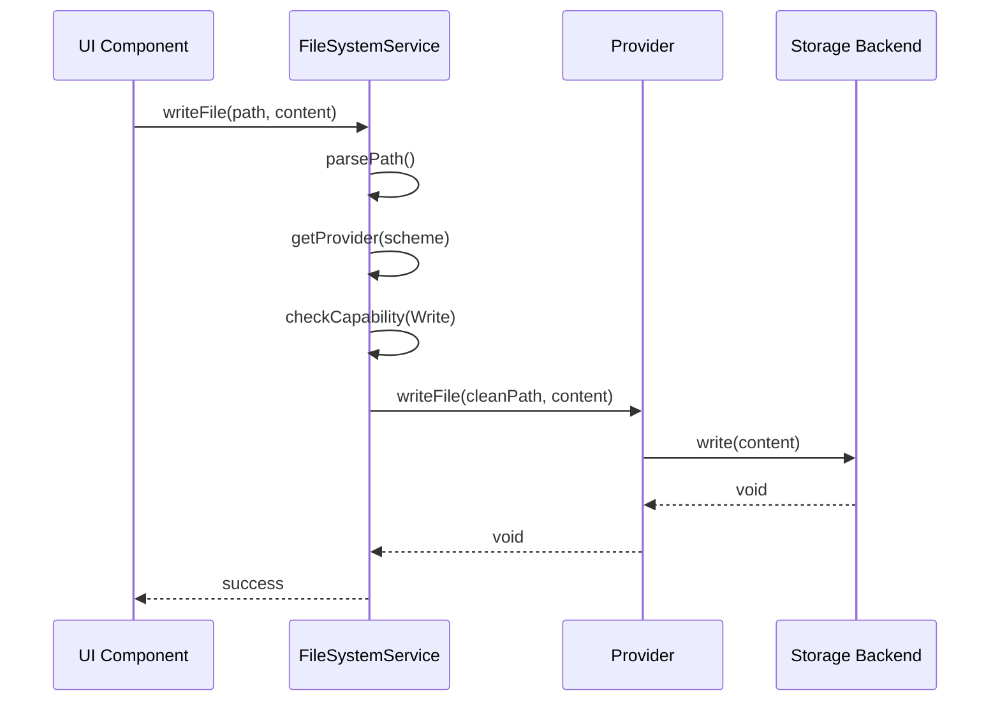

# 文件系统架构设计

## 1. 概述

文件系统位于前端系统的**平台层**，采用 Provider 模式设计：

- **应用层**: UI 组件（Projects Page, Files Panel, Editor Area）
- **平台层**: FileSystemService + IFileSystemProvider 接口 + 多个 Provider 实现
- **基础设施层**: Lifecycle（Disposable 模式）、Event、工具函数

**代码目录**: `apps/web/src/platform/file-system/`

详细的前端分层设计请参考 [前端系统架构](./frontend-architecture.md)。

---

## 2. 整体架构

### 2.1 架构图



### 2.2 代码目录结构

```
apps/web/src/platform/file-system/
├── index.ts           # 模块入口，统一导出
├── types.ts           # 类型定义
├── errors.ts          # 错误定义
├── provider/          # Provider 实现
├── service/           # 服务主逻辑
└── utils/             # 工具函数
```

---

## 3. 核心设计

### 3.1 Provider 模式

每个存储后端实现统一的 `IFileSystemProvider` 接口：



### 3.2 协议路由

路径格式：`{scheme}://{path}`

| 协议前缀 | Provider | 说明 |
|----------|----------|------|
| `memory://` | MemoryProvider | 内存存储，用于测试 |
| `idb://` | IndexedDBProvider | 浏览器 IndexedDB 持久化 |
| `file://` | FileSystemAccessAPIProvider | 浏览器原生文件访问 |

示例：
- `memory://docs/readme.md` → 路由到 MemoryProvider
- `idb://projects/my-project/files/test.md` → 路由到 IndexedDBProvider
- `file:///Users/project/src/index.ts` → 路由到 FileSystemAccessAPIProvider

---

## 4. 能力模型

### 4.1 能力枚举



| 能力 | 值 | 说明 |
|------|-----|------|
| None | `0` | 无能力 |
| Read | `1 << 0` | 读取文件内容 |
| Write | `1 << 1` | 写入/创建/删除文件 |
| List | `1 << 2` | 列出目录内容 |
| Metadata | `1 << 3` | 读取文件元信息 |

### 4.2 能力检查流程



---

## 5. 模块交互流程

### 5.1 文件读取流程



### 5.2 文件写入流程



---

## 6. 错误处理

### 6.1 错误码

| 错误码 | 说明 |
|--------|------|
| ProviderNotFound | 未找到对应 scheme 的 Provider |
| PermissionDenied | Provider 不具备所需能力 |
| FileNotFound | 文件不存在 |
| DirectoryNotFound | 目录不存在 |
| FileAlreadyExists | 文件已存在 |
| InvalidPath | 路径无效 |
| ReadFailed | 读取失败 |
| WriteFailed | 写入失败 |
| UserDeniedPermission | 用户拒绝授权 |

### 6.2 错误类

```typescript
class FileSystemError extends Error {
  code: FileSystemErrorCode;
  cause?: Error;
}
```

---

## 7. Provider 能力对比

| Provider | Read | Write | List | Metadata | 说明 |
|----------|------|-------|------|----------|------|
| MemoryProvider | ✅ | ✅ | ✅ | ✅ | 内存存储 |
| IndexedDBProvider | ✅ | ✅ | ✅ | ✅ | 持久化存储 |
| FileSystemAccessAPIProvider | ✅ | ✅ | ✅ | ✅ | 原生文件访问 |

---

## 8. 浏览器兼容性

| Provider | Chrome | Edge | Firefox | Safari |
|----------|--------|------|---------|--------|
| MemoryProvider | ✅ | ✅ | ✅ | ✅ |
| IndexedDBProvider | ✅ | ✅ | ✅ | ✅ |
| FileSystemAccessAPIProvider | ✅ 86+ | ✅ 86+ | ❌ | ❌ |

> 注意：FileSystemAccessAPI 仅在 Chromium 浏览器中可用。Fallback 方案可使用 IndexedDBProvider 存储用户上传的文件。
