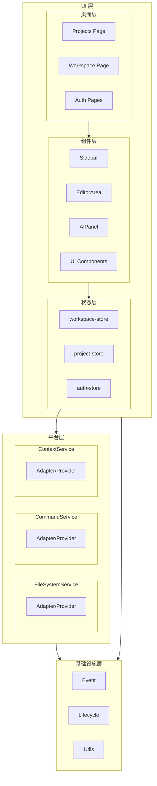

# 前端系统架构设计

## 1. 整体架构

前端系统采用 **三层架构** 设计：

---

## 2. 架构说明

| 层级 | 职责 | 主要模块 |
|------|------|----------|
| **UI 层** | 用户界面展示与交互 | 页面、组件、状态管理 |
| **平台层** | 业务逻辑 + 底层能力适配 | 服务模块（内置 Provider 适配） |
| **基础设施层** | 基础工具与能力 | 事件、生命周期、工具函数 |

---

## 3. UI 层

### 3.1 页面层

| 页面 | 职责 |
|------|------|
| Projects Page | 项目列表展示、创建入口 |
| Workspace Page | 工作空间容器、布局 |
| Auth Pages | 登录、注册、密码找回 |

### 3.2 组件层

| 组件 | 职责 |
|------|------|
| Sidebar | 侧边栏面板容器、标签页管理 |
| EditorArea | 编辑器区域、Tab 管理 |
| AIPanel | AI 对话、智能助手 |
| TopNav | 顶部导航栏 |
| StatusBar | 底部状态栏 |
| UI Components | Button、Input、Card 等基础组件 |

### 3.3 状态层

| Store | 职责 |
|-------|------|
| workspace-store | 工作空间状态（面板折叠、标签页配置） |
| project-store | 项目状态（当前项目、打开的文件） |
| auth-store | 认证状态（用户信息、token） |

---

## 4. 平台层

平台层由多个服务模块组成，每个服务模块内部包含自己的 Provider/Adapter 实现，用于适配不同的底层基础设施。

### 4.1 服务模块

| 服务 | 职责 |
|------|------|
| FileSystemService | 统一文件操作 API，内置多种 Provider 适配不同存储后端 |
| CommandService | 命令处理、快捷键绑定 |
| ContextService | 右键菜单、上下文操作 |

每个服务模块内部的 Provider/Adapter 负责适配不同的底层实现，例如：
- **FileSystemService** 可以包含：MemoryProvider、IndexedDBProvider、FileSystemAccessProvider 等

---

## 5. 基础设施层

对应代码目录：`base/`

| 模块 | 职责 |
|------|------|
| Event | 事件发射器、事件监听 |
| Lifecycle | 生命周期管理 |
| Utils | 通用工具函数 |

---

## 6. 层间通信规则

1. **单向数据流**: UI 层 → 平台层 → 基础设施层
2. **状态更新**: 平台层触发事件 → UI 状态层更新 → 组件层响应式渲染
3. **跨层调用**: 允许跨层调用，但不可反向依赖
