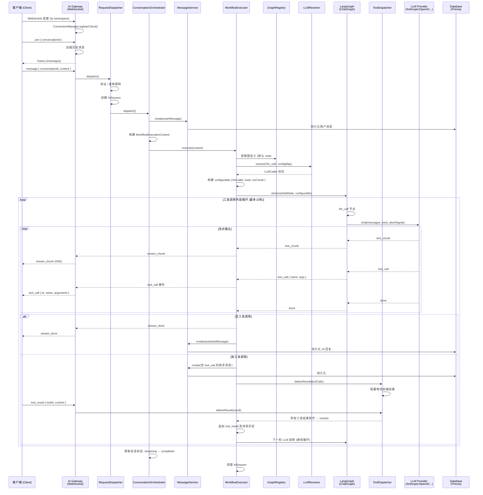

# AI 对话流程架构图

## 流程说明

### 1. 连接阶段
- 客户端通过 WebSocket 连接到 `ai` 命名空间
- 发送 `join` 事件加入对话，服务端加载历史消息

### 2. 消息分发
- `AI Gateway` → `RequestDispatcher` (验证 + 限流 + 会话管理) → `ConversationOrchestrator`

### 3. 工作流执行
- `WorkflowExecutor` 获取图定义，解析 LLM Provider，构建 configurable 上下文
- LangGraph `ChatGraph` 执行: `__start__` → `llm_call` → 条件分支 → `tools` → `llm_call` (循环) → `__end__`

### 4. 工具调用循环
- LLM 返回工具调用 → 推送前端 → 前端执行 → 返回结果 → 追加历史 → 继续下一轮 LLM 调用
- 最多 10 轮工具调用，超时 30 秒

### 5. 三层状态管理
| 层次 | 管理者 | 状态 |
|------|--------|------|
| 会话态 | AISession | pending → streaming → waiting_tool → completed |
| 持久态 | Conversation/Message | active → archived → deleted |
| 工作流态 | LangGraph State | messages / hasToolCalls / isDone |
