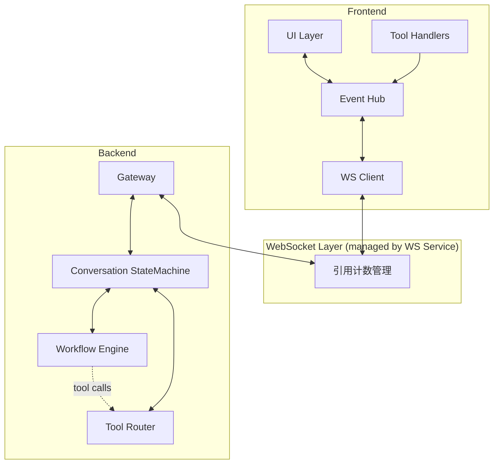
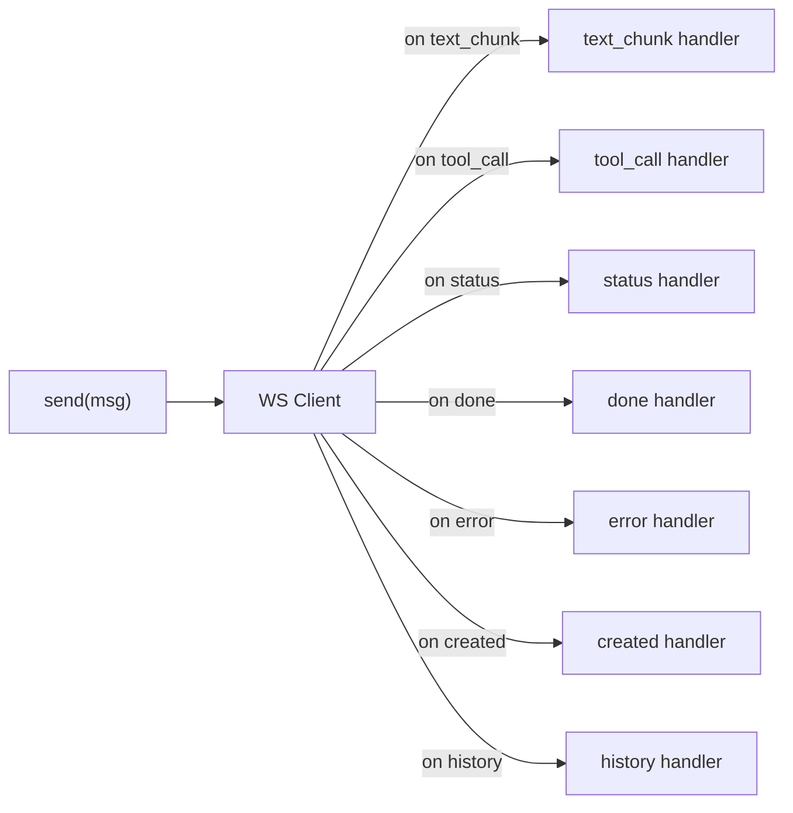
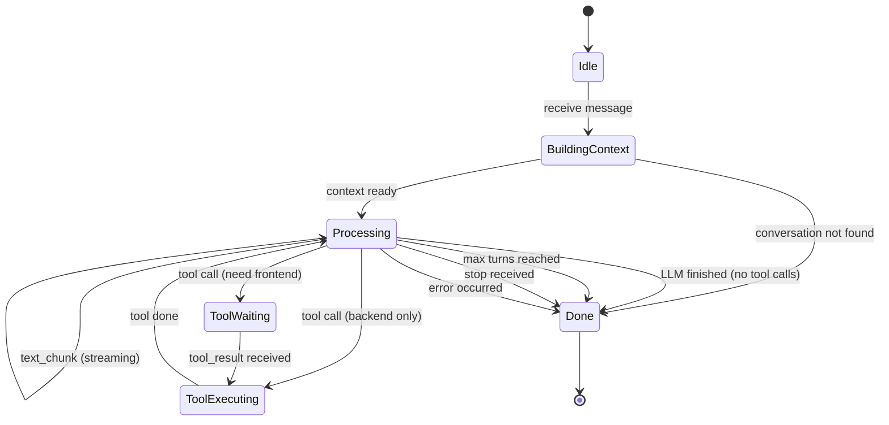
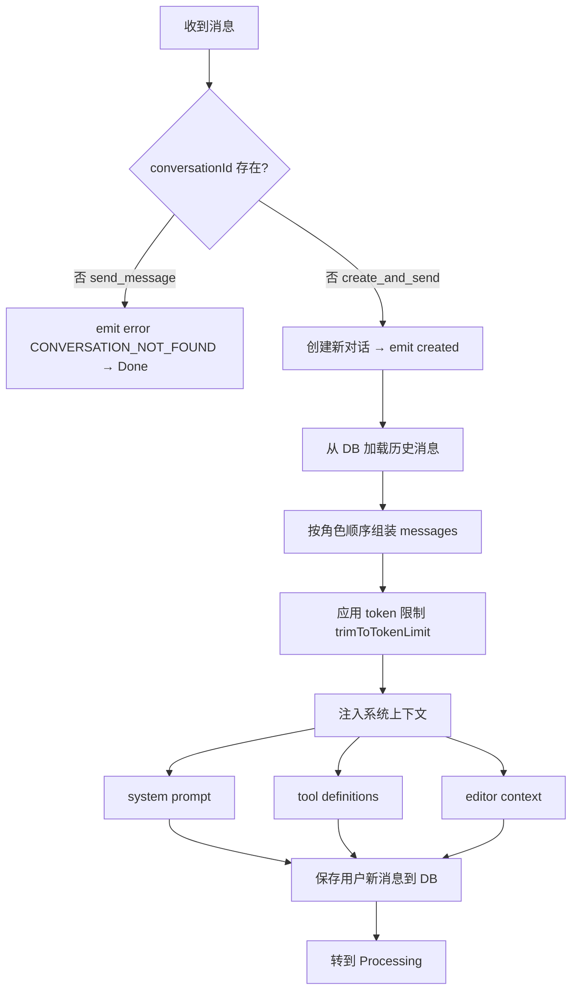
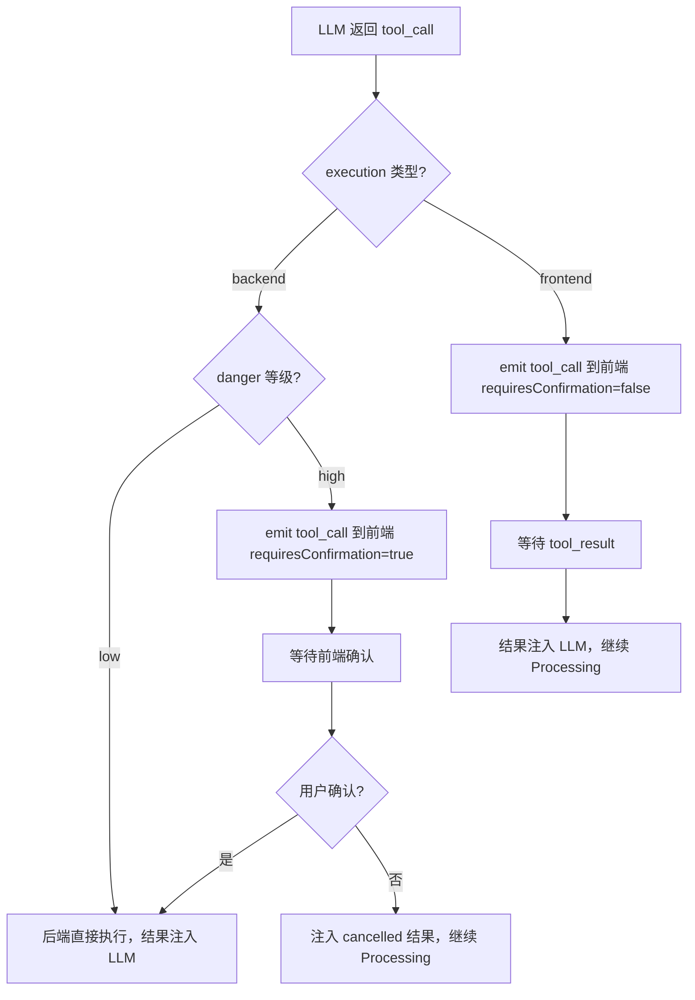
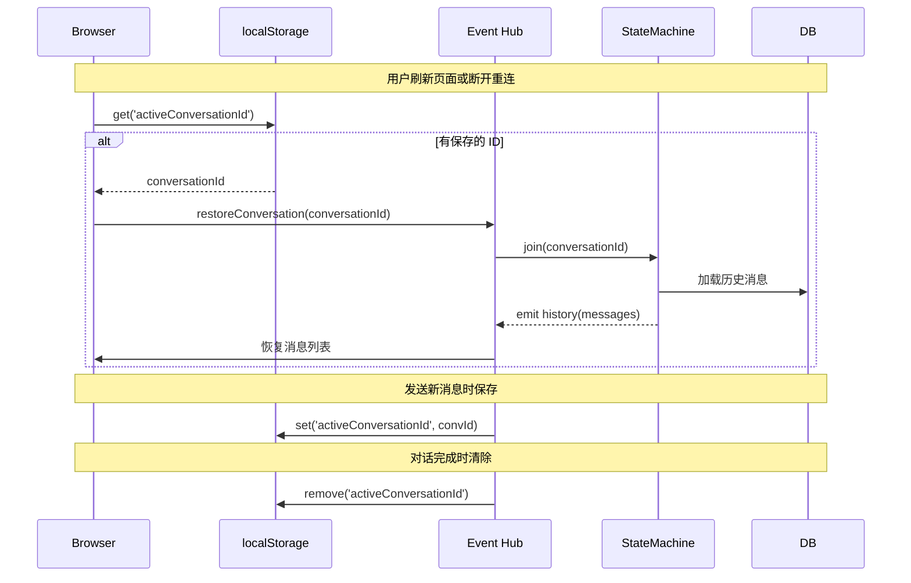

# AI 对话流程重新设计

**日期**: 2026-05-12
**状态**: Draft
**作者**: AI Assistant + User

## 1. 概述

重新设计 AI 对话的前后端交互流程，采用**状态机驱动的双层架构**，将连接层（WebSocket 管理）与业务层（对话逻辑）解耦。前端只关心消息的发送和事件的分发处理，不关心 WebSocket 连接的建立和释放。

### 设计目标

- 前端通过统一接口发送消息、接收事件，不处理 WS 连接生命周期
- 服务端使用状态机管理对话生命周期，工具调用循环内聚在状态机内部
- 所有事件功能单一，避免耦合
- 工具按危险等级分类，支持自动执行和用户确认两种模式
- 支持断线恢复：恢复对话上下文，不自动恢复生成

## 2. 整体架构



**核心分层**：

| 层 | 职责 | 前端需要关心吗 |
|----|------|---------------|
| 连接层 | WS 连接的建立/复用/断开，引用计数 | 否 |
| 前端 Event Hub | 消息发送、事件分发、工具执行 | 是 |
| 后端 Gateway | WS 事件接收/发送 | 否 |
| Conversation StateMachine | 对话生命周期管理 | 否 |
| Workflow Engine | LLM 调用、流式输出 | 否 |
| Tool Router | 工具路由（自动/前端/确认） | 否 |

## 3. 前端设计

### 3.1 事件协议

#### 前端 → 后端

| 事件名 | 触发时机 | 数据 |
|--------|---------|------|
| `create_and_send` | 新建对话并发送首条消息 | `{ content, context?: EditorContext }` |
| `send_message` | 已有对话发送消息 | `{ conversationId: string, content: string, context?: EditorContext }` |
| `tool_result` | 前端执行工具完成 | `{ conversationId: string, toolCallId: string, result: any }` |
| `stop` | 用户中止生成 | `{ conversationId: string }` |
| `join` | 恢复对话/切换对话 | `{ conversationId: string }` |

#### 后端 → 前端

| 事件名 | 触发时机 | 数据 |
|--------|---------|------|
| `created` | 对话创建成功 | `{ conversationId: string }` |
| `history` | 加入对话后返回历史消息 | `{ conversationId: string, messages: Message[] }` |
| `text_chunk` | LLM 流式文字输出 | `{ conversationId: string, content: string }` |
| `tool_call` | 需要前端执行的工具调用 | `{ conversationId: string, toolCallId: string, toolName: string, input: any, requiresConfirmation: boolean }` |
| `status` | 状态提示（不影响内容） | `{ conversationId: string, status: string, message?: string }` |
| `done` | 对话结束 | `{ conversationId: string, finishReason: string, error?: string }` |
| `error` | 错误 | `{ conversationId: string, code: string, message: string }` |

### 3.2 Event Hub 设计



Event Hub 职责：
1. 维护 `Map<conversationId, ConversationState>`，追踪每个对话的状态
2. 根据事件 `type` 分发到已注册的处理器
3. 处理工具调用的执行和结果回传
4. 提供 `send()` 方法统一发送消息
5. 管理 localStorage 中的 activeConversationId

### 3.3 前端使用方式（伪代码）

```typescript
const harness = new AIHarness();

// 发送消息（自动判断新建或复用）
const convId = await harness.sendMessage({
  conversationId: existingConvId,  // null 时自动创建
  content: '帮我写一段代码'
});

// 注册事件处理器
harness.on('text_chunk', (convId, chunk) => {
  appendToMessage(convId, chunk);
});

harness.on('status', (convId, status) => {
  updateLoadingIndicator(convId, status);
});

harness.on('tool_call', async (convId, toolCall) => {
  if (toolCall.requiresConfirmation) {
    const confirmed = await showConfirmation(toolCall);
    if (!confirmed) return harness.sendToolResult(convId, toolCall.toolCallId, { cancelled: true });
  }
  const result = await executeTool(toolCall.toolName, toolCall.input);
  harness.sendToolResult(convId, toolCall.toolCallId, result);
});

harness.on('done', (convId, result) => {
  markConversationDone(convId, result);
});

// 对话恢复
const savedId = localStorage.getItem('activeConversationId');
if (savedId) {
  harness.restoreConversation(savedId);
}
```

### 3.4 UI 状态控制

- 收到第一个 `text_chunk` 或 `status` 事件时 → **disable 发送按钮**
- 收到 `done` 或 `error` 事件时 → **enable 发送按钮**
- disabled 状态下点击发送 → 忽略或显示 toast "正在生成中"

### 3.5 localStorage 策略

```typescript
// 发送消息时保存
localStorage.setItem('activeConversationId', conversationId);

// 对话完成时清除
localStorage.removeItem('activeConversationId');
```

## 4. 后端设计

### 4.1 Conversation StateMachine



### 4.2 状态职责

| 状态 | 做什么 | 前端看到什么 |
|------|--------|-------------|
| `Idle` | 空闲，等待消息 | 无 |
| `BuildingContext` | 加载历史消息 + 系统上下文 | 可 emit `status('thinking')` |
| `Processing` | 调用 LLM，流式输出到前端 | 文字逐步显示 |
| `ToolWaiting` | 等待前端返回工具结果 | 显示工具调用 UI |
| `ToolExecuting` | 后端直接执行工具 | 可 emit `status('tool_executing')` |
| `Done` | 保存消息，emit done | 消息标记为完成 |

### 4.3 Context 构建流程



### 4.4 Tool Router 路由逻辑



工具分类规则：

| execution | danger | 行为 |
|-----------|--------|------|
| backend | low | 后端直接执行（如网页搜索） |
| backend | high | 转发前端，用户确认后后端执行 |
| frontend | - | 转发前端，前端直接执行 |

### 4.5 结束条件

| 条件 | finishReason | 说明 |
|------|-------------|------|
| LLM 返回纯文本 | `complete` | 正常完成 |
| 达到最大工具调用轮数 | `max_turns` | 超时完成 |
| 用户发送 stop | `stopped` | 中止完成 |
| 发生错误 | `error` | 错误完成 |

## 5. 错误处理

### 5.1 错误类型与处理

| 错误类型 | 服务端行为 | 前端行为 |
|---------|-----------|---------|
| `CONVERSATION_NOT_FOUND` | emit error → Done | 显示错误，不自动重试 |
| `LLM_UNAVAILABLE` | emit error → Done | 显示错误，允许重试 |
| `LLM_TIMEOUT` | abort → emit error → Done | 显示超时，允许重试 |
| `TOOL_TIMEOUT` | 注入超时结果 → 继续或 Done | 显示工具超时 |
| `TOOL_EXECUTION_ERROR` | 注入错误结果 → 继续 | 显示工具失败 |
| `CONVERSATION_BUSY` | emit error → 拒绝 | 显示"正在生成中" |

### 5.2 边界情况

| 场景 | 处理方式 |
|------|---------|
| 用户快速连续发送 | 同一对话 Processing 中收到新消息 → 拒绝，emit `CONVERSATION_BUSY` |
| 工具调用时关闭页面 | 状态机继续执行，超时后自动 Done |
| 流式输出中断 | emit done('interrupted') + 已输出内容保留 |
| WS 重连 | WS Service 自动处理，前端恢复对话上下文（见 Section 6） |

## 6. 对话恢复设计

### 6.1 恢复流程



### 6.2 恢复策略

- 仅恢复对话上下文（conversationId + 历史消息），不自动恢复生成
- 用户需要手动重新发送来继续对话
- 前端通过 localStorage 保存最后活跃的 conversationId
- 页面初始化时自动恢复该对话

## 7. 与现有架构的关系

### 7.1 保留的部分

| 组件 | 状态 | 说明 |
|------|------|------|
| LangGraph ChatGraph | 保留 | 作为 Workflow Engine 的图定义 |
| LLM Provider 抽象 | 保留 | 多 LLM 支持 |
| Message Service | 保留 | 消息持久化 |
| Conversation Service | 保留 | 对话 CRUD |
| Tool Registry | 需合并 | 目前有两个重复的 registry |

### 7.2 需要重构的部分

| 组件 | 问题 | 改进 |
|------|------|------|
| Workflow Executor | 手动工具循环在 graph 外部 | 移入状态机内部管理 |
| Tool Registry + Dispatcher | 两个独立 registry | 合并为一个 |
| Session Manager | abortByClientId 前缀匹配 bug | 精确匹配 |
| WS Gateway | 双向 message 事件名冲突 | 使用区分的事件名 |
| buildLLMHistory | 丢失 assistant tool_call block | 修复重建逻辑 |

## 8. 关键决策记录

| 决策 | 选择 | 理由 |
|------|------|------|
| 会话不存在时服务端行为 | 防御性报错 | 前端保证对话存在性，服务端只需防御 |
| WS 连接生命周期 | WS Service 自动管理 | 前端不关心连接细节 |
| 事件区分方式 | 不同事件名 | 前端可清晰路由到不同处理器 |
| 工具循环驱动方 | 后端状态机 | 前端只需响应式处理 |
| 工具调用确认 | 按危险等级分类 | 平衡安全性和用户体验 |
| 对话恢复策略 | 仅恢复上下文 | 简单可控，不自动恢复生成 |
| Processing 状态 UI | disable 发送按钮 | 防止并发请求 |
