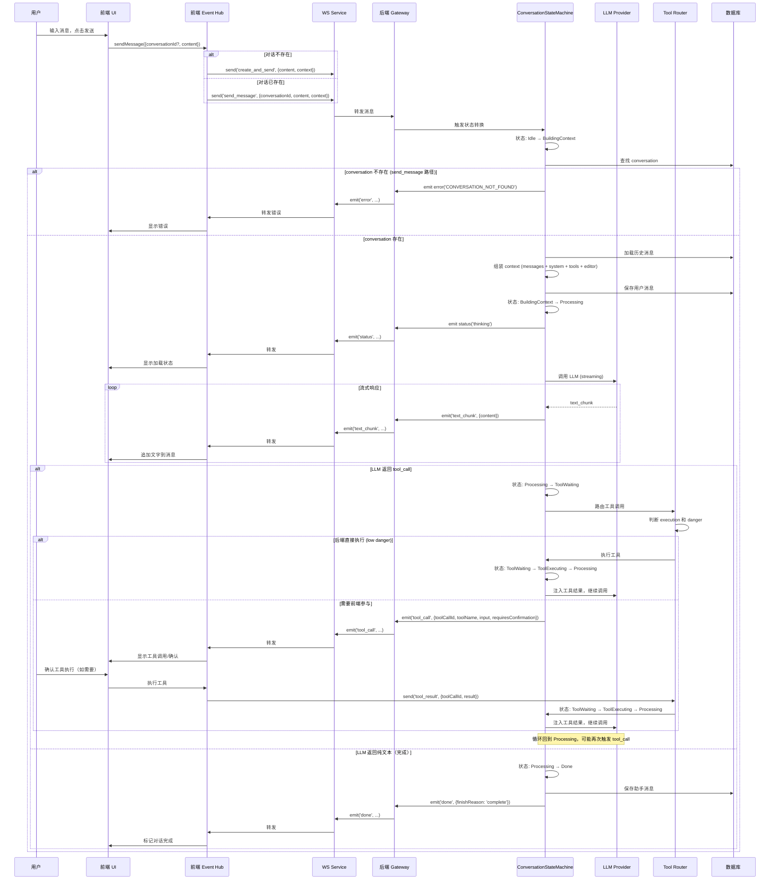
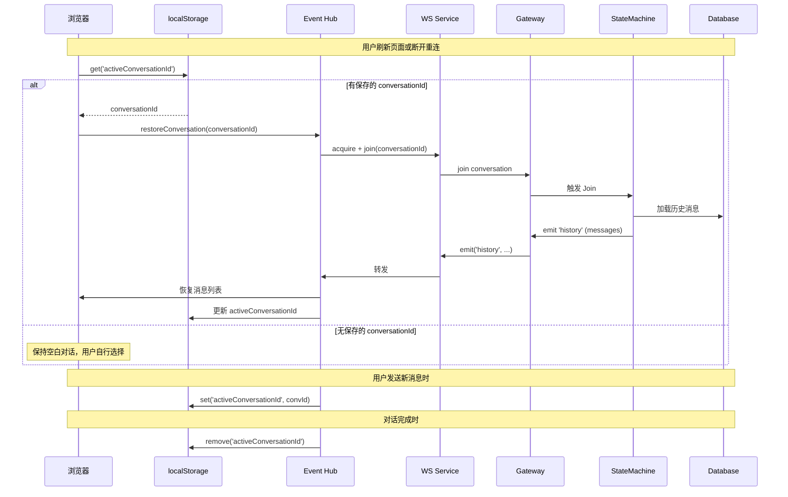

对话流程概览

```mermaid
sequenceDiagram
    participant U as 用户
    participant UI as 前端 UI
    participant EH as 前端 Event Hub
    participant WS as WS Service
    participant GW as 后端 Gateway
    participant SM as ConversationStateMachine
    participant LLM as LLM Provider
    participant TR as Tool Router
    participant DB as 数据库

    U->>UI: 输入消息，点击发送
    UI->>EH: sendMessage({conversationId?, content})
    
    alt 对话不存在
        EH->>WS: send('create_and_send', {content, context})
    else 对话已存在
        EH->>WS: send('send_message', {conversationId, content, context})
    end
    
    WS->>GW: 转发消息
    GW->>SM: 触发状态转换
    
    SM->>SM: 状态: Idle → BuildingContext
    SM->>DB: 查找 conversation
    alt conversation 不存在 (send_message 路径)
        SM->>GW: emit error('CONVERSATION_NOT_FOUND')
        GW->>WS: emit('error', ...)
        WS->>EH: 转发错误
        EH->>UI: 显示错误
    else conversation 存在
        SM->>DB: 加载历史消息
        SM->>SM: 组装 context (messages + system + tools + editor)
        SM->>DB: 保存用户消息
        
        SM->>SM: 状态: BuildingContext → Processing
        SM->>GW: emit status('thinking')
        GW->>WS: emit('status', ...)
        WS->>EH: 转发
        EH->>UI: 显示加载状态
        
        SM->>LLM: 调用 LLM (streaming)
        
        loop 流式响应
            LLM-->>SM: text_chunk
            SM->>GW: emit('text_chunk', {content})
            GW->>WS: emit('text_chunk', ...)
            WS->>EH: 转发
            EH->>UI: 追加文字到消息
        end
        
        alt LLM 返回 tool_call
            SM->>SM: 状态: Processing → ToolWaiting
            SM->>TR: 路由工具调用
            
            TR->>TR: 判断 execution 和 danger
            
            alt 后端直接执行 (low danger)
                TR->>SM: 执行工具
                SM->>SM: 状态: ToolWaiting → ToolExecuting → Processing
                SM->>LLM: 注入工具结果，继续调用
            else 需要前端参与
                SM->>GW: emit('tool_call', {toolCallId, toolName, input, requiresConfirmation})
                GW->>WS: emit('tool_call', ...)
                WS->>EH: 转发
                EH->>UI: 显示工具调用/确认
                
                U->>UI: 确认工具执行（如需要）
                UI->>EH: 执行工具
                EH->>TR: send('tool_result', {toolCallId, result})
                TR->>SM: 状态: ToolWaiting → ToolExecuting → Processing
                SM->>LLM: 注入工具结果，继续调用
            end
            
            Note over SM,LLM: 循环回到 Processing，可能再次触发 tool_call
        else LLM 返回纯文本（完成）
            SM->>SM: 状态: Processing → Done
            SM->>DB: 保存助手消息
            SM->>GW: emit('done', {finishReason: 'complete'})
            GW->>WS: emit('done', ...)
            WS->>EH: 转发
            EH->>UI: 标记对话完成
        end
    end
```

恢复对话流程

```mermaid
sequenceDiagram
    participant Browser as 浏览器
    participant LS as localStorage
    participant EH as Event Hub
    participant WS as WS Service
    participant GW as Gateway
    participant SM as StateMachine
    participant DB as Database

    Note over Browser,DB: 用户刷新页面或断开重连
    Browser->>LS: get('activeConversationId')
    alt 有保存的 conversationId
        LS-->>Browser: conversationId
        Browser->>EH: restoreConversation(conversationId)
        EH->>WS: acquire + join(conversationId)
        WS->>GW: join conversation
        GW->>SM: 触发 Join
        SM->>DB: 加载历史消息
        SM->>GW: emit 'history' (messages)
        GW->>WS: emit('history', ...)
        WS->>EH: 转发
        EH->>Browser: 恢复消息列表
        EH->>LS: 更新 activeConversationId
    else 无保存的 conversationId
        Note over Browser: 保持空白对话，用户自行选择
    end
    
    Note over Browser,DB: 用户发送新消息时
    EH->>LS: set('activeConversationId', convId)
    
    Note over Browser,DB: 对话完成时
    EH->>LS: remove('activeConversationId')

```