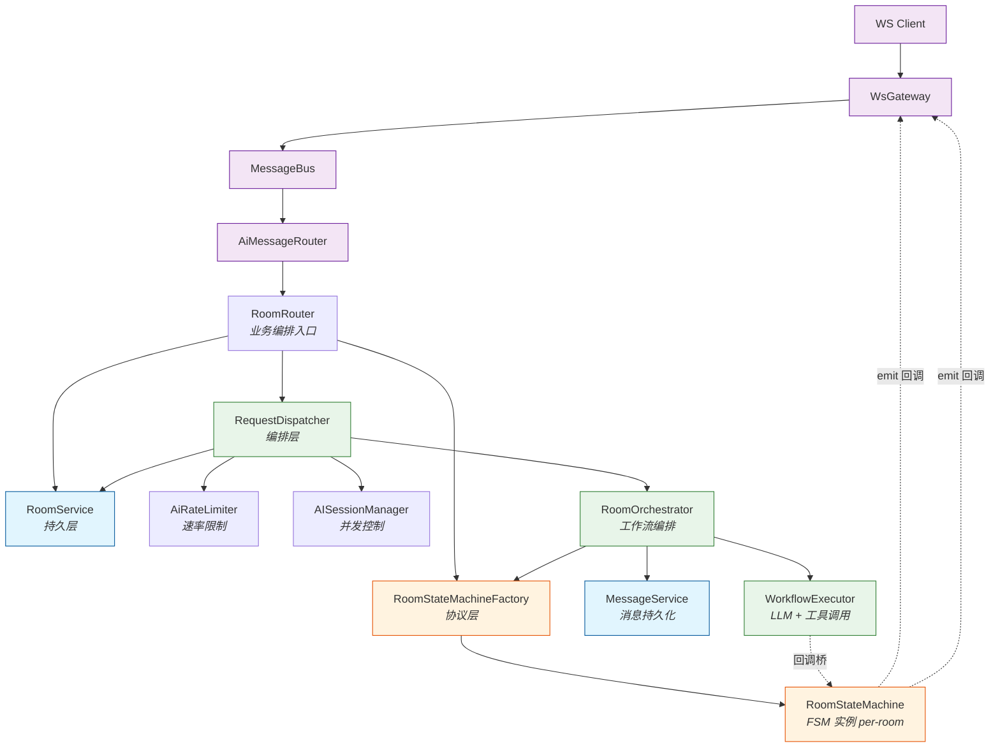
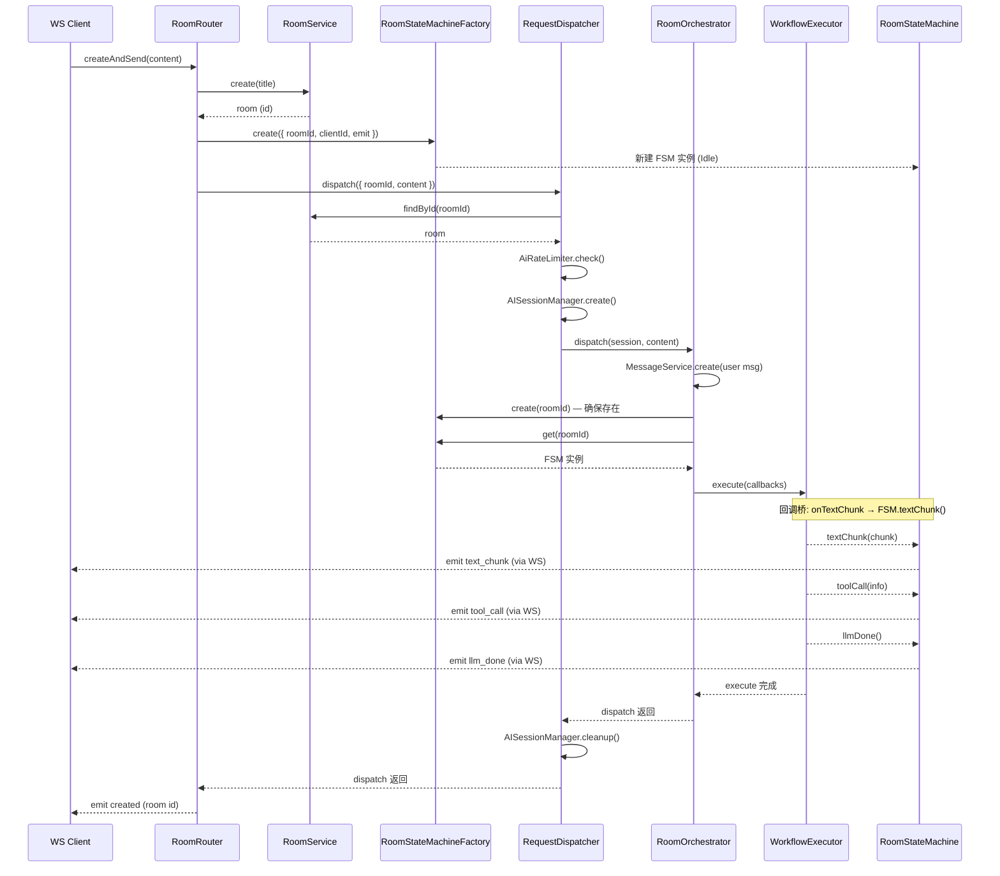

# AI 网关模块关系图

> 描述 `RoomService`、`RoomStateMachineFactory`、`RequestDispatcher` 三个模块的职责边界和交互关系。
> 生成时间：2026-05-18

## 整体架构

## 模块职责

| 模块 | 层级 | 职责 |
|------|------|------|
| **RoomService** | 持久层 | Room 的 CRUD、元数据管理、统计查询（通过 Prisma） |
| **RoomStateMachineFactory** | 协议层 | 管理 per-room 的 FSM 实例生命周期，按 `byRoomId` 和 `byClientId` 索引 |
| **RequestDispatcher** | 编排层 | 串联：查找/创建 Room → 速率检查 → 创建 AISession → 调用 Orchestrator |

## 消息流时序

## 关键设计点

### 1. `byRoomId` 索引

`RoomStateMachineFactory` 使用 `Map<string, RoomStateMachine>` 按 `roomId` 索引 FSM 实例。核心方法：

- `create()` — 创建新 FSM，若同 roomId 有活跃实例则抛出异常
- `get(roomId)` — 通过 `byRoomId.get()` 取回已存在的实例
- `destroy(roomId)` — 清理 FSM 并 abort 其 abortController

### 2. `byClientId` 反向索引

使用 `Map<string, Set<string>>` 维护 clientId → roomId 集合的反向映射，用于 `onClientDisconnect` 时批量清理该客户端的所有 FSM。

### 3. 双层状态机

| 状态机 | 状态 | 职责 |
|--------|------|------|
| **AISessionManager** | pending → streaming → waiting_tool → completed/aborted/error | 会话级并发控制和生命周期 |
| **RoomStateMachine** | Idle → BuildingContext → Processing → ToolWaiting → ToolExecuting → Done | 协议级状态管理和 WS 事件发射 |

两者跟踪相似的对话生命周期，但服务于不同抽象层。

### 4. 防御性 Room 创建

`RequestDispatcher.dispatch()` 在 `findById` 失败时自动创建 room。这是对 "消息先于 join 到达" 竞态的保护，但意味着 RoomRouter 和 RequestDispatcher 都可以创建 room，边界需要文档化。

## 已知关注点

1. **双重 `smFactory.create()` 调用**：RoomRouter 创建 FSM 后，RoomOrchestrator 再次调用 `create()`。若第一次的 FSM 未到达 `Done` 状态，第二次会抛 `already active` 异常。
2. **速率限制是内存级别**：进程重启后重置，多实例部署时不共享。
3. **所有服务在同一个 `AiModule` 中注册**：紧耦合，单元测试时需要 mock 整个链路。
