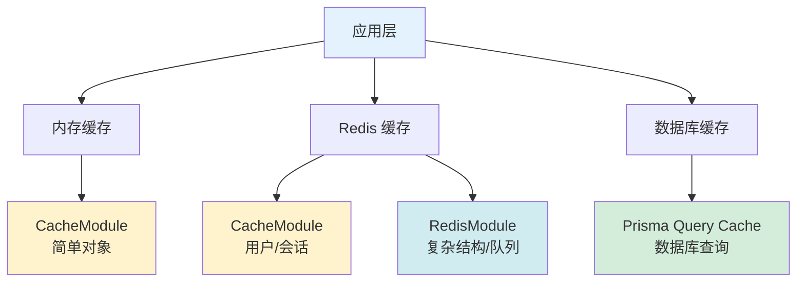
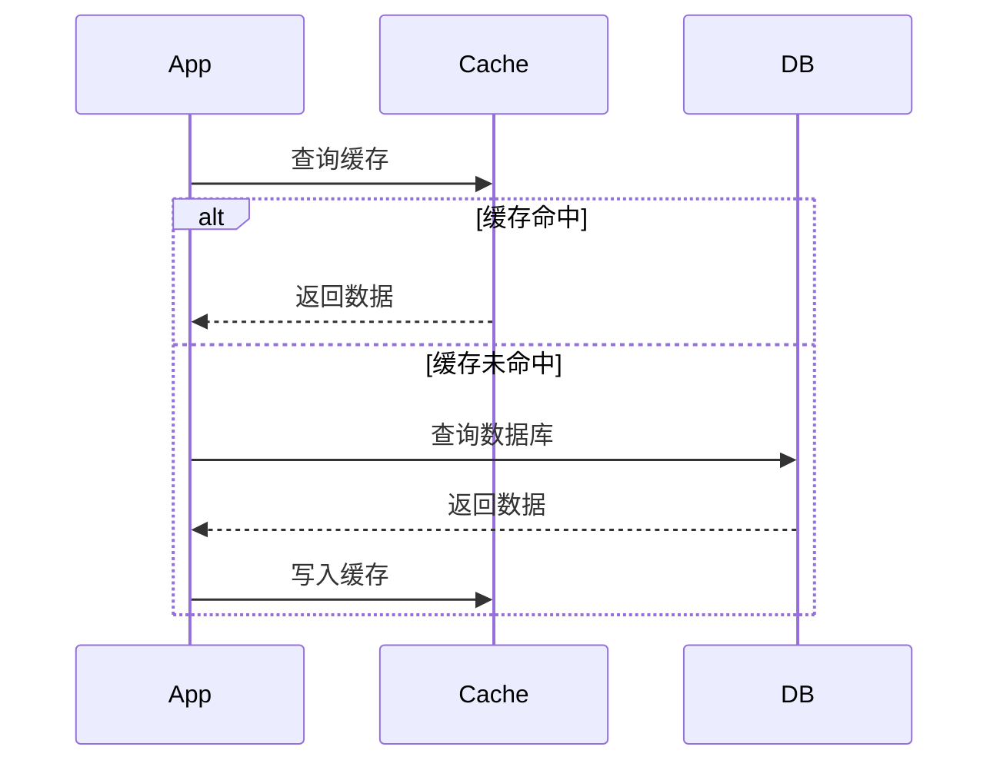
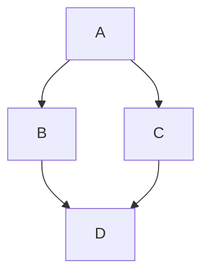
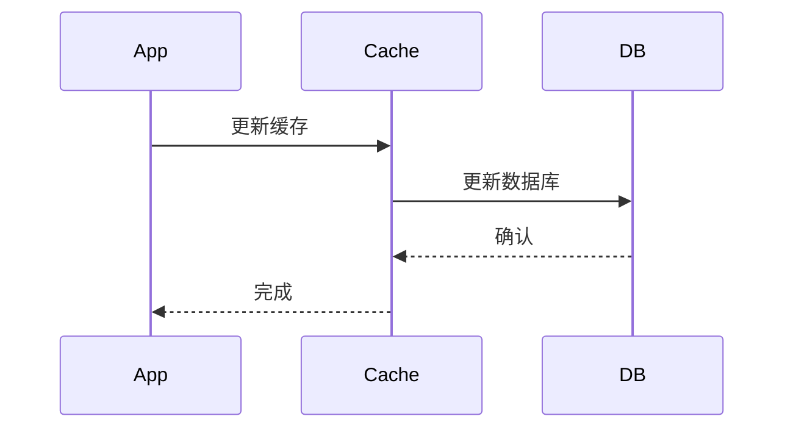
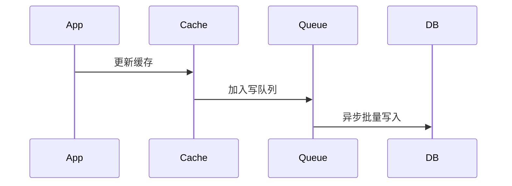
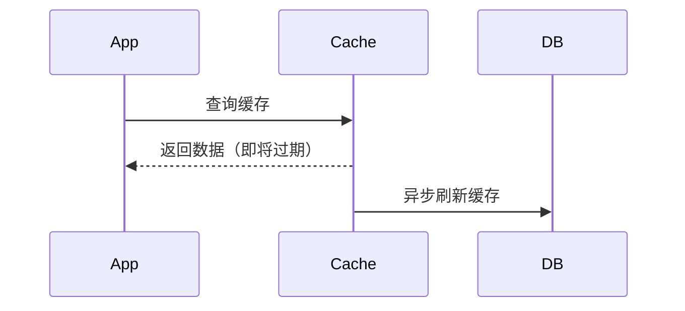

# 缓存系统设计规范

## 📋 概述

本文档定义 My-KM 个人知识管理系统的完整缓存架构设计，包括多级缓存策略、缓存模块设计、缓存使用场景和最佳实践。

**文档版本**: 1.0.0
**创建日期**: 2026-01-13
**更新日期**: 2026-01-13
**状态**: 📝 规划中

---

## 🎯 设计目标

### 核心目标

1. **性能优化**: 减少数据库查询，提升响应速度
2. **可扩展性**: 支持多种缓存策略和数据结构
3. **灵活性**: 根据场景选择合适的缓存方案
4. **一致性**: 保证缓存与数据库的数据一致性
5. **可维护性**: 统一的缓存接口和管理方式
6. **可观测性**: 缓存命中率、性能监控

### 缓存层次



---

## 🏗️ 缓存架构

### 整体架构

```
┌─────────────────────────────────────────────────────────┐
│                     应用层 (NestJS)                      │
├─────────────────────────────────────────────────────────┤
│                                                         │
│  ┌──────────────────┐  ┌──────────────────┐            │
│  │  CacheModule     │  │  RedisModule     │            │
│  │  (cache-manager) │  │  (ioredis)       │            │
│  ├──────────────────┤  ├──────────────────┤            │
│  │ • 简单 KV 缓存   │  │ • Redis 全功能   │            │
│  │ • TTL 管理       │  │ • 复杂数据结构   │            │
│  │ • 自动序列化     │  │ • Pub/Sub        │            │
│  │ • LRU 淘汰       │  │ • 事务           │            │
│  └────────┬─────────┘  └────────┬─────────┘            │
│           │                     │                       │
│           └──────────┬──────────┘                       │
│                      ▼                                  │
│           ┌─────────────────────┐                      │
│           │   Redis 服务器       │                      │
│           │  • DB 0: CacheModule │                      │
│           │  • DB 1: RedisModule │                      │
│           └─────────────────────┘                      │
└─────────────────────────────────────────────────────────┘
```

### 模块对比

| 特性 | CacheModule | RedisModule | Prisma Query Cache |
|------|-------------|-------------|-------------------|
| **实现方式** | @nestjs/cache-manager | ioredis | Prisma 内置 |
| **抽象层级** | 高级抽象 | 中级抽象 | 查询级缓存 |
| **数据结构** | String (JSON) | 全部 Redis 类型 | 查询结果 |
| **使用难度** | ⭐ 简单 | ⭐⭐⭐ 中等 | ⭐⭐ 简单 |
| **功能范围** | 基本 CRUD | 全功能 | 只读查询 |
| **适用场景** | 简单对象缓存 | 复杂场景 | 只读查询优化 |
| **连接管理** | 自动管理 | 手动管理 | 无连接 |
| **TTL 支持** | ✅ | ✅ | ❌ |
| **自动序列化** | ✅ | ❌ 手动 | ✅ |

---

## 📦 缓存模块详解

### 1. CacheModule（通用缓存模块）

#### 技术栈
- **核心**: @nestjs/cache-manager
- **适配器**: @keyv/redis
- **底层**: ioredis (间接)

#### 特点
- ✅ 零配置即可使用
- ✅ 自动 JSON 序列化/反序列化
- ✅ 统一的缓存接口
- ✅ 支持 TTL 过期时间
- ✅ LRU 淘汰策略
- ✅ 全局可用（@Global 装饰器）

#### 使用场景

1. **用户数据缓存**
   - 用户基本信息
   - 用户邮箱查询
   - 用户配置偏好

2. **会话缓存**
   - Session 存储
   - Token 黑名单

3. **简单查询结果**
   - 配置数据
   - 字典数据
   - 统计数据

#### 使用示例

```typescript
@Injectable()
export class UsersService {
  constructor(
    @Inject(CACHE_MANAGER) private cacheManager: Cache,
    private prisma: PrismaService,
  ) {}

  async findById(id: string): Promise<User> {
    // 1. 尝试从缓存获取
    const cacheKey = `user:${id}`;
    let user = await this.cacheManager.get<User>(cacheKey);

    if (user) {
      return user;
    }

    // 2. 从数据库查询
    user = await this.prisma.user.findUnique({ where: { id } });

    if (!user) {
      throw new NotFoundException('User not found');
    }

    // 3. 写入缓存（5分钟）
    await this.cacheManager.set(cacheKey, user, 300);

    return user;
  }

  async update(id: string, data: UpdateUserDto): Promise<User> {
    // 1. 更新数据库
    const user = await this.prisma.user.update({
      where: { id },
      data,
    });

    // 2. 使缓存失效
    await this.cacheManager.del(`user:${id}`);
    await this.cacheManager.del(`user:email:${user.email}`);

    return user;
  }
}
```

---

### 2. RedisModule（直接访问模块）

#### 技术栈
- **核心**: ioredis
- **连接**: 独立 Redis 连接

#### 特点
- ✅ 完整的 Redis 功能访问
- ✅ 支持所有数据结构
- ✅ Pub/Sub 消息传递
- ✅ 事务支持
- ✅ Lua 脚本执行
- ✅ Pipeline 批处理

#### 模块结构

```
apps/server/src/redis/
├── redis.module.ts              # 模块定义
├── redis.service.ts             # 主服务
├── redis.constants.ts           # 常量
├── redis.interfaces.ts          # 接口
└── redis.health.ts              # 健康检查
```

#### API 分类

**1. String 操作**
```typescript
class RedisService {
  set(key: string, value: string, ttl?: number): Promise<'OK'>
  get<T>(key: string): Promise<T | null>
  mset(keyValues: Record<string, string>): Promise<'OK'>
  mget<T>(keys: string[]): Promise<(T | null)[]>
  incr(key: string): Promise<number>
  decr(key: string): Promise<number>
  expire(key: string, seconds: number): Promise<boolean>
  del(keys: string | string[]): Promise<number>
}
```

**2. Hash 操作**
```typescript
class RedisService {
  hset(key: string, field: string, value: string): Promise<number>
  hget<T>(key: string, field: string): Promise<T | null>
  hgetall<T>(key: string): Promise<T>
  hmset(key: string, data: Record<string, string>): Promise<'OK'>
  hmget<T>(key: string, fields: string[]): Promise<(T | null)[]>
  hdel(key: string, fields: string | string[]): Promise<number>
  hkeys(key: string): Promise<string[]>
  hvals<T>(key: string): Promise<T[]>
  hlen(key: string): Promise<number>
}
```

**3. List 操作**
```typescript
class RedisService {
  lpush(key: string, ...values: string[]): Promise<number>
  rpush(key: string, ...values: string[]): Promise<number>
  lpop<T>(key: string): Promise<T | null>
  rpop<T>(key: string): Promise<T | null>
  lrange<T>(key: string, start: number, stop: number): Promise<T[]>
  llen(key: string): Promise<number>
  blpop<T>(keys: string[], timeout: number): Promise<[string, T] | null>
  brpop<T>(keys: string[], timeout: number): Promise<[string, T] | null>
}
```

**4. Set 操作**
```typescript
class RedisService {
  sadd(key: string, ...members: string[]): Promise<number>
  srem(key: string, ...members: string[]): Promise<number>
  smembers<T>(key: string): Promise<T[]>
  sismember(key: string, member: string): Promise<boolean>
  scard(key: string): Promise<number>
  sinter(...keys: string[]): Promise<string[]>
  sunion(...keys: string[]): Promise<string[]>
  sdiff(...keys: string[]): Promise<string[]>
}
```

**5. Sorted Set 操作**
```typescript
class RedisService {
  zadd(key: string, score: number, member: string): Promise<number>
  zrange<T>(key: string, start: number, stop: number): Promise<T[]>
  zscore(key: string, member: string): Promise<number | null>
  zrank(key: string, member: string): Promise<number | null>
  zrem(key: string, ...members: string[]): Promise<number>
  zcard(key: string): Promise<number>
}
```

**6. Pub/Sub 操作**
```typescript
class RedisService {
  publish(channel: string, message: string): Promise<number>
  subscribe(channels: string[], callback: Function): Promise<void>
  unsubscribe(channels: string[]): Promise<void>
}
```

**7. 事务操作**
```typescript
class RedisService {
  multi(): RedisTransaction
  exec(transaction: RedisTransaction): Promise<any[]>
  watch(keys: string[]): Promise<'OK'>
  unwatch(): Promise<'OK'>
}
```

**8. Lua 脚本**
```typescript
class RedisService {
  eval(script: string, numKeys: number, ...args: string[]): Promise<any>
  evalsha(sha: string, numKeys: number, ...args: string[]): Promise<any>
  scriptLoad(script: string): Promise<string>
}
```

#### 使用场景

1. **复杂对象存储**
   - 使用 Hash 存储用户会话
   - 使用 List 实现消息队列
   - 使用 Set 存储标签关系

2. **实时功能**
   - Pub/Sub 实时通知
   - 在线用户列表
   - WebSocket 连接管理

3. **计数和限流**
   - API 调用计数
   - 速率限制
   - 投票系统

4. **分布式功能**
   - 分布式锁
   - 分布式计数器
   - 任务调度

#### 使用示例

**1. 会话管理（Hash）**
```typescript
@Injectable()
export class SessionService {
  constructor(private redis: RedisService) {}

  async createSession(session: Session): Promise<void> {
    const key = `session:${session.id}`;

    await this.redis.hmset(key, {
      userId: session.userId,
      createdAt: session.createdAt.toISOString(),
      expiresAt: session.expiresAt.toISOString(),
    });

    await this.redis.expire(key, 7 * 24 * 3600);
  }

  async getSession(id: string): Promise<Session | null> {
    const data = await this.redis.hgetall(`session:${id}`);
    if (!data || Object.keys(data).length === 0) return null;

    return {
      id,
      userId: data.userId,
      createdAt: new Date(data.createdAt),
      expiresAt: new Date(data.expiresAt),
    };
  }
}
```

**2. 任务队列（List）**
```typescript
@Injectable()
export class EmailQueueService {
  constructor(private redis: RedisService) {}

  async enqueue(job: EmailJob): Promise<void> {
    await this.redis.lpush('email:queue', JSON.stringify(job));
  }

  async dequeue(): Promise<EmailJob | null> {
    const result = await this.redis.brpop(['email:queue'], 30);
    if (!result) return null;

    return JSON.parse(result[1]);
  }

  async getQueueLength(): Promise<number> {
    return await this.redis.llen('email:queue');
  }
}
```

**3. 速率限制（String + INCR）**
```typescript
@Injectable()
export class RateLimitService {
  constructor(private redis: RedisService) {}

  async checkLimit(userId: string, limit: number): Promise<boolean> {
    const key = `ratelimit:${userId}:${Date.now()}`;

    const current = await this.redis.incr(key);

    if (current === 1) {
      await this.redis.expire(key, 3600); // 1小时过期
    }

    return current <= limit;
  }
}
```

**4. 实时通知（Pub/Sub）**
```typescript
@Injectable()
export class NotificationService implements OnModuleInit {
  constructor(private redis: RedisService) {}

  async onModuleInit() {
    await this.redis.subscribe(['notifications'], (channel, message) => {
      console.log(`Received on ${channel}:`, message);
      this.handleNotification(JSON.parse(message));
    });
  }

  async sendNotification(notification: Notification): Promise<void> {
    await this.redis.publish('notifications', JSON.stringify(notification));
  }
}
```

**5. 分布式锁（Lua 脚本）**
```typescript
@Injectable()
export class LockService {
  constructor(private redis: RedisService) {}

  async acquireLock(resource: string, owner: string, ttl: number): Promise<boolean> {
    const script = `
      if redis.call("get", KEYS[1]) == false then
        return redis.call("setex", KEYS[1], ARGV[2], ARGV[1])
      else
        return false
      end
    `;

    const result = await this.redis.eval(script, 1, `lock:${resource}`, owner, ttl);
    return result === 'OK';
  }

  async releaseLock(resource: string, owner: string): Promise<boolean> {
    const script = `
      if redis.call("get", KEYS[1]) == ARGV[1] then
        return redis.call("del", KEYS[1])
      else
        return 0
      end
    `;

    const result = await this.redis.eval(script, 1, `lock:${resource}`, owner);
    return result === 1;
  }
}
```

**6. 标签系统（Set）**
```typescript
@Injectable()
export class TagService {
  constructor(private redis: RedisService) {}

  async addTagsToArticle(articleId: string, tags: string[]): Promise<void> {
    const key = `article:${articleId}:tags`;

    for (const tag of tags) {
      await this.redis.sadd(key, tag);

      // 反向索引
      await this.redis.sadd(`tag:${tag}:articles`, articleId);
    }
  }

  async getArticleTags(articleId: string): Promise<string[]> {
    return await this.redis.smembers(`article:${articleId}:tags`);
  }

  async getArticlesByTag(tag: string): Promise<string[]> {
    return await this.redis.smembers(`tag:${tag}:articles`);
  }
}
```

---

### 3. 数据库查询缓存（Prisma）

#### 特点
- ✅ 自动缓存查询结果
- ✅ 无需手动管理
- ✅ 查询级别的缓存
- ⚠️ 只适用于只读查询

#### 配置

```typescript
// prisma/schema.prisma
generator client {
  provider        = "prisma-client-js"
  previewFeatures = ["queryCache"]
}

// 应用配置
const prisma = new PrismaClient({
  log: ['query', 'error', 'warn'],
  queryCache: {
    ttl: 60, // 缓存 60 秒
    size: 1000, // 最多缓存 1000 个查询
  },
});
```

#### 使用场景

- 频繁的只读查询
- 配置数据查询
- 统计数据查询

#### 示例

```typescript
// 自动缓存
const users = await prisma.user.findMany({
  cache: 60, // 缓存 60 秒
});

// 清除缓存
await prisma.user.deleteMany();
await prisma.$queryCache.clear();
```

---

## 🎯 缓存使用策略

### 缓存模式

#### 1. Cache-Aside（旁路缓存）

**流程**:




**实现**:
```typescript
async getUser(id: string): Promise<User> {
  // 1. 查询缓存
  let user = await this.cacheManager.get<User>(`user:${id}`);

  if (user) {
    return user; // 缓存命中
  }

  // 2. 查询数据库
  user = await this.prisma.user.findUnique({ where: { id } });

  // 3. 写入缓存
  await this.cacheManager.set(`user:${id}`, user, 300);

  return user;
}
```

**适用场景**: 读写都较多的场景

---

#### 2. Write-Through（写穿透）

**流程**:


**实现**:
```typescript
async updateUser(id: string, data: UpdateUserDto): Promise<User> {
  // 1. 更新数据库
  const user = await this.prisma.user.update({
    where: { id },
    data,
  });

  // 2. 同步更新缓存
  await this.cacheManager.set(`user:${id}`, user, 300);

  return user;
}
```

**适用场景**: 写入后立即读取的场景

---

#### 3. Write-Behind（写回/异步写）

**流程**:


**实现**:
```typescript
async updateUserAsync(id: string, data: UpdateUserDto): Promise<User> {
  // 1. 立即更新缓存
  await this.cacheManager.set(`user:${id}`, data, 300);

  // 2. 加入写队列（异步持久化）
  await this.redis.lpush('write:queue', JSON.stringify({
    table: 'user',
    id,
    data,
  }));

  return data;
}
```

**适用场景**: 写入性能要求高的场景

---

#### 4. Refresh-Ahead（预刷新）

**流程**:


**实现**:
```typescript
async getUserWithRefresh(id: string): Promise<User> {
  const user = await this.cacheManager.get<User>(`user:${id}`);

  if (user) {
    // 检查剩余 TTL
    const ttl = await this.redis.ttl(`user:${id}`);

    if (ttl < 60) { // 少于 1 分钟，异步刷新
      this.prisma.user.findUnique({ where: { id } })
        .then(fresh => this.cacheManager.set(`user:${id}`, fresh, 300));
    }

    return user;
  }

  // 缓存未命中，同步查询
  return this.getUser(id);
}
```

**适用场景**: 高并发读取场景

---

### 缓存更新策略

| 策略 | 优点 | 缺点 | 适用场景 |
|------|------|------|---------|
| **Cache-Aside** | 简单，易实现 | 首次查询慢 | 大部分场景 |
| **Write-Through** | 数据一致性强 | 写入延迟高 | 强一致性要求 |
| **Write-Behind** | 写入性能高 | 可能丢数据 | 写入频繁 |
| **Refresh-Ahead** | 高命中，低延迟 | 实现复杂 | 高并发读取 |

---

### 缓存失效策略

#### 1. TTL 过期

```typescript
// 设置绝对过期时间
await this.cacheManager.set('key', value, 300); // 5 分钟后过期
```

#### 2. 主动失效

```typescript
// 更新数据时删除缓存
async update(id: string, data: any) {
  await this.prisma.user.update({ where: { id }, data });
  await this.cacheManager.del(`user:${id}`);
}
```

#### 3. 批量失效

```typescript
// 删除匹配模式的所有键
async invalidateUserCache(userId: string) {
  await this.cacheManager.del(`user:${userId}`);
  await this.cacheManager.del(`user:email:*`);
  await this.cacheManager.del(`session:${userId}:*`);
}
```

#### 4. 标签失效

```typescript
// 使用标签关联缓存
async setWithTags(key: string, value: any, tags: string[]) {
  await this.cacheManager.set(key, value);

  for (const tag of tags) {
    await this.redis.sadd(`tag:${tag}`, key);
  }
}

async invalidateByTag(tag: string) {
  const keys = await this.redis.smembers(`tag:${tag}`);

  for (const key of keys) {
    await this.cacheManager.del(key);
  }

  await this.redis.del(`tag:${tag}`);
}
```

---

## 📊 缓存场景设计

### 1. 用户数据缓存

**数据类型**: 用户基本信息、配置、权限

**缓存方案**: CacheModule

**键设计**:
```
user:{id}                    # 用户基本信息
user:email:{email}           # 按邮箱查询
user:permissions:{id}        # 用户权限列表
user:settings:{id}           # 用户配置
```

**TTL 策略**:
- 基本信息: 5 分钟
- 权限数据: 10 分钟
- 配置数据: 30 分钟

**失效策略**:
- 更新时主动失效
- 删除时主动失效
- 权限变更时批量失效

**实现**:
```typescript
@Injectable()
export class UserCacheService {
  constructor(
    @Inject(CACHE_MANAGER) private cacheManager: Cache,
    private prisma: PrismaService,
  ) {}

  async getUser(id: string): Promise<User> {
    const cacheKey = `user:${id}`;
    let user = await this.cacheManager.get<User>(cacheKey);

    if (!user) {
      user = await this.prisma.user.findUnique({ where: { id } });
      if (user) {
        await this.cacheManager.set(cacheKey, user, 300);
      }
    }

    return user;
  }

  async invalidateUser(id: string, email: string): Promise<void> {
    await this.cacheManager.del(`user:${id}`);
    await this.cacheManager.del(`user:email:${email}`);
    await this.cacheManager.del(`user:permissions:${id}`);
    await this.cacheManager.del(`user:settings:${id}`);
  }
}
```

---

### 2. 文章缓存

**数据类型**: 文章内容、统计数据

**缓存方案**: CacheModule

**键设计**:
```
article:{id}                 # 文章内容
article:stats:{id}           # 文章统计
article:views:{id}           # 浏览计数
user:articles:{userId}       # 用户文章列表
tag:articles:{tagId}         # 标签文章列表
```

**TTL 策略**:
- 文章内容: 10 分钟
- 统计数据: 1 分钟
- 文章列表: 5 分钟

**特殊处理**:
- 浏览计数使用 Redis INCR，定期持久化
- 列表缓存使用较短的 TTL

**实现**:
```typescript
@Injectable()
export class ArticleCacheService {
  constructor(
    @Inject(CACHE_MANAGER) private cacheManager: Cache,
    private redis: RedisService,
  ) {}

  async getArticle(id: string): Promise<Article> {
    const cacheKey = `article:${id}`;
    let article = await this.cacheManager.get<Article>(cacheKey);

    if (!article) {
      // 从数据库查询
      article = await this.prisma.article.findUnique({ where: { id } });
      if (article) {
        await this.cacheManager.set(cacheKey, article, 600);
      }
    }

    return article;
  }

  async incrementViews(id: string): Promise<number> {
    // 使用 Redis 计数器
    const counterKey = `article:views:${id}`;
    const views = await this.redis.incr(counterKey);

    // 每 100 次浏览持久化一次
    if (views % 100 === 0) {
      await this.prisma.article.update({
        where: { id },
        data: { views },
      });
    }

    return views;
  }
}
```

---

### 3. 会话缓存

**数据类型**: 用户会话、在线状态

**缓存方案**: RedisModule (Hash)

**键设计**:
```
session:{sessionId}           # 会话数据（Hash）
online:users                  # 在线用户集合（Set）
user:session:{userId}         # 用户当前会话
```

**TTL 策略**:
- 会话数据: 7 天
- 在线状态: 5 分钟（心跳刷新）

**实现**:
```typescript
@Injectable()
export class SessionCacheService {
  constructor(private redis: RedisService) {}

  async createSession(session: Session): Promise<void> {
    const key = `session:${session.id}`;

    // 使用 Hash 存储会话
    await this.redis.hmset(key, {
      userId: session.userId,
      userAgent: session.userAgent,
      ipAddress: session.ipAddress,
      createdAt: session.createdAt.toISOString(),
    });

    // 设置过期时间
    await this.redis.expire(key, 7 * 24 * 3600);

    // 记录用户当前会话
    await this.redis.set(`user:session:${session.userId}`, session.id);
  }

  async getSession(id: string): Promise<Session | null> {
    const data = await this.redis.hgetall(`session:${id}`);

    if (!data || Object.keys(data).length === 0) {
      return null;
    }

    return {
      id,
      userId: data.userId,
      userAgent: data.userAgent,
      ipAddress: data.ipAddress,
      createdAt: new Date(data.createdAt),
    };
  }

  async addOnlineUser(userId: string): Promise<void> {
    await this.redis.sadd('online:users', userId);
    await this.redis.expire('online:users', 300);
  }

  async getOnlineUsers(): Promise<string[]> {
    return await this.redis.smembers('online:users');
  }
}
```

---

### 4. 搜索结果缓存

**数据类型**: 搜索查询和结果

**缓存方案**: CacheModule + RedisModule

**键设计**:
```
search:query:{hash}           # 查询结果
search:trending               # 热门搜索（Sorted Set）
search:suggestions:{prefix}   # 搜索建议（List）
```

**TTL 策略**:
- 搜索结果: 15 分钟
- 热门搜索: 1 小时
- 搜索建议: 30 分钟

**实现**:
```typescript
@Injectable()
export class SearchCacheService {
  constructor(
    @Inject(CACHE_MANAGER) private cacheManager: Cache,
    private redis: RedisService,
  ) {}

  private getQueryHash(query: string, filters: any): string {
    return createHash('md5')
      .update(JSON.stringify({ query, filters }))
      .digest('hex');
  }

  async getSearchResults(
    query: string,
    filters: any
  ): Promise<Article[]> {
    const hash = this.getQueryHash(query, filters);
    const cacheKey = `search:query:${hash}`;

    let results = await this.cacheManager.get<Article[]>(cacheKey);

    if (!results) {
      // 执行搜索
      results = await this.searchService.search(query, filters);

      // 缓存结果
      await this.cacheManager.set(cacheKey, results, 900);
    }

    // 记录搜索热度
    await this.redis.zincrby('search:trending', 1, query);

    return results;
  }

  async getTrendingSearches(limit: number = 10): Promise<string[]> {
    return await this.redis.zrevrange('search:trending', 0, limit - 1);
  }
}
```

---

### 5. 限流缓存

**数据类型**: API 调用计数

**缓存方案**: RedisModule (String + INCR)

**键设计**:
```
ratelimit:{userId}:{hour}     # 用户每小时调用次数
ratelimit:ip:{ip}:{minute}    # IP 每分钟调用次数
ratelimit:global:{second}     # 全局每秒调用次数
```

**TTL 策略**:
- 用户级别: 1 小时
- IP 级别: 1 分钟
- 全局级别: 1 秒

**实现**:
```typescript
@Injectable()
export class RateLimitCacheService {
  constructor(private redis: RedisService) {}

  async checkUserLimit(
    userId: string,
    limit: number,
    window: number = 3600
  ): Promise<{ allowed: boolean; remaining: number; resetAt: Date }> {
    const hourKey = `ratelimit:${userId}:${Math.floor(Date.now() / window)}`;

    const current = await this.redis.incr(hourKey);

    if (current === 1) {
      await this.redis.expire(hourKey, window);
    }

    const allowed = current <= limit;
    const remaining = Math.max(0, limit - current);
    const resetAt = new Date((Math.floor(Date.now() / window) + 1) * window);

    return { allowed, remaining, resetAt };
  }

  async checkIPLimit(
    ip: string,
    limit: number = 60
  ): Promise<boolean> {
    const minuteKey = `ratelimit:ip:${ip}:${Math.floor(Date.now() / 60000)}`;

    const current = await this.redis.incr(minuteKey);

    if (current === 1) {
      await this.redis.expire(minuteKey, 60);
    }

    return current <= limit;
  }
}
```

---

### 6. 任务队列缓存

**数据类型**: 异步任务

**缓存方案**: RedisModule (List)

**队列设计**:
```
queue:email                   # 邮件发送队列
queue:notification            # 通知队列
queue:export                  # 导出任务队列
queue:processing:{id}         # 处理中任务
```

**实现**:
```typescript
@Injectable()
export class QueueCacheService {
  constructor(private redis: RedisService) {}

  async enqueue(queue: string, job: any): Promise<void> {
    await this.redis.lpush(`queue:${queue}`, JSON.stringify({
      id: generateId(),
      data: job,
      createdAt: new Date(),
      status: 'pending',
    }));
  }

  async dequeue(queue: string, timeout: number = 30): Promise<Job | null> {
    const result = await this.redis.brpop([`queue:${queue}`], timeout);

    if (!result) return null;

    return JSON.parse(result[1]);
  }

  async moveToProcessing(queue: string, job: Job): Promise<void> {
    await this.redis.lpush(`queue:processing:${job.id}`, JSON.stringify(job));
  }

  async completeJob(job: Job): Promise<void> {
    await this.redis.del(`queue:processing:${job.id}`);
  }

  async getQueueLength(queue: string): Promise<number> {
    return await this.redis.llen(`queue:${queue}`);
  }

  async getProcessingJobs(): Promise<Job[]> {
    const keys = await this.redis['client'].keys('queue:processing:*');
    const jobs: Job[] = [];

    for (const key of keys) {
      const data = await this.redis.get(key);
      if (data) {
        jobs.push(JSON.parse(data));
      }
    }

    return jobs;
  }
}
```

---

### 7. 分布式锁缓存

**数据类型**: 锁标识

**缓存方案**: RedisModule (String + Lua)

**键设计**:
```
lock:resource:{resourceId}    # 资源锁
lock:article:{articleId}      # 文章编辑锁
lock:user:{userId}            # 用户操作锁
```

**TTL 策略**:
- 默认: 30 秒
- 可根据操作时长调整

**实现**:
```typescript
@Injectable()
export class LockCacheService {
  constructor(private redis: RedisService) {}

  async acquireLock(
    resource: string,
    owner: string,
    ttl: number = 30
  ): Promise<boolean> {
    const script = `
      if redis.call("get", KEYS[1]) == false then
        return redis.call("setex", KEYS[1], ARGV[2], ARGV[1])
      else
        return false
      end
    `;

    const result = await this.redis.eval(
      script,
      1,
      `lock:resource:${resource}`,
      owner,
      ttl
    );

    return result === 'OK';
  }

  async releaseLock(resource: string, owner: string): Promise<boolean> {
    const script = `
      if redis.call("get", KEYS[1]) == ARGV[1] then
        return redis.call("del", KEYS[1])
      else
        return 0
      end
    `;

    const result = await this.redis.eval(
      script,
      1,
      `lock:resource:${resource}`,
      owner
    );

    return result === 1;
  }

  async extendLock(
    resource: string,
    owner: string,
    ttl: number = 30
  ): Promise<boolean> {
    const script = `
      if redis.call("get", KEYS[1]) == ARGV[1] then
        return redis.call("expire", KEYS[1], ARGV[2])
      else
        return 0
      end
    `;

    const result = await this.redis.eval(
      script,
      1,
      `lock:resource:${resource}`,
      owner,
      ttl
    );

    return result === 1;
  }
}
```

**使用示例**:
```typescript
async editArticle(articleId: string, userId: string): Promise<Article> {
  const lockId = generateId();

  // 尝试获取锁
  const acquired = await this.lockService.acquireLock(
    `article:${articleId}`,
    lockId,
    30
  );

  if (!acquired) {
    throw new ConflictException('文章正在被编辑');
  }

  try {
    // 执行编辑操作
    const article = await this.prisma.article.update({
      where: { id: articleId },
      data: { /* ... */ },
    });

    return article;
  } finally {
    // 释放锁
    await this.lockService.releaseLock(`article:${articleId}`, lockId);
  }
}
```

---

## 🔧 缓存配置管理

### 环境变量

```bash
# .env

# Redis 配置（两个模块共享）
REDIS_HOST=localhost
REDIS_PORT=6379
REDIS_PASSWORD=
REDIS_DB=0

# 缓存配置
CACHE_TTL=300                 # 默认 TTL（秒）
CACHE_KEY_PREFIX=my-km:       # 键前缀

# CacheModule 配置
CACHE_MAX_ITEMS=1000          # LRU 最大条目数

# RedisModule 配置（可选，使用独立 DB）
REDIS_DIRECT_DB=1
REDIS_CONNECTION_TIMEOUT=10000
REDIS_MAX_RETRIES=3
```

### 配置类

```typescript
// apps/server/src/config/cache.config.ts
@Injectable()
export class CacheConfig {
  constructor(private envConfig: EnvConfig) {}

  // CacheModule 配置
  get cacheOptions() {
    return {
      ttl: this.envConfig.cacheTtl,
      max: this.envConfig.cacheMaxItems || 1000,
    };
  }

  // RedisModule 配置
  get redisOptions() {
    return {
      host: this.envConfig.redisHost,
      port: this.envConfig.redisPort,
      password: this.envConfig.redisPassword,
      db: this.envConfig.redisDb,
      retryStrategy: (times: number) => Math.min(times * 50, 2000),
      connectionTimeout: 10000,
      maxRetriesPerRequest: 3,
    };
  }

  // 键前缀
  get keyPrefix() {
    const env = this.envConfig.nodeEnv;
    return `${env}:${this.envConfig.cacheKeyPrefix}`;
  }
}
```

---

## 📈 缓存监控

### 健康检查

```typescript
// apps/server/src/health/health.controller.ts
@Controller('health')
export class HealthController {
  constructor(
    private health: HealthCheckService,
    private cacheHealth: CacheHealthIndicator,
    private redisHealth: RedisHealthIndicator,
  ) {}

  @Get()
  @HealthCheck()
  check() {
    return this.health.check([
      () => this.cacheHealth.isHealthy(),
      () => this.redisHealth.isHealthy(),
    ]);
  }
}
```

### 缓存指标

```typescript
@Injectable()
export class CacheMetricsService {
  private metrics = {
    hits: 0,
    misses: 0,
    errors: 0,
    operations: 0,
  };

  recordHit(): void {
    this.metrics.hits++;
    this.metrics.operations++;
  }

  recordMiss(): void {
    this.metrics.misses++;
    this.metrics.operations++;
  }

  recordError(): void {
    this.metrics.errors++;
  }

  getMetrics() {
    return {
      ...this.metrics,
      hitRate: this.metrics.hits / this.metrics.operations,
      missRate: this.metrics.misses / this.metrics.operations,
      errorRate: this.metrics.errors / this.metrics.operations,
    };
  }

  reset(): void {
    this.metrics = {
      hits: 0,
      misses: 0,
      errors: 0,
      operations: 0,
    };
  }
}
```

### Redis 信息监控

```typescript
@Injectable()
export class RedisMonitorService {
  constructor(private redis: RedisService) {}

  async getRedisInfo(): Promise<{
    memory: number;
    keys: number;
    connections: number;
    opsPerSec: number;
  }> {
    const info = await this.redis['client'].info();

    return {
      memory: this.parseInfo(info, 'used_memory_human'),
      keys: this.parseInfo(info, 'db0'),
      connections: this.parseInfo(info, 'connected_clients'),
      opsPerSec: this.parseInfo(info, 'instantaneous_ops_per_sec'),
    };
  }

  private parseInfo(info: string, key: string): any {
    // 解析 INFO 命令输出
    const lines = info.split('\r\n');
    for (const line of lines) {
      if (line.startsWith(`${key}:`)) {
        return line.split(':')[1];
      }
    }
    return null;
  }
}
```

---

## 🚨 缓存问题和解决方案

### 1. 缓存穿透

**问题**: 查询不存在的数据，缓存和数据库都没有

**解决方案**:

```typescript
async getUser(id: string): Promise<User> {
  // 1. 查询缓存
  let user = await this.cacheManager.get<User>(`user:${id}`);

  if (user === null) {
    // 缓存中的 null 表示不存在
    throw new NotFoundException('User not found');
  }

  if (user) {
    return user;
  }

  // 2. 查询数据库
  user = await this.prisma.user.findUnique({ where: { id } });

  if (!user) {
    // 缓存 null 值，防止穿透
    await this.cacheManager.set(`user:${id}`, null, 60);
    throw new NotFoundException('User not found');
  }

  // 3. 写入缓存
  await this.cacheManager.set(`user:${id}`, user, 300);

  return user;
}
```

### 2. 缓存击穿

**问题**: 热点数据过期，大量请求直接打到数据库

**解决方案**:

```typescript
async getPopularArticle(id: string): Promise<Article> {
  // 使用分布式锁
  const lockId = generateId();
  const lockKey = `lock:article:${id}`;

  // 尝试获取锁
  const acquired = await this.redis['client'].set(
    lockKey,
    lockId,
    'EX',
    10,
    'NX'
  );

  if (!acquired) {
    // 未获取到锁，等待并重试从缓存读取
    await sleep(50);
    return this.getArticle(id);
  }

  try {
    // 获取到锁，查询数据库
    const article = await this.prisma.article.findUnique({ where: { id } });
    await this.cacheManager.set(`article:${id}`, article, 600);
    return article;
  } finally {
    // 释放锁
    const script = `
      if redis.call("get", KEYS[1]) == ARGV[1] then
        return redis.call("del", KEYS[1])
      end
    `;
    await this.redis.eval(script, 1, lockKey, lockId);
  }
}
```

### 3. 缓存雪崩

**问题**: 大量缓存同时失效，数据库压力剧增

**解决方案**:

```typescript
async getArticle(id: string): Promise<Article> {
  const cacheKey = `article:${id}`;
  let article = await this.cacheManager.get<Article>(cacheKey);

  if (article) {
    return article;
  }

  article = await this.prisma.article.findUnique({ where: { id } });

  if (article) {
    // 添加随机 TTL，防止雪崩
    const ttl = 300 + Math.random() * 60; // 5-6 分钟
    await this.cacheManager.set(cacheKey, article, ttl);
  }

  return article;
}
```

### 4. 缓存一致性

**问题**: 缓存与数据库数据不一致

**解决方案**:

```typescript
async updateArticle(id: string, data: UpdateArticleDto): Promise<Article> {
  // 1. 删除缓存
  await this.cacheManager.del(`article:${id}`);

  // 2. 更新数据库
  const article = await this.prisma.article.update({
    where: { id },
    data,
  });

  // 3. 延迟双删（防止并发导致的不一致）
  setTimeout(() => {
    this.cacheManager.del(`article:${id}`);
  }, 100);

  return article;
}
```

---

## 🎓 最佳实践

### 1. 键命名规范

```typescript
// ✅ 好的命名
user:123
article:comments:456
search:query:abc123

// ❌ 不好的命名
u123
a_c_456
temp
```

### 2. TTL 设置原则

```typescript
// 热点数据：较长 TTL
await cache.set('hot_article', data, 600); // 10 分钟

// 冷数据：较短 TTL
await cache.set('cold_article', data, 60); // 1 分钟

// 实时数据：很短或无 TTL
await cache.set('online_users', data, 10); // 10 秒
```

### 3. 大数据处理

```typescript
// ❌ 不好的做法
const largeData = await fetchLargeData();
await cache.set('large', largeData);

// ✅ 好的做法：分片存储
const chunks = splitIntoChunks(largeData);
for (let i = 0; i < chunks.length; i++) {
  await cache.set(`large:${i}`, chunks[i]);
}
await cache.set(`large:meta`, { chunks: chunks.length });
```

### 4. 错误处理

```typescript
async getWithCache(key: string): Promise<any> {
  try {
    // 尝试从缓存获取
    const cached = await this.cacheManager.get(key);
    if (cached) return cached;

    // 从数据库获取
    const data = await this.db.query();

    // 写入缓存（失败不影响主流程）
    this.cacheManager.set(key, data).catch(err => {
      this.logger.error('Cache set failed', err);
    });

    return data;
  } catch (error) {
    // 缓存失败不影响业务
    this.logger.error('Cache error', error);
    return this.db.query();
  }
}
```

---

## 📚 参考资源

- [Redis 官方文档](https://redis.io/documentation)
- [ioredis 文档](https://github.com/luin/ioredis)
- [NestJS Caching](https://docs.nestjs.com/techniques/caching)
- [cache-manager 文档](https://github.com/node-cache-manager/node-cache-manager)
- [Prisma Query Cache](https://www.prisma.io/docs/concepts/components/prisma-client/query-caching)

---

## 📊 附录：缓存决策树

```
需要缓存什么数据？
│
├─ 简单对象（用户、配置）
│  └─ 使用 CacheModule
│     • 自动序列化
│     • 统一接口
│     • TTL 管理
│
├─ 复杂结构（会话、列表）
│  └─ 使用 RedisModule
│     • Hash, List, Set
│     • 精细控制
│     • 高级功能
│
├─ 只读查询（统计数据）
│  └─ 使用 Prisma Query Cache
│     • 自动缓存
│     • 无需管理
│
├─ 实时通信（通知、消息）
│  └─ 使用 RedisModule Pub/Sub
│     • 发布订阅
│     • 实时推送
│
└─ 任务队列（异步处理）
   └─ 使用 RedisModule List
      • 队列操作
      • 阻塞弹出
```

---

**文档版本**: 1.0.0
**最后更新**: 2026-01-13
**维护者**: My-KM 开发团队
