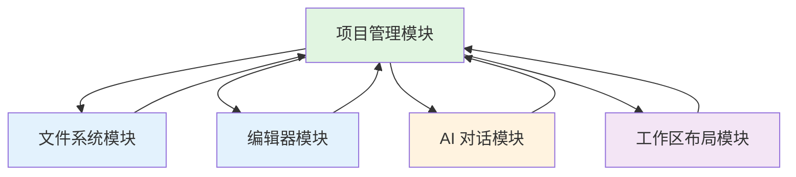
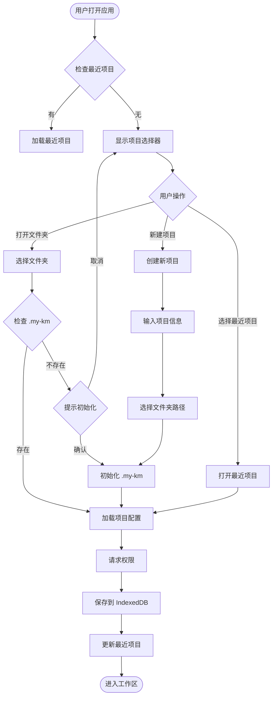
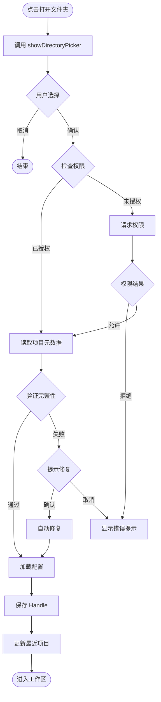
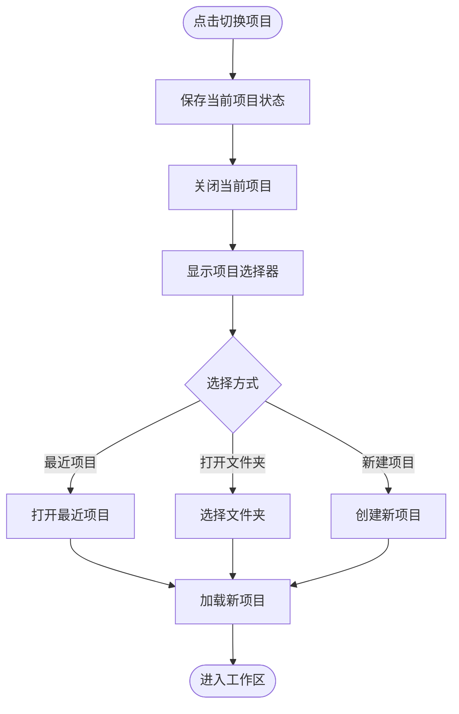

# 项目管理模块需求文档

## 📋 文档信息

- **模块名称**: Project Management
- **版本**: 1.0.0
- **创建日期**: 2026-01-16
- **状态**: 需求定义
- **作者**: My-KM Team

---

## 🎯 模块概述

### 功能描述

项目管理模块是 My-KM 应用的核心入口模块,负责管理用户的知识项目。每个项目对应一个本地文件夹,通过 File System API 进行访问和管理,项目元数据和配置通过 `.my-km` 文件夹持久化存储。

### 目标用户

- **知识工作者**: 需要系统化管理个人知识库的用户
- **技术写作者**: 组织技术文档和博客文章的开发者
- **研究员**: 管理研究项目和笔记的学术工作者

### 核心价值

1. **本地优先**: 所有数据存储在用户设备,完全掌控
2. **项目化组织**: 以项目为单位组织知识,清晰明了
3. **VSCode 风格**: 熟悉的项目管理体验,学习成本低
4. **配置灵活**: 多层级配置系统,满足不同场景需求

### 与其他模块的关系



**依赖关系**:
- **依赖文件系统模块**: 提供文件树和文件操作功能
- **依赖编辑器模块**: 打开文件时进入编辑器
- **依赖 AI 对话模块**: 从项目配置读取 AI 设置
- **依赖工作区布局模块**: 进入项目后显示工作区布局

**被依赖关系**:
- 文件系统模块需要获取当前项目信息
- 编辑器模块需要读取项目配置
- AI 对话模块需要读取项目的 AI 配置

---

## 📖 功能需求

### 1. 初始页面需求

#### PM-FR-1: 显示项目选择器界面

**优先级**: MUST

**描述**:
应用打开时,如果当前没有打开的项目,应显示项目选择器界面。该界面提供项目管理的主要入口。

**验收标准**:
- [ ] 界面包含应用 Logo 和标题
- [ ] 显示"欢迎使用 My-KM"等欢迎语
- [ ] 提供清晰的操作指引
- [ ] 界面设计简洁美观,符合 VSCode 风格

---

#### PM-FR-2: 提供"打开文件夹"按钮

**优先级**: MUST

**描述**:
提供"打开文件夹"按钮,点击后调用 File System API 的 `showDirectoryPicker()` 方法,让用户选择已有的项目文件夹。

**验收标准**:
- [ ] 按钮位置醒目,文案清晰
- [ ] 点击后调用 `showDirectoryPicker()` API
- [ ] 如果用户取消选择,不显示错误提示
- [ ] 如果浏览器不支持 File System API,显示友好提示

---

#### PM-FR-3: 提供"新建项目"按钮

**优先级**: MUST

**描述**:
提供"新建项目"按钮,点击后弹出新建项目对话框,允许用户输入项目名称、描述等信息,并创建新的项目文件夹。

**验收标准**:
- [ ] 按钮位置醒目,文案清晰
- [ ] 点击后显示新建项目表单
- [ ] 表单包含项目名称(必填)、描述(可选)字段
- [ ] 表单验证规则清晰(名称长度、特殊字符等)
- [ ] 创建成功后自动打开新项目

---

#### PM-FR-4: 显示最近项目列表

**优先级**: MUST

**描述**:
在初始页面显示最近打开的项目列表,最多显示 5 个项目。每个项目显示项目名称、最后打开时间等信息。

**验收标准**:
- [ ] 最多显示 5 个最近项目
- [ ] 每个项目显示:图标/emoji、项目名称、最后打开时间
- [ ] 点击项目卡片直接打开该项目
- [ ] 如果没有最近项目,显示空状态提示
- [ ] 支持从列表中移除项目(右键菜单或悬停显示删除按钮)

---

#### PM-FR-5: 支持快速打开最近项目

**优先级**: SHOULD

**描述**:
提供快捷键 `Cmd/Ctrl + R` 打开最近项目列表,支持上下键选择,回车键打开。

**验收标准**:
- [ ] 快捷键 `Cmd/Ctrl + R` 打开快速选择器
- [ ] 显示最近 5 个项目列表
- [ ] 支持上下键导航
- [ ] 支持回车键打开选中项目
- [ ] 支持 `Esc` 键关闭选择器

---

### 2. 项目创建需求

#### PM-FR-6: 支持创建空白项目

**优先级**: MUST

**描述**:
新建项目时创建空白项目,不包含任何预设文件或模板。用户可以在创建后自行组织文件结构。

**验收标准**:
- [ ] 创建的项目文件夹仅包含 `.my-km` 文件夹
- [ ] `.my-km` 文件夹包含必要的配置文件
- [ ] 不创建任何示例文件或文档

---

#### PM-FR-7: 输入项目名称和描述

**优先级**: MUST

**描述**:
新建项目时,用户需要输入项目名称(必填)和描述(可选)。

**验收标准**:
- [ ] 项目名称必填,2-50 个字符
- [ ] 项目描述可选,最多 200 个字符
- [ ] 实时验证输入(长度、特殊字符)
- [ ] 显示清晰的验证错误提示

---

#### PM-FR-8: 选择本地文件夹路径

**优先级**: MUST

**描述**:
创建项目时,用户需要选择或指定项目文件夹的本地路径。支持选择已有文件夹或创建新文件夹。

**验收标准**:
- [ ] 提供"选择文件夹"按钮
- [ ] 调用 `showDirectoryPicker()` 选择已有文件夹
- [ ] 如果文件夹为空,提示用户确认创建
- [ ] 如果文件夹非空且包含 `.my-km`,提示用户该项目已存在
- [ ] 如果文件夹非空但不含 `.my-km`,提示用户是否初始化为 My-KM 项目

---

#### PM-FR-9: 初始化 .my-km 文件夹和配置文件

**优先级**: MUST

**描述**:
创建项目时,自动在项目文件夹中创建 `.my-km` 隐藏文件夹,并初始化必要的配置文件。

**验收标准**:
- [ ] 自动创建 `.my-km` 文件夹
- [ ] 创建 `project.json` 文件,包含项目基本信息
- [ ] 创建 `settings.json` 文件,包含默认配置
- [ ] 创建 `ai.json` 文件,包含 AI 默认配置
- [ ] 文件格式为 JSON,缩进为 2 个空格
- [ ] 如果创建失败,显示详细的错误信息

---

### 3. 项目打开需求

#### PM-FR-10: 使用 File System API 访问文件夹

**优先级**: MUST

**描述**:
打开项目时,使用 File System API 的 `showDirectoryPicker()` 方法获取文件夹访问权限。

**验收标准**:
- [ ] 调用 `showDirectoryPicker()` API
- [ ] 请求 `readwrite` 权限
- [ ] 正确处理用户取消操作
- [ ] 正确处理权限被拒绝情况

---

#### PM-FR-11: 请求并保存文件访问权限

**优先级**: MUST

**描述**:
获取文件夹访问权限后,将权限持久化保存,避免每次打开项目时重新请求权限。

**验收标准**:
- [ ] 将 FileSystemDirectoryHandle 保存到 IndexedDB
- [ ] 使用 `requestPermission()` API 请求持久化权限
- [ ] 在设置中提供"记住权限"选项
- [ ] 如果用户选择不记住权限,每次打开时重新请求

---

#### PM-FR-12: 加载项目配置和元数据

**优先级**: MUST

**描述**:
打开项目后,从 `.my-km/project.json` 加载项目元数据,从 `.my-km/settings.json` 加载项目配置。

**验收标准**:
- [ ] 读取 `project.json` 文件
- [ ] 读取 `settings.json` 文件
- [ ] 读取 `ai.json` 文件
- [ ] 解析 JSON 数据,验证格式正确性
- [ ] 如果文件不存在,使用默认配置
- [ ] 如果文件格式错误,显示错误提示并使用默认配置

---

#### PM-FR-13: 验证项目完整性

**优先级**: SHOULD

**描述**:
打开项目时,验证项目文件夹的完整性,确保 `.my-km` 文件夹和必要的配置文件存在。

**验收标准**:
- [ ] 检查 `.my-km` 文件夹是否存在
- [ ] 检查 `project.json` 是否存在且格式正确
- [ ] 检查 `settings.json` 是否存在且格式正确
- [ ] 如果验证失败,提示用户并询问是否修复
- [ ] 提供自动修复功能(重建缺失的配置文件)

---

#### PM-FR-14: 进入工作区视图

**优先级**: MUST

**描述**:
项目成功加载后,进入工作区视图,显示文件树、编辑器和 AI 面板等。

**验收标准**:
- [ ] 隐藏项目选择器界面
- [ ] 显示工作区布局(左侧文件树,中间编辑区,右侧 AI 面板)
- [ ] 加载项目的文件树
- [ ] 应用项目的配置(主题、字体大小等)
- [ ] 更新最近项目列表

---

### 4. 项目信息管理需求

#### PM-FR-15: 编辑项目名称和描述

**优先级**: SHOULD

**描述**:
允许用户编辑项目的名称和描述信息,修改后自动保存到 `project.json` 文件。

**验收标准**:
- [ ] 提供项目设置页面或对话框
- [ ] 可以编辑项目名称和描述
- [ ] 实时验证输入
- [ ] 保存时更新 `project.json` 文件
- [ ] 保存成功后显示提示

---

#### PM-FR-16: 设置项目标签和图标

**优先级**: COULD

**描述**:
允许用户为项目设置标签和图标,用于项目分类和识别。

**验收标准**:
- [ ] 可以添加多个标签
- [ ] 可以选择 emoji 作为项目图标
- [ ] 标签和图标保存到 `project.json`
- [ ] 在项目列表中显示图标和标签

---

#### PM-FR-17: 更新项目状态

**优先级**: COULD

**描述**:
允许用户设置项目状态(活动、归档等),归档的项目在最近项目列表中不显示或置底显示。

**验收标准**:
- [ ] 提供项目状态选择(活动、归档)
- [ ] 归档的项目在列表中置底或隐藏
- [ ] 状态保存到 `project.json`
- [ ] 提供恢复归档项目的功能

---

### 5. 配置管理需求

#### PM-FR-18: 三级配置系统

**优先级**: MUST

**描述**:
实现三级配置系统:系统默认配置、用户全局配置、项目级别配置。配置按优先级合并后应用。

**验收标准**:
- [ ] 定义系统默认配置(应用内置)
- [ ] 用户全局配置存储在 LocalStorage
- [ ] 项目配置存储在 `.my-km/settings.json`
- [ ] 配置优先级:系统 < 用户 < 项目
- [ ] 配置合并算法正确工作
- [ ] 支持配置重置功能

---

#### PM-FR-19: 配置文件格式为 JSON

**优先级**: MUST

**描述**:
所有配置文件使用 JSON 格式,便于阅读和编辑。

**验收标准**:
- [ ] 配置文件使用 `.json` 扩展名
- [ ] JSON 格式正确,可以被解析
- [ ] 使用 2 个空格缩进
- [ ] 注释规范(使用特殊字段如 `__comment`)
- [ ] 提供配置文件的 schema 验证

---

#### PM-FR-20: 支持多种配置类型

**优先级**: MUST

**描述**:
支持多种配置类型,包括编辑器配置、文件系统配置、用户偏好配置、AI 配置等。

**验收标准**:
- [ ] `editor.*`: 编辑器相关配置
- [ ] `files.*`: 文件系统相关配置
- [ ] `ui.*`: 用户界面相关配置
- [ ] `ai.*`: AI 相关配置
- [ ] 每个配置类型都有清晰的 schema 定义
- [ ] 提供配置编辑器 UI

---

## 📊 数据结构设计

### .my-km 文件夹结构

```
project-root/
├── .my-km/
│   ├── project.json           # 项目基本信息
│   ├── settings.json          # 项目级别配置
│   ├── ai.json                # AI 配置
│   ├── storage/               # 内部存储(可选)
│   │   └── handles.db         # File System Handle 持久化
│   └── .gitkeep               # 确保 folder 被 git 追踪
├── docs/                      # 用户文档
├── images/                    # 图片资源
└── references/                # 参考资料
```

**文件夹说明**:
- `.my-km/`: 项目元数据和配置的隐藏文件夹
- `docs/`: 用户存放文档的文件夹(可选)
- `images/`: 用户存放图片的文件夹(可选)
- `references/`: 用户存放参考资料的文件夹(可选)

---

### project.json 结构

```typescript
interface ProjectConfig {
  // 基本信息
  id: string;                  // 项目唯一标识 (cuid)
  name: string;                // 项目名称
  description?: string;        // 项目描述
  version: string;             // 配置版本 (semver)

  // 时间戳
  createdAt: string;           // ISO 8601 格式
  updatedAt: string;           // ISO 8601 格式
  lastOpenedAt: string;        // ISO 8601 格式

  // 项目属性
  tags: string[];              // 项目标签
  icon?: string;               // 项目图标 (emoji 或 icon name)
  color?: string;              // 项目颜色 (hex, e.g., "#3b82f6")
  status: 'active' | 'archived'; // 项目状态

  // 可选元数据
  metadata?: {
    [key: string]: any;
  };
}
```

**示例**:
```json
{
  "id": "clk7g9k2j0000356h8g4k9j2l",
  "name": "知识库项目",
  "description": "我的个人知识库",
  "version": "1.0.0",
  "createdAt": "2026-01-16T08:00:00.000Z",
  "updatedAt": "2026-01-16T08:00:00.000Z",
  "lastOpenedAt": "2026-01-16T10:30:00.000Z",
  "tags": ["知识管理", "个人"],
  "icon": "📚",
  "color": "#3b82f6",
  "status": "active"
}
```

---

### settings.json 结构(项目级别)

```typescript
interface SettingsConfig {
  // 编辑器配置
  editor: {
    fontSize: number;          // 字体大小 (px)
    tabSize: number;           // Tab 宽度 (空格数)
    wordWrap: boolean;         // 是否自动换行
    minimap: boolean;          // 是否显示小地图
    lineNumbers: boolean;      // 是否显示行号
    autoSave: 'afterDelay' | 'onFocusChange' | 'onWindowChange';
    autoSaveDelay: number;     // 自动保存延迟 (ms)
    fontFamily?: string;       // 字体家族
    lineHeight?: number;       // 行高
  };

  // 文件系统配置
  files: {
    exclude: string[];         // 排除的文件模式 (glob)
    include: string[];         // 包含的文件模式 (glob)
    watch: boolean;            // 是否监听文件变化
    maxDepth?: number;         // 文件树最大深度
    showHiddenFiles: boolean;  // 是否显示隐藏文件
  };

  // UI 配置
  ui: {
    layout: 'default' | 'compact' | 'focus';
    sidebar: 'files' | 'search' | 'ai' | 'none';
    fontSize: number;          // UI 字体大小
    theme: 'light' | 'dark' | 'auto';
    colorScheme?: string;      // 颜色主题
    density: 'comfortable' | 'compact' | 'spacious';
  };

  // 协作配置(预留)
  collaboration?: {
    enabled: boolean;
    shareSettings?: any;
  };
}
```

**示例**:
```json
{
  "editor": {
    "fontSize": 14,
    "tabSize": 2,
    "wordWrap": true,
    "minimap": true,
    "lineNumbers": true,
    "autoSave": "afterDelay",
    "autoSaveDelay": 1000
  },
  "files": {
    "exclude": ["node_modules/**", ".git/**", "dist/**"],
    "include": ["**/*.md", "**/*.txt", "**/*.pdf"],
    "watch": true,
    "showHiddenFiles": false
  },
  "ui": {
    "layout": "default",
    "sidebar": "files",
    "fontSize": 14,
    "theme": "auto",
    "density": "comfortable"
  }
}
```

---

### ai.json 结构

```typescript
interface AIConfig {
  // 模型配置
  model: string;               // AI 模型名称
  provider: string;            // AI 提供商

  // 参数配置
  temperature: number;         // 温度参数 (0-1)
  maxTokens: number;           // 最大 token 数
  topP?: number;               // Top-p 采样
  frequencyPenalty?: number;   // 频率惩罚
  presencePenalty?: number;    // 存在惩罚

  // 上下文配置
  contextWindow: number;       // 上下文窗口大小
  systemPrompt?: string;       // 系统提示词
  enableRAG: boolean;          // 是否启用 RAG

  // 高级配置
  streamOutput: boolean;       // 是否流式输出
  retryAttempts: number;       // 重试次数
  timeout?: number;            // 超时时间 (ms)
}
```

**示例**:
```json
{
  "model": "claude-sonnet-4-5",
  "provider": "anthropic",
  "temperature": 0.7,
  "maxTokens": 4096,
  "topP": 0.9,
  "contextWindow": 200000,
  "systemPrompt": "你是一个专业的知识管理助手...",
  "enableRAG": true,
  "streamOutput": true,
  "retryAttempts": 3,
  "timeout": 30000
}
```

---

### recent-projects.json 结构(用户级别)

```typescript
interface RecentProjectsConfig {
  recent: RecentProject[];
  maxRecent: number;           // 最大保存数量
}

interface RecentProject {
  id: string;                  // 项目 ID
  name: string;                // 项目名称
  path: string;                // 文件夹路径
  lastOpened: string;          // ISO 8601
  handleId?: string;           // IndexedDB 中的 handle ID
}
```

**示例**:
```json
{
  "recent": [
    {
      "id": "clk7g9k2j0000356h8g4k9j2l",
      "name": "知识库项目",
      "path": "/Users/user/Documents/Knowledge",
      "lastOpened": "2026-01-16T10:30:00.000Z",
      "handleId": "handle_123456"
    },
    {
      "id": "clk7g9k2j0000356h8g4k9j2m",
      "name": "博客文章",
      "path": "/Users/user/Documents/Blog",
      "lastOpened": "2026-01-15T14:20:00.000Z"
    }
  ],
  "maxRecent": 5
}
```

---

### IndexedDB 数据结构

```typescript
// 数据库: MyKM
// 表: project_handles

interface ProjectHandleRecord {
  id: string;                  // 主键
  projectId: string;           // 项目 ID
  handle: FileSystemDirectoryHandle; // File System Handle
  handleId: string;            // 唯一标识符
  createdAt: string;           // ISO 8601
  updatedAt: string;           // ISO 8601
}

// 表: user_settings

interface UserSettingsRecord {
  id: 'global';                // 单例
  settings: {
    editor: { /* ... */ };
    files: { /* ... */ };
    ui: { /* ... */ };
    ai: { /* ... */ };
  };
  updatedAt: string;           // ISO 8601
}
```

---

## 🔧 配置优先级和合并规则

### 配置层级

```
┌─────────────────────────────────────┐
│     项目级别配置 (最高优先级)         │
│   .my-km/settings.json              │
└─────────────────────────────────────┘
                 ↓ 覆盖
┌─────────────────────────────────────┐
│      用户全局配置 (中等优先级)        │
│   LocalStorage (userSettings)        │
└─────────────────────────────────────┘
                 ↓ 覆盖
┌─────────────────────────────────────┐
│      系统默认配置 (最低优先级)        │
│   应用内置默认值                      │
└─────────────────────────────────────┘
```

### 合并算法

```typescript
/**
 * 配置合并函数
 * @param systemConfig 系统默认配置
 * @param userConfig 用户全局配置
 * @param projectConfig 项目级别配置
 * @returns 合并后的有效配置
 */
function getEffectiveConfig(
  systemConfig: SystemConfig,
  userConfig?: UserConfig,
  projectConfig?: ProjectConfig
): EffectiveConfig {
  // 深度合并三个层级的配置
  return deepMerge(
    systemConfig,    // 底层
    userConfig || {},      // 中间层
    projectConfig || {}    // 顶层(最高优先级)
  );
}

/**
 * 深度合并对象
 */
function deepMerge(...objects: object[]): object {
  const result = {};

  for (const obj of objects) {
    for (const [key, value] of Object.entries(obj)) {
      if (value && typeof value === 'object' && !Array.isArray(value)) {
        // 递归合并对象
        result[key] = deepMerge(result[key] || {}, value);
      } else {
        // 直接覆盖(数组、基本类型)
        result[key] = value;
      }
    }
  }

  return result;
}
```

### 冲突解决规则

| 类型 | 合并策略 | 示例 |
|-----|---------|-----|
| **对象** | 深度合并 | `editor.fontSize` 会被覆盖,但 `editor` 其他字段保留 |
| **数组** | 完全替换 | `files.exclude` 被新数组完全替换 |
| **基本类型** | 覆盖 | `fontSize: 14` 覆盖 `fontSize: 16` |
| **undefined/null** | 忽略 | 跳过该层级的配置 |

### 示例

```typescript
// 系统默认配置
const systemConfig = {
  editor: {
    fontSize: 14,
    tabSize: 2,
    wordWrap: true,
    autoSave: 'afterDelay',
    autoSaveDelay: 1000
  },
  files: {
    exclude: ['node_modules/**'],
    watch: true
  },
  ui: {
    theme: 'auto',
    fontSize: 14
  }
};

// 用户全局配置
const userConfig = {
  editor: {
    fontSize: 16,          // 覆盖系统默认
    wordWrap: false        // 覆盖系统默认
  },
  ui: {
    theme: 'dark'          // 覆盖系统默认
  }
};

// 项目配置
const projectConfig = {
  editor: {
    autoSaveDelay: 2000    // 覆盖系统默认
  },
  files: {
    exclude: ['dist/**']   // 完全替换系统默认
  }
};

// 合并后的有效配置
const effectiveConfig = {
  editor: {
    fontSize: 16,          // 来自用户配置
    tabSize: 2,            // 来自系统默认
    wordWrap: false,       // 来自用户配置
    autoSave: 'afterDelay',// 来自系统默认
    autoSaveDelay: 2000    // 来自项目配置
  },
  files: {
    exclude: ['dist/**'],  // 来自项目配置(完全替换)
    watch: true            // 来自系统默认
  },
  ui: {
    theme: 'dark',         // 来自用户配置
    fontSize: 14           // 来自系统默认
  }
};
```

---

## 🔄 用户交互流程

### 首次使用流程



### 打开项目流程



### 切换项目流程



---

## 💻 技术实现要点

### File System API 使用

#### 请求目录访问权限

```typescript
/**
 * 请求目录访问权限
 */
async function openFolder(): Promise<FileSystemDirectoryHandle | null> {
  try {
    // 调用 File System API
    const handle = await window.showDirectoryPicker();

    // 请求持久化权限(可选)
    const permission = await handle.requestPermission({ mode: 'readwrite' });

    if (permission !== 'granted') {
      throw new Error('权限被拒绝');
    }

    return handle;
  } catch (error) {
    if (error.name === 'AbortError') {
      // 用户取消
      return null;
    }
    throw error;
  }
}
```

#### 读取项目文件

```typescript
/**
 * 从 .my-km 文件夹读取配置文件
 */
async function readProjectConfig(
  handle: FileSystemDirectoryHandle
): Promise<ProjectConfig | null> {
  try {
    // 获取 .my-km 文件夹
    const myKmFolder = await handle.getDirectoryHandle('.my-km');

    // 读取 project.json
    const fileHandle = await myKmFolder.getFileHandle('project.json');
    const file = await fileHandle.getFile();
    const content = await file.text();

    // 解析 JSON
    const config = JSON.parse(content) as ProjectConfig;

    return config;
  } catch (error) {
    console.error('读取项目配置失败:', error);
    return null;
  }
}
```

#### 写入项目文件

```typescript
/**
 * 写入配置文件到 .my-km 文件夹
 */
async function writeProjectConfig(
  handle: FileSystemDirectoryHandle,
  config: ProjectConfig
): Promise<void> {
  try {
    // 获取或创建 .my-km 文件夹
    const myKmFolder = await handle.getDirectoryHandle('.my-km', {
      create: true,
    });

    // 获取或创建 project.json
    const fileHandle = await myKmFolder.getFileHandle('project.json', {
      create: true,
    });

    // 写入内容
    const writable = await fileHandle.createWritable();
    await writable.write(
      JSON.stringify(config, null, 2) + '\n'  // 2 空格缩进
    );
    await writable.close();
  } catch (error) {
    console.error('写入项目配置失败:', error);
    throw error;
  }
}
```

#### 初始化项目文件夹

```typescript
/**
 * 初始化项目的 .my-km 文件夹和配置文件
 */
async function initializeProject(
  handle: FileSystemDirectoryHandle,
  projectInfo: {
    name: string;
    description?: string;
  }
): Promise<void> {
  // 创建 .my-km 文件夹
  const myKmFolder = await handle.getDirectoryHandle('.my-km', {
    create: true,
  });

  // 创建 project.json
  const projectConfig: ProjectConfig = {
    id: generateCuid(),
    name: projectInfo.name,
    description: projectInfo.description,
    version: '1.0.0',
    createdAt: new Date().toISOString(),
    updatedAt: new Date().toISOString(),
    lastOpenedAt: new Date().toISOString(),
    tags: [],
    status: 'active',
  };

  await writeProjectConfig(handle, projectConfig);

  // 创建 settings.json(默认配置)
  const settingsConfig = getDefaultSettings();
  await writeSettingsFile(handle, settingsConfig);

  // 创建 ai.json(默认配置)
  const aiConfig = getDefaultAIConfig();
  await writeAIFile(handle, aiConfig);
}
```

---

### IndexedDB 存储方案

#### 使用 Dexie.js 简化操作

```typescript
import Dexie, { Table } from 'dexie';

// 定义数据库
class MyKMDatabase extends Dexie {
  project_handles!: Table<ProjectHandleRecord>;

  constructor() {
    super('MyKM');
    this.version(1).stores({
      project_handles: 'id, projectId, handleId',
    });
  }
}

const db = new MyKMDatabase();

// 存储 FileSystemHandle
async function saveProjectHandle(
  projectId: string,
  handle: FileSystemDirectoryHandle
): Promise<void> {
  const handleId = generateCuid();

  await db.project_handles.add({
    id: generateCuid(),
    projectId,
    handle,  // FileSystemHandle 无法序列化,但 IndexedDB 可以存储
    handleId,
    createdAt: new Date().toISOString(),
    updatedAt: new Date().toISOString(),
  });
}

// 获取 FileSystemHandle
async function getProjectHandle(
  projectId: string
): Promise<FileSystemDirectoryHandle | null> {
  const record = await db.project_handles
    .where('projectId')
    .equals(projectId)
    .first();

  return record?.handle || null;
}

// 更新最近访问时间
async function updateLastOpened(projectId: string): Promise<void> {
  await db.project_handles
    .where('projectId')
    .equals(projectId)
    .modify({
      updatedAt: new Date().toISOString(),
    });
}
```

---

### 权限管理策略

#### 权限管理配置

```typescript
/**
 * 权限策略枚举
 */
enum PermissionStrategy {
  AlwaysAsk = 'alwaysAsk',      // 每次请求
  Remember = 'remember',        // 永久保存
}

/**
 * 权限管理器
 */
class PermissionManager {
  private strategy: PermissionStrategy;

  constructor() {
    // 从用户设置中读取策略
    this.strategy = this.loadStrategy();
  }

  /**
   * 请求权限
   */
  async requestPermission(
    handle: FileSystemDirectoryHandle
  ): Promise<boolean> {
    if (this.strategy === PermissionStrategy.AlwaysAsk) {
      // 每次请求权限
      const permission = await handle.requestPermission({
        mode: 'readwrite',
      });
      return permission === 'granted';
    } else {
      // 尝试直接使用,如果权限过期则请求
      try {
        await handle.entries();  // 测试权限
        return true;
      } catch {
        const permission = await handle.requestPermission({
          mode: 'readwrite',
        });
        return permission === 'granted';
      }
    }
  }

  /**
   * 设置权限策略
   */
  setStrategy(strategy: PermissionStrategy): void {
    this.strategy = strategy;
    localStorage.setItem('permissionStrategy', strategy);
  }

  private loadStrategy(): PermissionStrategy {
    return (
      localStorage.getItem('permissionStrategy') ||
      PermissionStrategy.Remember
    );
  }
}
```

---

### 自动恢复机制

#### 检测和恢复丢失的项目

```typescript
/**
 * 检测项目是否丢失
 */
async function isProjectLost(handle: FileSystemDirectoryHandle): Promise<boolean> {
  try {
    await handle.entries();
    return false;
  } catch (error) {
    if (error.name === 'NotFoundError') {
      return true;
    }
    throw error;
  }
}

/**
 * 尝试恢复项目
 */
async function recoverProject(
  projectId: string,
  projectConfig: ProjectConfig
): Promise<FileSystemDirectoryHandle | null> {
  // 1. 尝试从 IndexedDB 恢复
  const handle = await getProjectHandle(projectId);
  if (handle && !(await isProjectLost(handle))) {
    return handle;
  }

  // 2. 提示用户重新选择文件夹
  const confirmed = confirm(
    `项目 "${projectConfig.name}" 的文件夹丢失或无法访问。\n\n` +
    `是否要重新选择文件夹位置?`
  );

  if (!confirmed) {
    return null;
  }

  // 3. 用户选择新文件夹
  const newHandle = await openFolder();
  if (!newHandle) {
    return null;
  }

  // 4. 检查是否包含有效的 .my-km 文件夹
  const hasMyKm = await checkMyKmFolder(newHandle);

  if (!hasMyKm) {
    // 5. 自动重建 .my-km 文件夹
    const shouldInit = confirm(
      `选择的文件夹不包含项目配置。\n\n` +
      `是否要使用默认配置初始化此项目?`
    );

    if (shouldInit) {
      await initializeProject(newHandle, {
        name: projectConfig.name,
        description: projectConfig.description,
      });
    } else {
      return null;
    }
  }

  // 6. 保存新的 Handle
  await saveProjectHandle(projectId, newHandle);

  return newHandle;
}

/**
 * 检查是否存在 .my-km 文件夹
 */
async function checkMyKmFolder(
  handle: FileSystemDirectoryHandle
): Promise<boolean> {
  try {
    for await (const entry of handle.values()) {
      if (entry.name === '.my-km' && entry.kind === 'directory') {
        return true;
      }
    }
    return false;
  } catch {
    return false;
  }
}
```

---

## 🎨 UI/UX 设计要求

### 初始页面布局

```
┌────────────────────────────────────────────────────────────────┐
│  ┌─────┐  My-KM                    设置  关于   [用户头像]    │
│  │ Logo│                                                         │
│  └─────┘                                                         │
├────────────────────────────────────────────────────────────────┤
│                                                                 │
│              欢迎使用 My-KM                                      │
│         VSCode 风格的 AI 知识工作站                               │
│                                                                 │
│   ┌──────────────────────┐  ┌──────────────────────┐           │
│   │                      │  │                      │           │
│   │   📁 打开文件夹       │  │   ➕  新建项目        │           │
│   │                      │  │                      │           │
│   └──────────────────────┘  └──────────────────────┘           │
│                                                                 │
│                      最近项目                                    │
│   ┌─────────────────────────────────────────────────────────┐  │
│   │ 📚 知识库项目                              2小时前       │  │
│   │ 我的个人知识库,包含技术文档和学习笔记                       │  │
│   ├─────────────────────────────────────────────────────────┤  │
│   │ 📝 博客文章                                昨天          │  │
│   │ 技术博客的草稿和发布文章                                  │  │
│   ├─────────────────────────────────────────────────────────┤  │
│   │ 🔬 研究笔记                              3天前           │  │
│   │ AI 和深度学习相关的研究笔记                               │  │
│   └─────────────────────────────────────────────────────────┘  │
│                                                                 │
│                              [清除所有历史]                     │
│                                                                 │
└────────────────────────────────────────────────────────────────┘
```

### 组件设计规范

#### 按钮样式

```typescript
// 主按钮(打开文件夹、新建项目)
{
  variant: 'default',
  size: 'lg',
  className: 'min-w-[200px] gap-2'
}

// 次要按钮(清除历史)
{
  variant: 'ghost',
  size: 'sm',
  className: 'text-muted-foreground'
}
```

#### 项目卡片样式

```typescript
// 项目卡片
{
  className: `
    group relative p-4 rounded-lg border
    hover:border-primary hover:shadow-md
    transition-all cursor-pointer
  `
}

// 项目图标
{
  className: 'text-4xl mb-2'
}

// 项目名称
{
  className: 'font-semibold text-lg mb-1'
}

// 项目描述
{
  className: 'text-sm text-muted-foreground line-clamp-2'
}

// 最后打开时间
{
  className: 'text-xs text-muted-foreground mt-2'
}
```

### 设计原则

1. **简洁明了**: 突出核心操作,减少干扰元素
2. **VSCode 风格**: 使用熟悉的图标、颜色和布局
3. **状态反馈**: 加载、错误、成功状态的明确视觉反馈
4. **键盘友好**: 支持快捷键和键盘导航
5. **响应式设计**: 适配不同屏幕尺寸(最小 1024px)

### 响应式断点

```css
/* 移动设备 */
@media (max-width: 640px) {
  .project-selector {
    padding: 1rem;
  }
  .action-buttons {
    flex-direction: column;
  }
}

/* 平板设备 */
@media (min-width: 641px) and (max-width: 1024px) {
  .project-selector {
    max-width: 600px;
  }
}

/* 桌面设备 */
@media (min-width: 1025px) {
  .project-selector {
    max-width: 800px;
  }
}
```

### 动画和过渡

```css
/* 按钮悬停效果 */
.btn-primary:hover {
  transform: translateY(-2px);
  box-shadow: 0 4px 12px rgba(59, 130, 246, 0.3);
}

/* 项目卡片悬停效果 */
.project-card {
  transition: all 0.2s ease-in-out;
}

.project-card:hover {
  transform: translateY(-4px);
  box-shadow: 0 8px 24px rgba(0, 0, 0, 0.1);
}

/* 加载动画 */
@keyframes spin {
  to { transform: rotate(360deg); }
}

.spinner {
  animation: spin 1s linear infinite;
}
```

---

## ⚠️ 边界情况和错误处理

### 错误场景处理表

| 错误场景 | 检测方法 | 处理策略 | 用户提示 |
|---------|---------|---------|---------|
| **权限被拒绝** | `requestPermission()` 返回 'denied' | 显示错误提示,提供重试按钮 | "需要文件夹访问权限才能打开项目。请点击允许。" |
| **文件夹被删除** | `handle.entries()` 抛出 `NotFoundError` | 尝试从最近项目恢复,或提示重新选择 | "项目文件夹无法访问。是否要重新选择文件夹位置?" |
| **文件夹被移动** | Handle 失效,但路径可能存在 | 提示用户重新选择文件夹 | "项目位置已更改。请重新选择项目文件夹。" |
| **配置文件损坏** | `JSON.parse()` 抛出语法错误 | 使用默认配置,备份损坏的文件 | "项目配置文件已损坏,已使用默认配置。损坏的文件已备份。" |
| **配置文件缺失** | `getFileHandle()` 抛出 `NotFoundError` | 自动重建缺失的配置文件 | "项目配置文件缺失,已自动创建默认配置。" |
| **浏览器不支持** | `!window.showDirectoryPicker` | 显示友好提示,建议使用 Chrome/Edge | "您的浏览器不支持本地文件访问。建议使用 Chrome 86+ 或 Edge 86+。" |
| **磁盘空间不足** | 写入时抛出 `QuotaExceededError` | 提前检查可用空间,警告用户 | "磁盘空间不足,无法保存文件。请清理磁盘空间后重试。" |
| **并发写入冲突** | 多个标签页同时写入 | 使用乐观锁或文件锁机制 | "文件已被其他进程修改。刷新页面以获取最新内容。" |
| **项目已打开** | 检测到项目已在其他标签页打开 | 提示用户切换到已打开的标签页 | "该项目已在其他标签页中打开。是否切换到该标签页?" |
| **网络离线** (v2.0) | `navigator.onLine === false` | 使用本地模式,禁用云同步功能 | "当前离线,使用本地模式。云同步功能已禁用。" |

### 错误提示组件设计

```typescript
interface ErrorAlertProps {
  title: string;
  message: string;
  type: 'error' | 'warning' | 'info';
  actions?: Array<{
    label: string;
    onClick: () => void;
    variant?: 'default' | 'outline' | 'ghost';
  }>;
}

// 使用示例
<ErrorAlert
  title="项目无法访问"
  message="项目文件夹已被移动或删除。请重新选择项目位置。"
  type="error"
  actions={[
    {
      label: "重新选择",
      onClick: handleReSelectFolder,
      variant: "default"
    },
    {
      label: "取消",
      onClick: handleCancel,
      variant: "outline"
    }
  ]}
/>
```

### 错误日志和监控

```typescript
/**
 * 错误日志记录
 */
function logError(error: Error, context?: object): void {
  const errorLog = {
    message: error.message,
    stack: error.stack,
    context,
    timestamp: new Date().toISOString(),
    userAgent: navigator.userAgent,
    url: window.location.href,
  };

  // 存储到 LocalStorage
  const logs = JSON.parse(localStorage.getItem('errorLogs') || '[]');
  logs.push(errorLog);
  localStorage.setItem('errorLogs', JSON.stringify(logs.slice(-100)));  // 只保留最近 100 条

  // 发送到远程监控(v2.0)
  if (isMonitoringEnabled()) {
    sendToMonitoring(errorLog);
  }
}

/**
 * 错误边界组件
 */
class ProjectErrorBoundary extends React.Component {
  componentDidCatch(error: Error, errorInfo: React.ErrorInfo) {
    logError(error, {
      componentStack: errorInfo.componentStack,
      phase: 'render',
    });
  }
}
```

---

## ✅ 验收标准

### 功能验收清单

#### 项目创建
- [ ] 能够成功创建新项目
- [ ] 新建项目时自动创建 `.my-km` 文件夹
- [ ] `.my-km` 文件夹包含所有必需的配置文件
- [ ] 配置文件格式正确,可以被解析
- [ ] 项目名称和描述正确保存到 `project.json`
- [ ] 创建成功后自动打开新项目

#### 项目打开
- [ ] 能够通过"打开文件夹"按钮打开已有项目
- [ ] 正确请求和处理 File System API 权限
- [ ] 能够读取和解析 `project.json` 配置
- [ ] 能够读取和解析 `settings.json` 配置
- [ ] 能够读取和解析 `ai.json` 配置
- [ ] 配置文件缺失时能够自动重建
- [ ] 配置文件损坏时能够使用默认配置
- [ ] 打开成功后进入工作区视图

#### 最近项目
- [ ] 正确显示最近 5 个项目
- [ ] 显示项目的图标、名称、最后打开时间
- [ ] 点击项目卡片能够快速打开
- [ ] 打开项目后更新最近项目列表
- [ ] 能够从列表中移除项目

#### 项目切换
- [ ] 关闭当前项目时正确保存状态
- [ ] 切换到新项目时正确加载配置
- [ ] 切换项目时 UI 正确更新

#### 配置管理
- [ ] 系统默认配置正确加载
- [ ] 用户全局配置正确保存到 LocalStorage
- [ ] 项目配置正确保存到 `.my-km/settings.json`
- [ ] 配置优先级合并逻辑正确工作
- [ ] 配置编辑器能够正确读取和保存配置
- [ ] 配置重置功能正确工作

---

### 性能验收标准

| 指标 | 目标值 | 测量方法 |
|-----|-------|---------|
| **初始页面渲染时间** | < 300ms | Performance API 测量 |
| **项目打开时间** | < 1s (1000 文件) | 从点击到进入工作区 |
| **配置文件加载时间** | < 100ms | 读取和解析 JSON |
| **IndexedDB 查询时间** | < 50ms | 查询项目 Handle |
| **项目创建时间** | < 500ms | 从确认到创建完成 |

---

### 兼容性验收标准

#### 浏览器兼容性矩阵

| 浏览器 | 最低版本 | File System API | 支持级别 |
|-------|---------|----------------|---------|
| Chrome | 86+ | ✅ 完全支持 | 完全支持 |
| Edge | 86+ | ✅ 完全支持 | 完全支持 |
| Firefox | 95+ | ⚠️ 部分支持 | 降级方案 |
| Safari | 16.4+ | ⚠️ 部分支持 | 降级方案 |
| Opera | 72+ | ✅ 完全支持 | 完全支持 |

#### 降级方案

对于不支持 File System API 的浏览器:
1. 使用传统文件上传/下载方式
2. 将文件内容存储在 IndexedDB(小文件)
3. 显示友好提示,建议使用 Chrome/Edge
4. 提供基础功能,禁用高级功能

---

### 错误处理验收标准

- [ ] 所有错误都有友好的错误提示
- [ ] 权限被拒绝时提供明确的解决指引
- [ ] 文件夹丢失时能够自动恢复或引导用户
- [ ] 配置文件损坏时能够使用默认配置
- [ ] 错误日志正确记录到 LocalStorage
- [ ] 致命错误有错误边界保护
- [ ] 网络错误不影响本地功能

---

### 可访问性验收标准

- [ ] 支持键盘导航(Tab 键)
- [ ] 支持快捷键操作(`Cmd/Ctrl + O`, `Cmd/Ctrl + R`)
- [ ] 错误提示对屏幕阅读器友好
- [ ] 按钮和链接有明确的焦点状态
- [ ] 颜色对比度符合 WCAG 2.1 AA 标准
- [ ] 表单字段有关联的 label

---

### 安全性验收标准

- [ ] 文件路径验证,防止路径遍历攻击
- [ ] JSON 配置验证,防止注入攻击
- [ ] FileSystemHandle 正确隔离,不泄露其他文件
- [ ] 敏感信息不记录到错误日志
- [ ] 权限请求明确告知用户用途

---

## 📚 附录

### 术语表

| 术语 | 定义 |
|-----|-----|
| **项目** | 对应一个本地文件夹的知识管理单元 |
| **.my-km 文件夹** | 存储项目元数据和配置的隐藏文件夹 |
| **File System API** | 浏览器提供的本地文件系统访问 API |
| **IndexedDB** | 浏览器提供的本地数据库 |
| **配置优先级** | 系统默认 < 用户全局 < 项目级别 |
| **最近项目** | 最近打开的项目列表,最多 5 个 |

### 参考资源

- [File System Access API](https://developer.mozilla.org/en-US/docs/Web/API/File_System_Access_API)
- [Using the File System Access API](https://web.dev/file-system-access/)
- [IndexedDB API](https://developer.mozilla.org/en-US/docs/Web/API/IndexedDB_API)
- [VSCode Settings](https://code.visualstudio.com/docs/getstarted/settings)
- [Dexie.js Documentation](https://dexie.org/)

### 相关文档

- [产品概览](../product-overview.md)
- [需求文档](../requirements.md)
- [文件系统模块](./file-system.md) ⏳
- [编辑器模块](./editor.md) ⏳
- [AI 对话模块](./ai-chat.md) ⏳

---

## 📝 变更历史

| 版本 | 日期 | 变更说明 | 作者 |
|-----|------|---------|-----|
| 1.0.0 | 2026-01-16 | 初始版本,完整的项目管理模块需求定义 | My-KM Team |

---

**文档状态**: ✅ 需求定义完成
**下一步**: 文件系统模块需求文档
