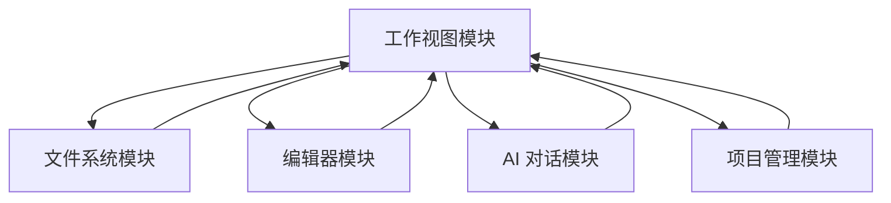

# 工作视图模块需求文档

## 📋 文档信息

- **模块名称**: Workspace View (工作视图)
- **版本**: 1.2.0
- **创建日期**: 2026-01-19
- **最后更新**: 2026-01-23
- **状态**: 📝 需求定义阶段
- **作者**: My-KM Team

---

## 🎯 模块概述

### 功能描述

工作视图模块是 My-KM 应用的核心工作区,为用户提供类 VSCode 风格的现代化三栏布局界面。该界面整合了文件资源管理、Markdown 编辑、AI 智能助手等核心功能，支持深色/亮色双主题切换，旨在提供沉浸式且高效的知识管理体验。

### 核心价值

1. **类 VSCode 体验**: 熟悉的三栏布局 + 底部状态栏，降低开发者和技术用户的学习成本。
2. **双主题支持**: 完备的深色 (Dark) 与亮色 (Light) 主题适配，满足不同光照环境下的使用需求。
3. **高效工作流**: 文件浏览、实时编辑、AI 辅助无缝衔接。
4. **AI 深度集成**: 独立的右侧 AI 面板，支持上下文感知的智能对话。

### 与其他模块的关系



---

## 📖 功能模块清单

### 1. 全局导航与状态

- **顶部导航栏 (Top Nav)**:
  - 左侧: Logo、应用名称、当前项目名称
  - 右侧: 侧边栏开关、AI 面板开关、全局搜索按钮
- **底部状态栏 (Status Bar)**:
  - 左侧: 光标位置 (行/列)、字数统计
  - 右侧: 字符编码 (UTF-8)、语言模式 (Markdown)、通知中心

### 2. 左侧侧边栏 (Sidebar)

- **活动条 (Activity Bar)**: 位于最左侧的窄条，用于切换侧边栏视图 (文件、搜索、Git、扩展等)。
- **侧边面板 (Sidebar Panel)**: 展示具体内容，如文件资源管理器树状结构。
- **功能**: 支持折叠/展开，宽度可调整。

### 3. 编辑器区域 (Editor Area)

- **标签页栏 (Tab Bar)**: 显示当前打开的文件，支持拖拽排序和关闭。
- **编辑内容区**: Markdown 编辑器核心区域，支持语法高亮和实时预览。
- **功能**: 支持多窗口拆分 (Split View)。

### 4. AI 助手面板 (AI Panel)

- **位置**: 位于工作区最右侧。
- **功能**:
  - 历史对话流展示
  - 底部输入框 (支持多行输入)
  - 上下文感知 (引用当前文件或选中文本)
  - 支持折叠/展开

---

## 🎨 UI/UX 设计规范

### 布局结构

```
┌─────────────────────────────────────────────────────────────────────────┐
│  [Logo] My-KM  项目名称                           [搜索][AI开关][侧边栏] │ <-- Top Nav
├──────┬──────────────────────┬─────────────────────────────────┬─────────┤
│ Act  │                      │  Tab1  Tab2  Tab3               │         │
│ Bar  │  Sidebar Panel       │ ┌─────────────────────────────┐ │ AI      │
│      │  (Files/Search)      │ │                             │ │ Panel   │
│Files │                      │ │      Editor Content         │ │         │
│Search│                      │ │                             │ │         │
│Git   │                      │ │                             │ │         │
│...   │                      │ └─────────────────────────────┘ │         │
├──────┴──────────────────────┴─────────────────────────────────┴─────────┤
│  Ln 1, Col 1  128 words                        UTF-8  Markdown  [Bell]  │ <-- Status Bar
└─────────────────────────────────────────────────────────────────────────┘
```

### 配色系统 (Design Tokens)

系统采用 CSS 变量管理颜色，支持实时主题切换。

| 变量名 | 深色值 (Dark) | 亮色值 (Light) | 用途说明 |
| :--- | :--- | :--- | :--- |
| `bg-ws-bg-primary` | `#181818` | `#FFFFFF` | 主背景 (导航栏、侧边栏、AI 面板) |
| `bg-ws-bg-secondary` | `#1E1E1E` | `#F6F8FA` | 编辑器背景 |
| `bg-ws-bg-tertiary` | `#252525` | `#EBEEF1` | 次级背景 (标签栏、输入框、按钮) |
| `border-ws-border` | `#333333` | `#D0D7DE` | 分割线、边框 |
| `text-ws-fg-primary` | `#CCCCCC` | `#1F2328` | 主要文字颜色 |
| `text-ws-fg-muted` | `#999999` | `#636C76` | 次要文字、图标颜色 |
| `text-ws-accent` | `#58A6FF` | `#0969DA` | 强调色 (Logo、选中状态、链接) |

---

## 📊 数据结构设计

### 工作区状态 (WorkspaceState)

```typescript
interface WorkspaceState {
  // 布局状态
  layout: {
    sidebarCollapsed: boolean;
    aiPanelCollapsed: boolean;
    sidebarWidth: number;
    aiPanelWidth: number;
  };

  // 侧边栏状态
  sidebar: {
    activeActivity: 'files' | 'search' | 'git' | 'extensions'; // 活动条选中项
  };

  // 状态栏信息
  statusBar: {
    cursorPosition: { line: number; column: number };
    wordCount: number;
    encoding: string; // e.g., 'UTF-8'
    language: string; // e.g., 'Markdown'
  };
}
```

---

## 📝 变更历史

| 版本 | 日期 | 变更说明 | 作者 |
|-----|------|---------|-----|
| 1.0.0 | 2026-01-19 | 初始版本 | My-KM Team |
| 1.1.0 | 2026-01-20 | 新增侧边栏详情 | My-KM Team |
| 1.2.0 | 2026-01-23 | 根据新设计稿重构布局，增加 TopNav 和 StatusBar，定义双主题变量 | My-KM Team |
