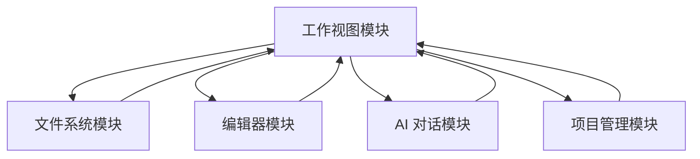

# 工作视图模块需求文档

## 📋 文档信息

- **模块名称**: Workspace View (工作视图)
- **版本**: 1.0.0
- **创建日期**: 2026-01-19
- **最后更新**: 2026-01-19
- **状态**: 📝 需求定义阶段
- **作者**: My-KM Team

---

## 🎯 模块概述

### 功能描述

工作视图模块是 My-KM 应用的核心工作区,为用户提供 VSCode 风格的三栏布局界面。用户进入项目后,在工作视图中进行文件浏览、内容编辑、AI 对话等核心操作。

### 核心价值

1. **VSCode 风格**: 熟悉的三栏布局,学习成本低
2. **高效工作流**: 文件浏览、编辑、AI 对话无缝集成
3. **灵活布局**: 支持多窗口拆分,适应不同工作场景
4. **AI 深度集成**: 上下文感知的智能对话,提升工作效率

### 与其他模块的关系



**依赖关系**:
- **依赖项目管理模块**: 需要获取当前项目信息
- **依赖文件系统模块**: 提供文件树和文件操作功能
- **依赖编辑器模块**: 显示和编辑文件内容
- **依赖 AI 对话模块**: 与 AI 进行交互

---

## 📖 功能模块清单

### 1. 布局结构模块

- **文档**: [./layout.md](./layout.md)
- **功能描述**: 定义工作视图的整体布局结构,包括三栏布局、面板尺寸、折叠展开等基础功能

**核心功能**:
- 三栏布局结构 (WV-FR-1)
- 左侧侧边栏 Tab 切换 (WV-FR-2)
- 底部用户操作区 (WV-FR-3)

---

### 2. 编辑器管理模块

- **文档**: [./editor.md](./editor.md)
- **功能描述**: 管理编辑器的 Tab、多窗口拆分、内容显示等功能

**核心功能**:
- 编辑器 Tab 管理 (WV-FR-4)
- 多窗口拆分 (WV-FR-5)
- 编辑器内容显示 (WV-FR-6)

---

### 3. AI 面板集成模块

- **文档**: [./ai-panel.md](./ai-panel.md)
- **功能描述**: 右侧 AI 对话面板及其上下文感知功能

**核心功能**:
- AI 对话界面 (WV-FR-7)
- AI 上下文感知 (WV-FR-8)
- AI 快捷操作 (WV-FR-9)

---

### 4. 交互体验模块

- **文档**: [./interaction.md](./interaction.md)
- **功能描述**: 键盘快捷键、面板折叠展开等交互功能

**核心功能**:
- 键盘快捷键 (WV-FR-10)
- 面板折叠和展开 (WV-FR-11)

---

## 📊 数据结构设计

### 工作区状态管理

```typescript
interface WorkspaceState {
  // 侧边栏状态
  sidebar: {
    activeTab: 'files' | 'search';  // 当前激活的 tab
    isCollapsed: boolean;            // 是否折叠
    width: number;                   // 宽度(px)
  };

  // 编辑器组状态
  editorGroups: EditorGroup[];

  // AI 面板状态
  aiPanel: {
    isCollapsed: boolean;            // 是否折叠
    width: number;                   // 宽度(px)
    conversationId?: string;         // 当前对话 ID
  };

  // 项目信息
  projectId: string;
  projectPath: string;
}

interface EditorGroup {
  id: string;                        // 编辑器组 ID
  editors: Editor[];
  activeIndex: number;               // 当前激活的编辑器索引
  layout: {
    direction: 'horizontal' | 'vertical';  // 拆分方向
    ratio: number;                   // 拆分比例(0-1)
  };
}

interface Editor {
  id: string;                        // 编辑器 ID
  fileId: string;                    // 文件 ID
  fileName: string;                  // 文件名
  fileType: 'markdown' | 'code' | 'text';
  isModified: boolean;               // 是否已修改
  isSelected: boolean;               // 是否选中
  selection?: {                      // 选中的文本
    text: string;
    startLine: number;
    endLine: number;
  };
}
```

---

### AI 上下文数据结构

```typescript
interface AIContext {
  // 项目上下文
  project: {
    id: string;
    name: string;
    config: AIConfig;  // 从 .my-km/ai.json 读取
  };

  // 当前文件上下文
  files: Array<{
    id: string;
    path: string;
    name: string;
    content: string;
    language: string;
  }>;

  // 选中文本上下文
  selection?: {
    text: string;
    file: {
      id: string;
      path: string;
      name: string;
    };
    range: {
      start: { line: number; column: number };
      end: { line: number; column: number };
    };
  };

  // 知识库检索结果
  knowledgeBase?: Array<{
    fileId: string;
    fileName: string;
    relevance: number;  // 相关性评分
    snippet: string;    // 相关片段
  }>;
}
```

---

## 🎨 UI/UX 设计要求

### 布局设计

```
┌─────────────────────────────────────────────────────────────────────────┐
│  My-KM                        项目名称                    [设置][用户]   │
├──────┬────────────────────────────────────────────────────────┬─────────┤
│      │ Tab1  Tab2  Tab3*                            Tab4      │         │
│ ┌────┴────────────────────────────────────────────────────────┬──┐      │
│ │                                                               │  │      │
│ │ ┌─────────────┬────────────────────────────────────────┐    │  │      │
│ │ │             │                                        │    │  │      │
│ │ │   Files     │         Editor Content                 │    │  │      │
│ │ │             │                                        │    │  │      │
│ │ │   Search    │                                        │    │  │      │
│ │ │             │                                        │    │  │      │
│ │ └─────────────┴────────────────────────────────────────┘    │  │      │
│ │                                                               │  │      │
│ └───────────────────────────────────────────────────────────────┴──┘      │
│                                                                       │     │
│  [设置]                                                     [折叠]    │     │
│  [用户]                                                    [AI对话]  │     │
└─────────────────────────────────────────────────────────────────────────┘
```

---

## 🚀 实施进度

### 待实现功能

#### Phase 1: 基础布局
详见: [./layout.md](./layout.md)

#### Phase 2: 编辑器功能
详见: [./editor.md](./editor.md)

#### Phase 3: AI 集成
详见: [./ai-panel.md](./ai-panel.md)

#### Phase 4: 交互优化
详见: [./interaction.md](./interaction.md)

---

## 📚 附录

### 术语表

| 术语 | 定义 |
|-----|-----|
| **工作视图** | 项目打开后的主界面,包含侧边栏、编辑区、AI 面板 |
| **编辑器组** | 一个或多个编辑器的集合,支持拆分 |
| **Tab** | 编辑器顶部显示的文件标签 |
| **拆分** | 将编辑器区域分为多个独立窗口 |
| **上下文感知** | AI 对话时自动获取相关的文件和选中文本 |

### 相关文档

- [项目管理模块](./project-management.md)
- [工作视图 - 布局结构](./layout.md)
- [工作视图 - 编辑器管理](./editor.md)
- [工作视图 - AI 面板](./ai-panel.md)
- [工作视图 - 交互体验](./interaction.md)
- [文件系统模块](./file-system.md) ⏳
- [编辑器模块](./editor.md) ⏳
- [AI 对话模块](./ai-chat.md) ⏳

---

## 📝 变更历史

| 版本 | 日期 | 变更说明 | 作者 |
|-----|------|---------|-----|
| 1.0.0 | 2026-01-19 | 初始版本,工作视图需求定义 | My-KM Team |

---

**文档状态**: ✅ 需求定义完成
**下一步**: 查看各子模块详细文档
