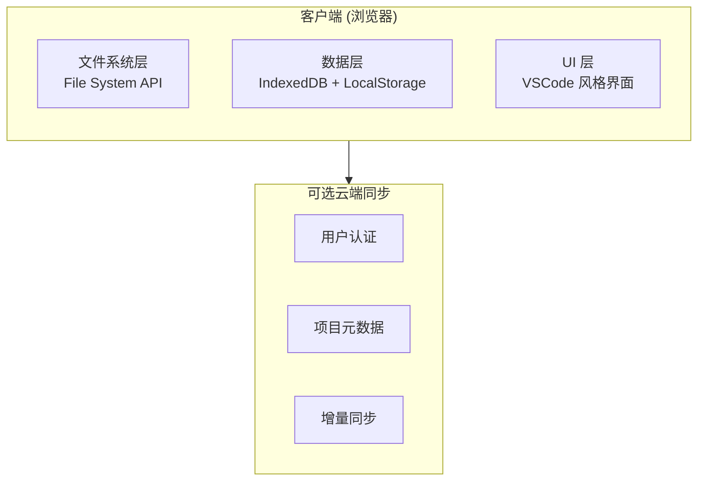
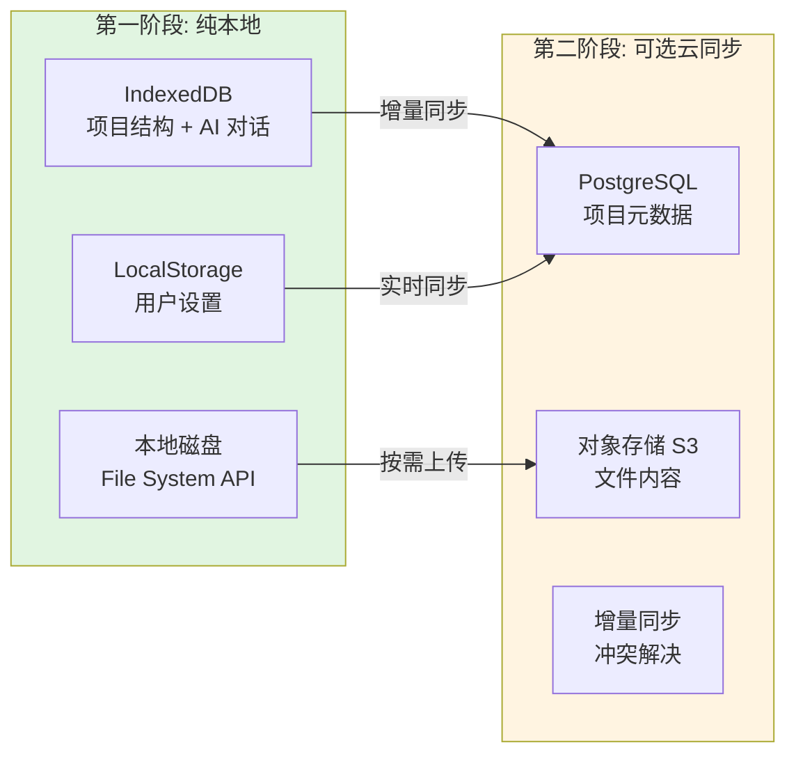
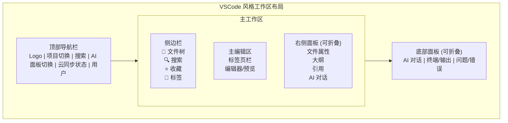
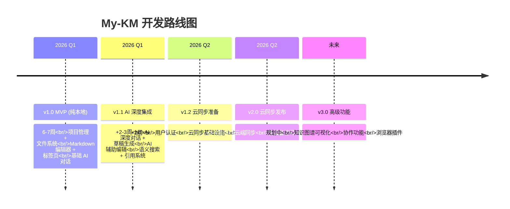
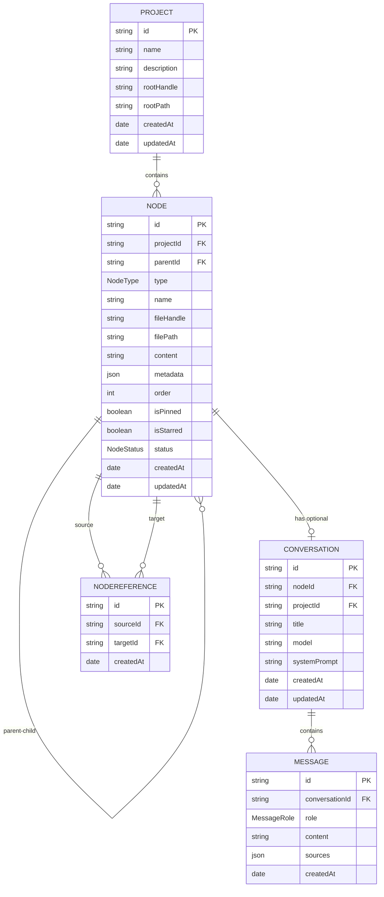
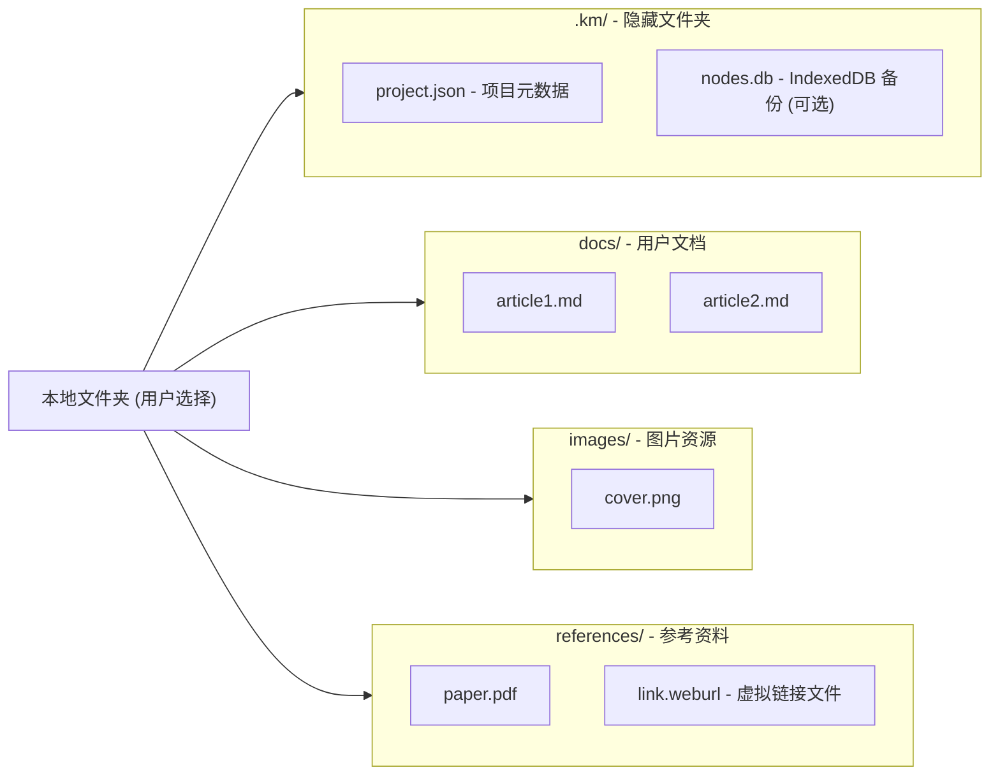

# 产品规格概览

## 📋 文档信息

- **版本**: 3.0.0
- **创建日期**: 2026-01-16
- **状态**: 规格定义阶段

---

## 🎯 产品定位

> **VSCode 风格的 AI 知识工作站**

像管理代码一样管理知识 - AI 深度对话 + 项目化组织 + 本地文件系统 + 云端同步

### 核心价值主张

- 🗂️ **VSCode 风格界面**：熟悉的文件树、标签页、可调整面板
- 💾 **本地优先存储**：所有数据存储在本地，完全掌控
- 🤖 **AI 深度集成**：AI 面板随时可用，智能辅助每一步
- ☁️ **云端可选同步**：数据可选择性同步到云端，多设备访问

### 目标用户

- **技术写作者/博主**：持续产出高质量技术内容
- **独立开发者/研究员**：深度研究和技术沉淀
- **知识工作者**：系统化管理专业知识

---

## 🏗️ 系统架构

### 本地优先架构



### 数据存储策略

#### 第一阶段：纯本地

| 数据类型 | 存储位置 | 说明 |
|---------|---------|------|
| 文件内容 | 本地磁盘 | 通过 File System API 直接管理 |
| 项目结构 | IndexedDB | Node 树结构、元数据 |
| 用户设置 | LocalStorage | UI 偏好、面板状态 |
| AI 对话 | IndexedDB | 对话历史、草稿 |

#### 第二阶段：云端同步（可选）

| 数据类型 | 云端存储 | 同步策略 |
|---------|---------|---------|
| 项目元数据 | PostgreSQL | 增量同步 |
| 文件内容 | 对象存储 (S3) | 按需上传 |
| AI 对话 | PostgreSQL | 增量同步 |
| 用户设置 | PostgreSQL | 实时同步 |

**关键设计原则**：
- 本地为主，云端为辅
- 用户完全控制是否启用云同步
- 云端同步可随时关闭，数据不受影响



## 📦 核心模块

### 1. 项目管理模块 ⭐

**功能概述**：
以项目为单位组织知识，每个项目对应一个本地文件夹。

**核心功能**：
- 创建/打开/关闭项目
- 项目元数据管理（名称、描述、标签）
- 本地文件夹选择和权限管理
- 项目状态管理（草稿、进行中、已完成）

**技术实现**：
- File System API 管理本地文件夹
- IndexedDB 存储项目结构
- 支持项目导入/导出

**详细规格**: [项目管理规格](./modules/project-management.md) ⏳

---

### 2. 文件系统模块 ⭐

**功能概述**：
VSCode 风格的文件树，支持多种文件类型和无限层级。

**核心功能**：
- 树形文件浏览器
- 文件/文件夹 CRUD 操作
- 拖拽移动和重排序
- 文件类型识别和图标
- 右键上下文菜单

**支持的文件类型**：
- 📄 文档类：Markdown (.md)、文本 (.txt)、PDF (.pdf)
- 🖼️ 媒体类：图片、视频、音频
- 💻 代码类：各种编程语言文件
- 🔗 虚拟节点：AI 对话、网页链接、白板

**详细规格**: [文件系统规格](./modules/file-system.md) ⏳

---

### 3. 编辑器模块 ⭐

**功能概述**：
多标签页编辑系统，支持多种编辑器类型和实时预览。

**核心功能**：
- 标签页管理（打开、关闭、拖拽排序）
- 多编辑器类型支持
- 实时预览和分屏模式
- 自动保存和版本历史
- 快捷键支持

**编辑器类型**：
- **Markdown 编辑器**：Lexial 编辑器，支持实时预览
- **文本编辑器**：纯文本编辑，代码高亮
- **代码编辑器**：Monaco Editor（可选）
- **预览器**：图片、PDF、网页链接

**详细规格**: [编辑器规格](./modules/editor.md) ⏳

---

### 4. AI 深度对话模块 🤖

**功能概述**：
可切换位置的 AI 面板，上下文感知的智能对话。

**核心功能**：
- 上下文感知对话
- 多轮对话和草稿生成
- 引用来源标注
- 节点级和项目级对话
- 对话历史管理

**AI 能力**：
- 基于本地文件的 RAG 检索
- 知识库问答
- 写作辅助（润色、扩写、缩写）
- 材料分析和逻辑梳理

**详细规格**: [AI 对话规格](./modules/ai-chat.md) ⏳

---

### 5. 引用系统模块 🔗

**功能概述**：
构建知识网络的双向链接系统。

**核心功能**：
- `[[节点名]]` 语法快速引用
- 双向链接显示
- 反向引用面板
- 引用关系可视化（v2.0）

**详细规格**: [引用系统规格](./modules/references.md) ⏳

---

### 6. 搜索模块 🔍

**功能概述**：
全局搜索和快速打开功能。

**核心功能**：
- 全局搜索 (Cmd/Ctrl + Shift + F)
- 快速打开 (Cmd/Ctrl + P)
- 关键词搜索
- 语义搜索（v1.1）
- 搜索结果高亮

**详细规格**: [搜索规格](./modules/search.md) ⏳

---

### 7. 工作区布局模块

**功能概述**：
可调整的三栏布局系统。

**核心功能**：
- 三栏布局（侧边栏、编辑器、右侧面板）
- 可拖拽调整大小
- 面板显示/隐藏切换
- 布局状态持久化
- AI 面板位置切换（底部/右侧）

**详细规格**: [工作区布局规格](./modules/workspace-layout.md) ⏳

---

### 8. 云同步模块 ☁️

**功能概述**：
可选的云端数据同步功能。

**核心功能**：
- 用户认证和授权
- 项目元数据同步
- 文件内容按需上传
- 增量同步和冲突解决
- 多设备访问

**同步策略**：
- 本地优先，云端辅助
- 用户控制同步范围
- 支持离线使用
- 智能冲突解决

**详细规格**: [云同步规格](./modules/cloud-sync.md) ⏳

---

## 🎨 UI/UX 设计

### 整体布局



### 设计原则

1. **VSCode 风格**：熟悉的界面和交互
2. **响应式设计**：适配不同屏幕尺寸
3. **性能优先**：流畅的动画和快速响应
4. **可访问性**：键盘导航和屏幕阅读器支持

---

## 🚀 开发路线

### 版本时间线



### 版本详情

#### v1.0 - MVP（第一阶段：纯本地）

**时间**：6-7 周

**核心功能**：
- ✅ 项目管理（本地文件夹）
- ✅ 文件系统（文件树、CRUD）
- ✅ Markdown 编辑器
- ✅ 标签页系统
- ✅ 基础 AI 对话（本地上下文）

**不包含**：
- ❌ 云端同步
- ❌ 用户认证
- ❌ 协作功能

---

#### v1.1 - AI 深度集成

**时间**：+2-3 周

**新增功能**：
- 🔥 AI 深度对话 + 草稿生成
- 🔥 AI 辅助编辑
- 🔍 语义搜索
- 🔗 引用系统（基础版）

---

#### v1.2 - 云同步准备

**时间**：+2 周

**新增功能**：
- 👤 用户认证
- ☁️ 云同步基础设施
- 📦 数据模型扩展
- 🔐 权限管理

---

#### v2.0 - 云同步发布

**时间**：+3-4 周

**新增功能**：
- ☁️ 云端同步
- 📱 多设备访问
- 🔄 冲突解决
- 💾 数据备份

---

#### v3.0 - 高级功能

**时间**：规划中

**新增功能**：
- 🔗 知识图谱可视化
- 👥 协作功能
- 🔌 浏览器插件
- 📊 数据统计

---

## 🗂️ 数据模型（第一阶段：纯本地）

### 本地存储结构

```typescript
// IndexedDB 存储结构
interface LocalDatabase {
  // 项目表
  projects: {
    id: string;
    name: string;
    description?: string;
    rootHandle: string; // 序列化的 FileSystemDirectoryHandle
    rootPath: string;
    createdAt: Date;
    updatedAt: Date;
  };

  // 节点表（文件系统树）
  nodes: {
    id: string;
    projectId: string;
    parentId: string | null;
    type: NodeType;
    name: string;
    fileHandle?: string; // 序列化的 FileSystemFileHandle
    filePath?: string;
    content?: string; // 虚拟节点内容
    metadata?: Json;
    order: number;
    isPinned: boolean;
    isStarred: boolean;
    status: NodeStatus;
    createdAt: Date;
    updatedAt: Date;
  };

  // AI 对话表
  conversations: {
    id: string;
    nodeId?: string;
    projectId?: string;
    title: string;
    model: string;
    systemPrompt?: string;
    createdAt: Date;
    updatedAt: Date;
  };

  // AI 消息表
  messages: {
    id: string;
    conversationId: string;
    role: 'USER' | 'ASSISTANT' | 'SYSTEM';
    content: string;
    sources?: Json;
    createdAt: Date;
  };

  // 引用关系表
  references: {
    id: string;
    sourceId: string;
    targetId: string;
    createdAt: Date;
  };
}

enum NodeType {
  FOLDER,         // 文件夹
  MARKDOWN,       // Markdown 文件
  TEXT,           // 文本文件
  PDF,            // PDF 文件
  IMAGE,          // 图片
  VIDEO,          // 视频
  CODE,           // 代码文件
  ARTICLE,        // 富文本文章（虚拟）
  WEB_LINK,       // 网页链接（虚拟）
  CHAT_SESSION,   // AI 对话（虚拟）
}

enum NodeStatus {
  ACTIVE,
  ARCHIVED,
  DELETED,
}
```

### 数据关系图



### 文件系统映射



---

## 🔐 隐私和安全

### 第一阶段：纯本地

- ✅ 所有数据存储在用户设备
- ✅ 无需网络连接即可使用
- ✅ 完全离线可用
- ✅ 用户完全掌控数据

### 第二阶段：云同步

- ✅ 可选择启用云同步
- ✅ 数据传输加密 (HTTPS/TLS)
- ✅ 数据存储加密
- ✅ 可随时删除云端数据
- ✅ 符合 GDPR 和数据保护法规

---

## 🌐 浏览器兼容性

### 核心功能

| 功能 | Chrome | Edge | Firefox | Safari | 说明 |
|-----|--------|------|---------|--------|------|
| File System API | ✅ 86+ | ✅ 86+ | ⚠️ 部分 | ⚠️ 部分 | 推荐使用 Chrome/Edge |
| IndexedDB | ✅ | ✅ | ✅ | ✅ | 全支持 |
| Service Worker | ✅ | ✅ | ✅ | ✅ | 全支持 |

### 降级方案

对于不支持 File System API 的浏览器：
- 使用传统文件上传/下载
- 文件存储在 IndexedDB（小文件）
- 提示用户使用推荐浏览器

---

## 📊 成功指标

### 技术指标

- File System API 权限成功率 > 95%
- 文件树加载时间 < 500ms（1000 节点）
- 编辑器响应延迟 < 50ms
- AI 响应首字时间 < 2s
- 云同步成功率 > 99%

### 用户指标（未来）

- 日活用户数（DAU）
- 用户留存率（次日、7日、30日）
- 平均每用户项目数量
- AI 对话使用频率
- 云同步启用率

---

## 📚 模块规格文档索引

- [项目管理规格](./modules/project-management.md) ⏳ 待创建
- [文件系统规格](./modules/file-system.md) ⏳ 待创建
- [编辑器规格](./modules/editor.md) ⏳ 待创建
- [AI 对话规格](./modules/ai-chat.md) ⏳ 待创建
- [引用系统规格](./modules/references.md) ⏳ 待创建
- [搜索规格](./modules/search.md) ⏳ 待创建
- [工作区布局规格](./modules/workspace-layout.md) ⏳ 待创建
- [云同步规格](./modules/cloud-sync.md) ⏳ 待创建

---

## 📝 变更历史

| 版本 | 日期 | 变更说明 |
|-----|------|---------|
| 3.0.0 | 2026-01-16 | 重新设计为 VSCode 风格，本地优先架构 |
| 2.0.0 | 2026-01-15 | 完整的功能说明和版本规划 |
| 1.0.0 | 2026-01-15 | 初始版本，产品愿景定义 |

---

## 🔗 相关文档

- [产品愿景](./product-vision.md)
- [功能说明](./features.md)
- [产品规划](./roadmap.md)
- [需求文档](./requirements.md)
