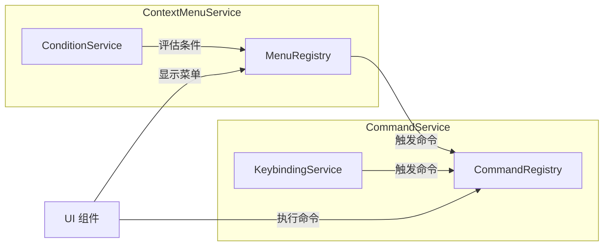

# 服务层架构设计文档

## 📋 文档信息

- **所属模块**: 前端服务层 (Frontend Services)
- **版本**: 1.0.0
- **创建日期**: 2026-01-23
- **状态**: 📝 架构设计阶段
- **作者**: My-KM Team

---

## 🎯 概述

本目录包含 My-KM 前端应用的核心服务层架构设计文档。服务层采用 **Service + Provider** 模式，将业务逻辑与 UI 组件解耦，提供可复用、可测试的核心功能。

### 设计原则

1. **声明式配置**: 通过配置声明功能，而非硬编码
2. **松耦合**: 服务之间通过接口通信，降低依赖
3. **可扩展**: 支持运行时动态注册/注销
4. **类型安全**: 完整的 TypeScript 类型定义
5. **可测试**: 服务层独立于 UI，易于单元测试

---

## 📚 文档目录

### 1. [右键菜单服务](./context-menu.md)

Context Menu Service - 全局右键菜单管理服务

- 菜单位置标识符 (Menu Location IDs)
- 声明式菜单项注册
- 条件表达式 (when clauses) 支持
- 分组排序机制
- 与命令服务的集成

### 2. [命令服务](./command-service.md)

Command Service - 全局命令注册与执行服务

- 命令定义与注册
- 命令执行上下文
- 快捷键绑定系统
- 命令面板集成
- 命令历史管理

### 3. [条件评估服务](./condition-service.md)

Condition Service - 通用条件表达式评估服务

- 表达式解析与求值
- 支持比较、逻辑、正则运算符
- 上下文变量访问
- 上下文提供者机制
- 用于菜单、命令的条件控制

---

## 🏗️ 架构概览

```
┌─────────────────────────────────────────────────────────────────┐
│                        UI 触发层                                 │
│  ┌──────────┐  ┌──────────┐  ┌──────────┐  ┌──────────────────┐ │
│  │ 右键菜单  │  │  快捷键   │  │ 命令面板  │  │  按钮/工具栏     │ │
│  └────┬─────┘  └────┬─────┘  └────┬─────┘  └────────┬─────────┘ │
└───────┼─────────────┼─────────────┼─────────────────┼───────────┘
        │             │             │                 │
        ▼             ▼             ▼                 ▼
┌─────────────────────────────────────────────────────────────────┐
│                      Provider 层                                 │
│  ┌──────────────────────┐  ┌──────────────────────────────────┐ │
│  │ ContextMenuProvider  │  │       CommandProvider            │ │
│  │ - 菜单状态管理        │  │  - 命令注册表                    │ │
│  │ - 菜单渲染           │  │  - 执行上下文                    │ │
│  └──────────┬───────────┘  └──────────────┬───────────────────┘ │
└─────────────┼──────────────────────────────┼────────────────────┘
              │                              │
              ▼                              ▼
┌─────────────────────────────────────────────────────────────────┐
│                       Service 层                                 │
│  ┌────────────────┐  ┌────────────────┐  ┌──────────────────┐  │
│  │ MenuRegistry   │  │CommandRegistry │  │ConditionService │  │
│  │ - 菜单注册     │  │ - 命令注册      │  │ - when 表达式   │  │
│  │ - 菜单查询     │  │ - 命令执行      │  │ - 条件评估      │  │
│  └────────────────┘  └────────────────┘  └──────────────────┘  │
│                                                                  │
│  ┌────────────────┐  ┌────────────────────────────────────────┐ │
│  │KeybindingService│ │         其他服务...                    │ │
│  │ - 快捷键绑定    │  │                                       │ │
│  │ - 快捷键触发    │  │                                       │ │
│  └────────────────┘  └────────────────────────────────────────┘ │
└─────────────────────────────────────────────────────────────────┘
```

---

## 🔗 服务间关系



---

## 📂 代码结构

```
apps/web/src/
├── lib/
│   ├── commands/                    # 命令服务
│   │   ├── index.ts                 # 导出入口
│   │   ├── command-registry.ts      # 命令注册表
│   │   ├── keybinding-service.ts    # 快捷键服务
│   │   └── contributions/           # 命令贡献
│   │       ├── index.ts
│   │       ├── files.ts             # 文件相关命令
│   │       ├── editor.ts            # 编辑器相关命令
│   │       └── workspace.ts         # 工作区相关命令
│   │
│   └── context-menu/                # 右键菜单服务
│       ├── index.ts                 # 导出入口
│       ├── menu-registry.ts         # 菜单注册表
│       ├── condition-service.ts     # 条件评估服务
│       └── contributions/           # 菜单贡献
│           ├── index.ts
│           ├── files-panel.ts       # 文件面板菜单
│           ├── editor-tab.ts        # 编辑器 Tab 菜单
│           └── sidebar-tab.ts       # 侧边栏 Tab 菜单
│
├── components/
│   ├── ui/
│   │   └── context-menu.tsx         # Context Menu UI 组件
│   └── providers/
│       ├── command-provider.tsx     # 命令服务 Provider
│       └── context-menu-provider.tsx # 右键菜单 Provider
│
├── hooks/
│   ├── use-command.ts               # 命令 Hook
│   └── use-context-menu.ts          # 右键菜单 Hook
│
└── types/
    ├── command.ts                   # 命令类型定义
    └── context-menu.ts              # 菜单类型定义
```

---

## 🚀 快速开始

### 注册命令

```typescript
import { commandRegistry } from '@/lib/commands';

commandRegistry.register({
  id: 'files.newFile',
  title: '新建文件',
  category: 'files',
  handler: async (ctx) => {
    // 创建新文件的逻辑
  },
});
```

### 注册菜单项

```typescript
import { menuRegistry } from '@/lib/context-menu';

menuRegistry.register('files-panel.background', {
  id: 'newFile',
  command: 'files.newFile',
  label: '新建文件',
  icon: 'FilePlus',
  group: '1_create',
  order: 1,
});
```

### 在组件中使用

```tsx
import { useContextMenu } from '@/hooks/use-context-menu';

function FilesPanel() {
  const { showMenu } = useContextMenu();
  
  const handleContextMenu = (e: React.MouseEvent) => {
    e.preventDefault();
    showMenu('files-panel.background', {}, e);
  };
  
  return <div onContextMenu={handleContextMenu}>...</div>;
}
```

---

## 📚 相关文档

- [Sidebar 架构设计](../modules/sidebar/architecture.md)
- [工作视图模块](../modules/workspace-view/workspace-view.md)
- [前端技术栈](../../technical/frontend-tech-stack.md)

---

## 📝 变更历史

| 版本 | 日期 | 变更说明 | 作者 |
|-----|------|---------|-----|
| 1.0.0 | 2026-01-23 | 初始版本，创建服务层文档结构 | My-KM Team |

---

**文档状态**: ✅ 初始版本完成
