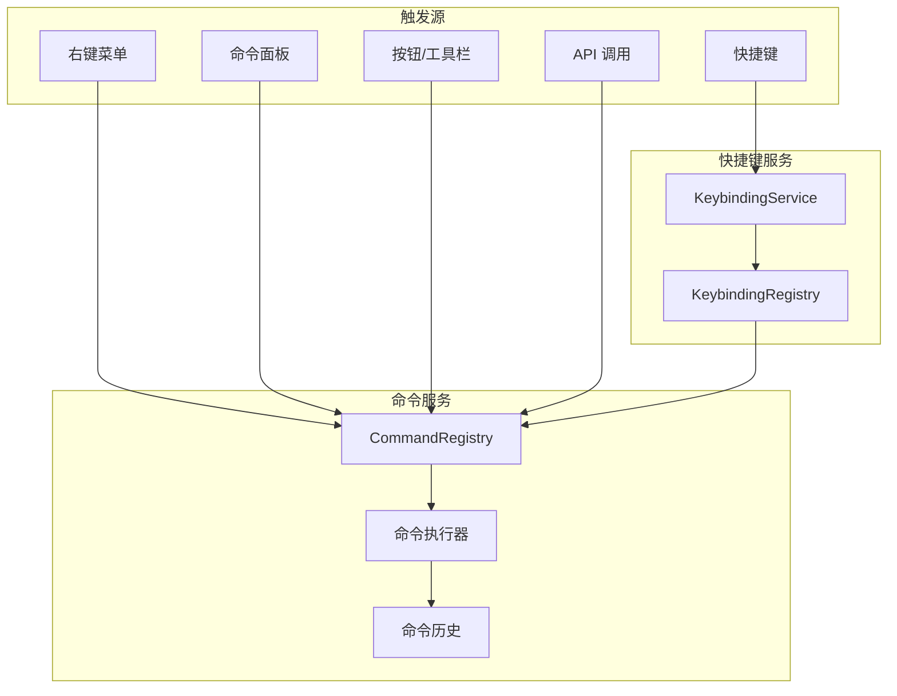
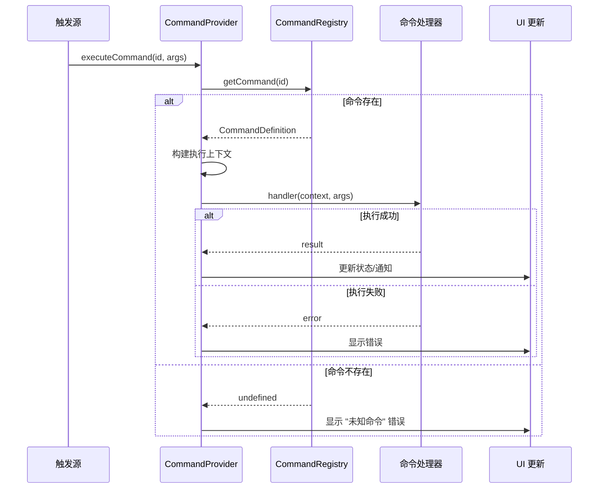

# 命令服务架构设计

## 📋 文档信息

- **服务名称**: Command Service (命令服务)
- **版本**: 1.0.0
- **创建日期**: 2026-01-23
- **状态**: 📝 架构设计阶段
- **作者**: My-KM Team

---

## 🎯 概述

### 功能描述

Command Service 是一个全局命令注册与执行服务，参考 VSCode 的 Commands API 设计。该服务是应用中所有可执行操作的中心枢纽，支持：

- **统一命令注册**: 所有可执行操作通过命令系统注册
- **多触发方式**: 支持右键菜单、快捷键、命令面板、按钮等多种触发方式
- **执行上下文**: 命令执行时携带上下文信息
- **命令历史**: 支持撤销/重做 (可选)
- **类型安全**: 完整的 TypeScript 类型定义

### 核心价值

1. **解耦**: UI 与业务逻辑分离，通过命令 ID 关联
2. **复用**: 同一命令可在多处触发
3. **可扩展**: 支持动态注册/注销命令
4. **可发现**: 通过命令面板发现所有可用命令

### 与其他服务的关系



---

## 📐 架构设计

### 整体架构

```
┌─────────────────────────────────────────────────────────────────┐
│                      触发层                                      │
│  ┌──────────┐ ┌──────────┐ ┌──────────┐ ┌──────────┐ ┌────────┐ │
│  │ 右键菜单  │ │ 快捷键   │ │ 命令面板  │ │ 工具栏   │ │ API    │ │
│  └────┬─────┘ └────┬─────┘ └────┬─────┘ └────┬─────┘ └───┬────┘ │
└───────┼────────────┼────────────┼────────────┼───────────┼──────┘
        │            │            │            │           │
        └────────────┴────────────┴────────────┴───────────┘
                                  │
                                  ▼
┌─────────────────────────────────────────────────────────────────┐
│                    CommandProvider                               │
│  ┌────────────────────────────────────────────────────────────┐ │
│  │ - 提供 React Context                                        │ │
│  │ - 管理命令执行状态                                           │ │
│  │ - 错误处理和通知                                             │ │
│  └────────────────────────────────────────────────────────────┘ │
└───────────────────────────┬─────────────────────────────────────┘
                            │
                            ▼
┌─────────────────────────────────────────────────────────────────┐
│                      Service 层                                  │
│                                                                  │
│  ┌─────────────────────────────────────────────────────────────┐│
│  │                   CommandRegistry                            ││
│  │  ┌─────────────┐  ┌─────────────┐  ┌─────────────────────┐  ││
│  │  │ 命令注册表   │  │ 命令执行器   │  │ 命令历史 (可选)      │  ││
│  │  │             │  │             │  │                     │  ││
│  │  │ Map<id,cmd> │  │ execute()   │  │ undo() / redo()     │  ││
│  │  └─────────────┘  └─────────────┘  └─────────────────────┘  ││
│  └─────────────────────────────────────────────────────────────┘│
│                                                                  │
│  ┌─────────────────────────────────────────────────────────────┐│
│  │                  KeybindingService                           ││
│  │  ┌─────────────┐  ┌─────────────┐  ┌─────────────────────┐  ││
│  │  │ 快捷键注册表 │  │ 快捷键监听   │  │ 冲突检测            │  ││
│  │  └─────────────┘  └─────────────┘  └─────────────────────┘  ││
│  └─────────────────────────────────────────────────────────────┘│
└─────────────────────────────────────────────────────────────────┘
```

### 命令执行流程



---

## 📊 类型定义

### 命令定义

```typescript
/**
 * 命令定义接口
 */
export interface CommandDefinition<TArgs = unknown, TResult = void> {
  /** 命令唯一标识符，格式: category.action */
  id: string;
  
  /** 命令标题 (用于命令面板显示) */
  title: string;
  
  /** 命令分类 */
  category: CommandCategory;
  
  /** 命令描述 (可选，用于命令面板) */
  description?: string;
  
  /** 命令图标 (Lucide 图标名称) */
  icon?: string;
  
  /**
   * 命令处理函数
   * @param context 执行上下文
   * @param args 命令参数
   * @returns 执行结果
   */
  handler: (context: CommandContext, args?: TArgs) => TResult | Promise<TResult>;
  
  /**
   * 条件表达式
   * 当条件为 true 时命令可执行，否则禁用
   */
  when?: string;
  
  /**
   * 是否支持撤销
   * 如果为 true，需要提供 undo 函数
   */
  undoable?: boolean;
  
  /**
   * 撤销函数 (可选)
   */
  undo?: (context: CommandContext, args?: TArgs) => void | Promise<void>;
}

/**
 * 命令分类
 */
export type CommandCategory =
  | 'files'        // 文件操作
  | 'editor'       // 编辑器操作
  | 'workspace'    // 工作区操作
  | 'sidebar'      // 侧边栏操作
  | 'ai'           // AI 相关
  | 'view'         // 视图操作
  | 'preferences'  // 设置/偏好
  | 'help'         // 帮助
  | string;        // 可扩展
```

### 执行上下文

```typescript
/**
 * 命令执行上下文
 * 包含命令执行时的环境信息
 */
export interface CommandContext {
  /** 触发来源 */
  source: CommandSource;
  
  /** 当前活动编辑器信息 */
  activeEditor?: {
    id: string;
    path: string;
    content?: string;
    selection?: {
      start: { line: number; column: number };
      end: { line: number; column: number };
      text: string;
    };
  };
  
  /** 当前活动文件信息 */
  activeFile?: {
    id: string;
    name: string;
    path: string;
    extension: string;
  };
  
  /** 右键菜单上下文 (如果从菜单触发) */
  menuContext?: MenuContext;
  
  /** 扩展属性 */
  [key: string]: unknown;
}

/**
 * 命令触发来源
 */
export type CommandSource =
  | 'menu'           // 右键菜单
  | 'keybinding'     // 快捷键
  | 'palette'        // 命令面板
  | 'toolbar'        // 工具栏
  | 'api';           // API 调用
```

### 快捷键绑定

```typescript
/**
 * 快捷键绑定定义
 */
export interface KeybindingDefinition {
  /** 关联的命令 ID */
  command: string;
  
  /** 
   * 快捷键
   * 格式: Modifier+Key, 如 "Ctrl+S", "Ctrl+Shift+P"
   * 支持的修饰键: Ctrl, Shift, Alt, Meta (Mac 上的 Cmd)
   */
  key: string;
  
  /** Mac 专用快捷键 (可选) */
  mac?: string;
  
  /** 
   * 条件表达式
   * 快捷键只在条件满足时生效
   */
  when?: string;
  
  /** 命令参数 (可选) */
  args?: unknown;
}

/**
 * 解析后的快捷键
 */
export interface ParsedKeybinding {
  ctrl: boolean;
  shift: boolean;
  alt: boolean;
  meta: boolean;
  key: string;  // 主键，如 'S', 'P', 'F2', 'Delete'
}
```

### 命令面板

```typescript
/**
 * 命令面板项
 */
export interface CommandPaletteItem {
  /** 命令 ID */
  id: string;
  
  /** 显示标题 */
  title: string;
  
  /** 分类标签 */
  category: string;
  
  /** 描述 */
  description?: string;
  
  /** 图标 */
  icon?: string;
  
  /** 快捷键 (用于显示) */
  keybinding?: string;
  
  /** 是否禁用 */
  disabled: boolean;
  
  /** 最近使用时间 (用于排序) */
  lastUsed?: number;
}
```

---

## 🔧 服务实现

### CommandRegistry

```typescript
/**
 * 命令注册表
 * 管理所有命令的注册和执行
 */
class CommandRegistry {
  private static instance: CommandRegistry;
  private commands: Map<string, CommandDefinition> = new Map();
  private listeners: Set<() => void> = new Set();
  
  static getInstance(): CommandRegistry {
    if (!CommandRegistry.instance) {
      CommandRegistry.instance = new CommandRegistry();
    }
    return CommandRegistry.instance;
  }
  
  /**
   * 注册命令
   * @returns 注销函数
   */
  register<TArgs = unknown, TResult = void>(
    command: CommandDefinition<TArgs, TResult>
  ): () => void {
    if (this.commands.has(command.id)) {
      console.warn(`Command "${command.id}" is already registered. Overwriting.`);
    }
    
    this.commands.set(command.id, command as CommandDefinition);
    this.notifyListeners();
    
    return () => this.unregister(command.id);
  }
  
  /**
   * 批量注册命令
   */
  registerMany(commands: CommandDefinition[]): () => void {
    const disposables = commands.map(cmd => this.register(cmd));
    return () => disposables.forEach(dispose => dispose());
  }
  
  /**
   * 注销命令
   */
  unregister(commandId: string): void {
    this.commands.delete(commandId);
    this.notifyListeners();
  }
  
  /**
   * 获取命令定义
   */
  getCommand(commandId: string): CommandDefinition | undefined {
    return this.commands.get(commandId);
  }
  
  /**
   * 检查命令是否存在
   */
  hasCommand(commandId: string): boolean {
    return this.commands.has(commandId);
  }
  
  /**
   * 获取所有命令 (用于命令面板)
   */
  getAllCommands(): CommandDefinition[] {
    return Array.from(this.commands.values());
  }
  
  /**
   * 按分类获取命令
   */
  getCommandsByCategory(category: CommandCategory): CommandDefinition[] {
    return this.getAllCommands().filter(cmd => cmd.category === category);
  }
  
  /**
   * 执行命令
   */
  async execute<TArgs = unknown, TResult = void>(
    commandId: string,
    context: CommandContext,
    args?: TArgs
  ): Promise<TResult> {
    const command = this.commands.get(commandId);
    
    if (!command) {
      throw new Error(`Command "${commandId}" not found`);
    }
    
    // 评估条件
    if (command.when) {
      const canExecute = conditionService.evaluate(command.when, context);
      if (!canExecute) {
        throw new Error(`Command "${commandId}" is disabled in current context`);
      }
    }
    
    try {
      return await command.handler(context, args) as TResult;
    } catch (error) {
      console.error(`Error executing command "${commandId}":`, error);
      throw error;
    }
  }
  
  /**
   * 订阅命令注册表变更
   */
  subscribe(listener: () => void): () => void {
    this.listeners.add(listener);
    return () => this.listeners.delete(listener);
  }
  
  private notifyListeners(): void {
    this.listeners.forEach(listener => listener());
  }
}

export const commandRegistry = CommandRegistry.getInstance();
```

### KeybindingService

```typescript
/**
 * 快捷键服务
 * 管理快捷键绑定和触发
 */
class KeybindingService {
  private static instance: KeybindingService;
  private keybindings: Map<string, KeybindingDefinition[]> = new Map();
  private enabled: boolean = true;
  
  static getInstance(): KeybindingService {
    if (!KeybindingService.instance) {
      KeybindingService.instance = new KeybindingService();
    }
    return KeybindingService.instance;
  }
  
  /**
   * 初始化键盘事件监听
   */
  initialize(): void {
    if (typeof window === 'undefined') return;
    
    window.addEventListener('keydown', this.handleKeyDown.bind(this));
  }
  
  /**
   * 销毁监听器
   */
  destroy(): void {
    if (typeof window === 'undefined') return;
    
    window.removeEventListener('keydown', this.handleKeyDown.bind(this));
  }
  
  /**
   * 注册快捷键绑定
   */
  register(keybinding: KeybindingDefinition): () => void {
    const key = this.normalizeKey(keybinding.key);
    const existing = this.keybindings.get(key) || [];
    existing.push(keybinding);
    this.keybindings.set(key, existing);
    
    return () => this.unregister(keybinding);
  }
  
  /**
   * 批量注册快捷键
   */
  registerMany(keybindings: KeybindingDefinition[]): () => void {
    const disposables = keybindings.map(kb => this.register(kb));
    return () => disposables.forEach(dispose => dispose());
  }
  
  /**
   * 注销快捷键
   */
  unregister(keybinding: KeybindingDefinition): void {
    const key = this.normalizeKey(keybinding.key);
    const existing = this.keybindings.get(key);
    if (existing) {
      const filtered = existing.filter(kb => kb.command !== keybinding.command);
      if (filtered.length > 0) {
        this.keybindings.set(key, filtered);
      } else {
        this.keybindings.delete(key);
      }
    }
  }
  
  /**
   * 获取命令的快捷键 (用于显示)
   */
  getKeybindingForCommand(commandId: string): string | undefined {
    for (const [, keybindings] of this.keybindings) {
      const found = keybindings.find(kb => kb.command === commandId);
      if (found) {
        return this.isMac() && found.mac ? found.mac : found.key;
      }
    }
    return undefined;
  }
  
  /**
   * 启用/禁用快捷键
   */
  setEnabled(enabled: boolean): void {
    this.enabled = enabled;
  }
  
  private handleKeyDown(event: KeyboardEvent): void {
    if (!this.enabled) return;
    
    // 忽略输入框中的快捷键 (除了特定的全局快捷键)
    const target = event.target as HTMLElement;
    const isInputField = 
      target.tagName === 'INPUT' ||
      target.tagName === 'TEXTAREA' ||
      target.isContentEditable;
    
    const pressed = this.parseKeyEvent(event);
    const key = this.formatKeybinding(pressed);
    
    const keybindings = this.keybindings.get(key);
    if (!keybindings || keybindings.length === 0) return;
    
    // 查找匹配的快捷键绑定
    const context = this.getCurrentContext();
    
    for (const keybinding of keybindings) {
      // 检查条件
      if (keybinding.when) {
        const canExecute = conditionService.evaluate(keybinding.when, context);
        if (!canExecute) continue;
      }
      
      // 如果在输入框中，只处理全局快捷键
      if (isInputField && !this.isGlobalKeybinding(keybinding)) {
        continue;
      }
      
      // 阻止默认行为并执行命令
      event.preventDefault();
      event.stopPropagation();
      
      commandRegistry.execute(keybinding.command, {
        ...context,
        source: 'keybinding',
      }, keybinding.args);
      
      return;
    }
  }
  
  private parseKeyEvent(event: KeyboardEvent): ParsedKeybinding {
    return {
      ctrl: event.ctrlKey,
      shift: event.shiftKey,
      alt: event.altKey,
      meta: event.metaKey,
      key: event.key.length === 1 ? event.key.toUpperCase() : event.key,
    };
  }
  
  private formatKeybinding(parsed: ParsedKeybinding): string {
    const parts: string[] = [];
    if (parsed.ctrl) parts.push('Ctrl');
    if (parsed.shift) parts.push('Shift');
    if (parsed.alt) parts.push('Alt');
    if (parsed.meta) parts.push('Meta');
    parts.push(parsed.key);
    return parts.join('+');
  }
  
  private normalizeKey(key: string): string {
    // 标准化快捷键格式
    return key
      .split('+')
      .map(part => part.trim())
      .map(part => {
        const lower = part.toLowerCase();
        if (lower === 'ctrl' || lower === 'control') return 'Ctrl';
        if (lower === 'shift') return 'Shift';
        if (lower === 'alt' || lower === 'option') return 'Alt';
        if (lower === 'meta' || lower === 'cmd' || lower === 'command') return 'Meta';
        return part.length === 1 ? part.toUpperCase() : part;
      })
      .sort((a, b) => {
        // 修饰键排在前面
        const order = ['Ctrl', 'Shift', 'Alt', 'Meta'];
        const aIndex = order.indexOf(a);
        const bIndex = order.indexOf(b);
        if (aIndex !== -1 && bIndex !== -1) return aIndex - bIndex;
        if (aIndex !== -1) return -1;
        if (bIndex !== -1) return 1;
        return 0;
      })
      .join('+');
  }
  
  private isMac(): boolean {
    if (typeof navigator === 'undefined') return false;
    return /Mac|iPod|iPhone|iPad/.test(navigator.platform);
  }
  
  private isGlobalKeybinding(keybinding: KeybindingDefinition): boolean {
    // 定义哪些快捷键是全局的 (即使在输入框中也生效)
    const globalCommands = [
      'editor.save',
      'workspace.toggleCommandPalette',
      'workspace.toggleSearch',
    ];
    return globalCommands.includes(keybinding.command);
  }
  
  private getCurrentContext(): CommandContext {
    // 获取当前上下文 (可以扩展)
    return {
      source: 'keybinding',
    };
  }
}

export const keybindingService = KeybindingService.getInstance();
```

---

## 🎨 React 集成

### CommandProvider

```typescript
'use client';

import { createContext, useContext, useCallback, useEffect, useMemo } from 'react';
import { commandRegistry } from '@/lib/commands/command-registry';
import { keybindingService } from '@/lib/commands/keybinding-service';
import { toast } from 'sonner';
import type { CommandContext, CommandSource } from '@/types/command';

interface CommandContextValue {
  executeCommand: <TArgs = unknown, TResult = void>(
    commandId: string,
    args?: TArgs,
    source?: CommandSource
  ) => Promise<TResult>;
  hasCommand: (commandId: string) => boolean;
  getAllCommands: () => CommandDefinition[];
}

const CommandContext = createContext<CommandContextValue | null>(null);

export function CommandProvider({ children }: { children: React.ReactNode }) {
  // 初始化快捷键服务
  useEffect(() => {
    keybindingService.initialize();
    return () => keybindingService.destroy();
  }, []);
  
  const executeCommand = useCallback(async <TArgs = unknown, TResult = void>(
    commandId: string,
    args?: TArgs,
    source: CommandSource = 'api'
  ): Promise<TResult> => {
    try {
      const context: CommandContext = {
        source,
        // 可以添加更多上下文信息
        activeEditor: getActiveEditorInfo(),
        activeFile: getActiveFileInfo(),
      };
      
      return await commandRegistry.execute<TArgs, TResult>(commandId, context, args);
    } catch (error) {
      const message = error instanceof Error ? error.message : '命令执行失败';
      toast.error(message);
      throw error;
    }
  }, []);
  
  const hasCommand = useCallback((commandId: string): boolean => {
    return commandRegistry.hasCommand(commandId);
  }, []);
  
  const getAllCommands = useCallback((): CommandDefinition[] => {
    return commandRegistry.getAllCommands();
  }, []);
  
  const value = useMemo(() => ({
    executeCommand,
    hasCommand,
    getAllCommands,
  }), [executeCommand, hasCommand, getAllCommands]);
  
  return (
    <CommandContext.Provider value={value}>
      {children}
    </CommandContext.Provider>
  );
}

export function useCommand(): CommandContextValue {
  const context = useContext(CommandContext);
  if (!context) {
    throw new Error('useCommand must be used within CommandProvider');
  }
  return context;
}

/**
 * Hook: 注册命令
 * 在组件挂载时注册，卸载时自动注销
 */
export function useRegisterCommand(command: CommandDefinition): void {
  useEffect(() => {
    return commandRegistry.register(command);
  }, [command]);
}

/**
 * Hook: 注册快捷键
 */
export function useRegisterKeybinding(keybinding: KeybindingDefinition): void {
  useEffect(() => {
    return keybindingService.register(keybinding);
  }, [keybinding]);
}
```

### 命令面板组件

```typescript
'use client';

import { useState, useMemo, useCallback } from 'react';
import { Command } from 'cmdk';
import { useCommand } from '@/components/providers/command-provider';
import { keybindingService } from '@/lib/commands/keybinding-service';
import { conditionService } from '@/lib/context-menu/condition-service';
import { DynamicIcon } from '@/components/ui/dynamic-icon';
import type { CommandPaletteItem } from '@/types/command';

interface CommandPaletteProps {
  open: boolean;
  onOpenChange: (open: boolean) => void;
}

export function CommandPalette({ open, onOpenChange }: CommandPaletteProps) {
  const { getAllCommands, executeCommand } = useCommand();
  const [search, setSearch] = useState('');
  
  const items = useMemo((): CommandPaletteItem[] => {
    const commands = getAllCommands();
    const context = { source: 'palette' as const };
    
    return commands
      .filter(cmd => {
        // 过滤掉禁用的命令
        if (cmd.when) {
          return conditionService.evaluate(cmd.when, context);
        }
        return true;
      })
      .map(cmd => ({
        id: cmd.id,
        title: cmd.title,
        category: cmd.category,
        description: cmd.description,
        icon: cmd.icon,
        keybinding: keybindingService.getKeybindingForCommand(cmd.id),
        disabled: false,
      }));
  }, [getAllCommands]);
  
  const handleSelect = useCallback(async (commandId: string) => {
    onOpenChange(false);
    await executeCommand(commandId, undefined, 'palette');
  }, [executeCommand, onOpenChange]);
  
  return (
    <Command.Dialog
      open={open}
      onOpenChange={onOpenChange}
      label="命令面板"
    >
      <Command.Input
        value={search}
        onValueChange={setSearch}
        placeholder="输入命令..."
      />
      
      <Command.List>
        <Command.Empty>未找到命令</Command.Empty>
        
        {items.map(item => (
          <Command.Item
            key={item.id}
            value={`${item.category} ${item.title}`}
            onSelect={() => handleSelect(item.id)}
          >
            {item.icon && <DynamicIcon name={item.icon} className="mr-2 h-4 w-4" />}
            <span>{item.title}</span>
            {item.keybinding && (
              <span className="ml-auto text-muted-foreground text-xs">
                {item.keybinding}
              </span>
            )}
          </Command.Item>
        ))}
      </Command.List>
    </Command.Dialog>
  );
}
```

---

## 📋 预定义命令配置

### 命令命名规范

参考 VSCode 命名规范：

- **格式**: `{category}.{action}`
- **分类**: 使用小写字母，表示命令所属的功能模块
- **动作**: 使用驼峰命名，描述具体操作

```
files.newFile          ✓ 正确
files.new-file         ✗ 避免短横线
createNewFile          ✗ 缺少分类
```

### 文件操作命令

```typescript
// lib/commands/contributions/files.ts

export const filesCommands: CommandDefinition[] = [
  {
    id: 'files.newFile',
    title: '新建文件',
    category: 'files',
    icon: 'FilePlus',
    handler: async (context) => {
      // 获取目标文件夹
      const targetFolder = context.menuContext?.target?.path || '/';
      // 实现新建文件逻辑
      await createFile(targetFolder);
    },
  },
  {
    id: 'files.newFolder',
    title: '新建文件夹',
    category: 'files',
    icon: 'FolderPlus',
    handler: async (context) => {
      const targetFolder = context.menuContext?.target?.path || '/';
      await createFolder(targetFolder);
    },
  },
  {
    id: 'files.open',
    title: '打开文件',
    category: 'files',
    icon: 'FileText',
    handler: async (context) => {
      const file = context.menuContext?.target;
      if (file) {
        await openFile(file.path);
      }
    },
  },
  {
    id: 'files.rename',
    title: '重命名',
    category: 'files',
    icon: 'Pencil',
    handler: async (context) => {
      const file = context.menuContext?.target;
      if (file) {
        await renameFile(file.path);
      }
    },
    undoable: true,
    undo: async (context) => {
      // 实现撤销重命名
    },
  },
  {
    id: 'files.delete',
    title: '删除',
    category: 'files',
    icon: 'Trash2',
    handler: async (context) => {
      const file = context.menuContext?.target;
      if (file) {
        await deleteFile(file.path);
      }
    },
    undoable: true,
  },
  {
    id: 'files.copy',
    title: '复制',
    category: 'files',
    icon: 'Copy',
    handler: async (context) => {
      const file = context.menuContext?.target;
      if (file) {
        await copyToClipboard(file.path);
      }
    },
  },
  {
    id: 'files.cut',
    title: '剪切',
    category: 'files',
    icon: 'Scissors',
    handler: async (context) => {
      const file = context.menuContext?.target;
      if (file) {
        await cutToClipboard(file.path);
      }
    },
  },
  {
    id: 'files.paste',
    title: '粘贴',
    category: 'files',
    icon: 'Clipboard',
    handler: async (context) => {
      const targetFolder = context.menuContext?.target?.path || '/';
      await pasteFromClipboard(targetFolder);
    },
    when: 'clipboard.hasFiles',
  },
  {
    id: 'files.copyPath',
    title: '复制路径',
    category: 'files',
    icon: 'Link',
    handler: async (context) => {
      const file = context.menuContext?.target;
      if (file) {
        await navigator.clipboard.writeText(file.path);
        toast.success('路径已复制');
      }
    },
  },
  {
    id: 'files.refresh',
    title: '刷新',
    category: 'files',
    icon: 'RefreshCw',
    handler: async () => {
      await refreshFileTree();
    },
  },
];
```

### 编辑器操作命令

```typescript
// lib/commands/contributions/editor.ts

export const editorCommands: CommandDefinition[] = [
  {
    id: 'editor.save',
    title: '保存',
    category: 'editor',
    icon: 'Save',
    handler: async (context) => {
      const editor = context.activeEditor;
      if (editor) {
        await saveFile(editor.path);
      }
    },
  },
  {
    id: 'editor.saveAll',
    title: '保存全部',
    category: 'editor',
    icon: 'SaveAll',
    handler: async () => {
      await saveAllFiles();
    },
  },
  {
    id: 'editor.closeTab',
    title: '关闭标签页',
    category: 'editor',
    icon: 'X',
    handler: async (context) => {
      const tab = context.menuContext?.target;
      if (tab) {
        await closeTab(tab.id);
      }
    },
  },
  {
    id: 'editor.closeOtherTabs',
    title: '关闭其他标签页',
    category: 'editor',
    handler: async (context) => {
      const tab = context.menuContext?.target;
      if (tab) {
        await closeOtherTabs(tab.id);
      }
    },
    when: 'openTabsCount > 1',
  },
  {
    id: 'editor.closeAllTabs',
    title: '关闭所有标签页',
    category: 'editor',
    handler: async () => {
      await closeAllTabs();
    },
  },
  {
    id: 'editor.closeTabsToRight',
    title: '关闭右侧标签页',
    category: 'editor',
    handler: async (context) => {
      const tabIndex = context.menuContext?.tabIndex;
      if (tabIndex !== undefined) {
        await closeTabsToRight(tabIndex);
      }
    },
    when: 'hasTabsToRight',
  },
  {
    id: 'editor.pinTab',
    title: '固定标签页',
    category: 'editor',
    icon: 'Pin',
    handler: async (context) => {
      const tab = context.menuContext?.target;
      if (tab) {
        await pinTab(tab.id);
      }
    },
    when: '!target.isPinned',
  },
  {
    id: 'editor.unpinTab',
    title: '取消固定',
    category: 'editor',
    icon: 'PinOff',
    handler: async (context) => {
      const tab = context.menuContext?.target;
      if (tab) {
        await unpinTab(tab.id);
      }
    },
    when: 'target.isPinned',
  },
];
```

### 工作区操作命令

```typescript
// lib/commands/contributions/workspace.ts

export const workspaceCommands: CommandDefinition[] = [
  {
    id: 'workspace.toggleSidebar',
    title: '切换侧边栏',
    category: 'workspace',
    icon: 'PanelLeft',
    handler: async () => {
      useWorkspaceStore.getState().toggleSidebar();
    },
  },
  {
    id: 'workspace.toggleAIPanel',
    title: '切换 AI 面板',
    category: 'workspace',
    icon: 'Bot',
    handler: async () => {
      useWorkspaceStore.getState().toggleAIPanel();
    },
  },
  {
    id: 'workspace.toggleCommandPalette',
    title: '打开命令面板',
    category: 'workspace',
    icon: 'Command',
    handler: async () => {
      // 打开命令面板
      openCommandPalette();
    },
  },
  {
    id: 'workspace.toggleSearch',
    title: '全局搜索',
    category: 'workspace',
    icon: 'Search',
    handler: async () => {
      openGlobalSearch();
    },
  },
];
```

### 预定义快捷键

```typescript
// lib/commands/contributions/keybindings.ts

export const defaultKeybindings: KeybindingDefinition[] = [
  // 文件操作
  { command: 'files.newFile', key: 'Ctrl+N', mac: 'Cmd+N' },
  { command: 'files.newFolder', key: 'Ctrl+Shift+N', mac: 'Cmd+Shift+N' },
  { command: 'files.rename', key: 'F2' },
  { command: 'files.delete', key: 'Delete', mac: 'Cmd+Backspace' },
  
  // 编辑器
  { command: 'editor.save', key: 'Ctrl+S', mac: 'Cmd+S' },
  { command: 'editor.saveAll', key: 'Ctrl+Shift+S', mac: 'Cmd+Shift+S' },
  { command: 'editor.closeTab', key: 'Ctrl+W', mac: 'Cmd+W' },
  
  // 工作区
  { command: 'workspace.toggleSidebar', key: 'Ctrl+B', mac: 'Cmd+B' },
  { command: 'workspace.toggleAIPanel', key: 'Ctrl+Shift+A', mac: 'Cmd+Shift+A' },
  { command: 'workspace.toggleCommandPalette', key: 'Ctrl+Shift+P', mac: 'Cmd+Shift+P' },
  { command: 'workspace.toggleSearch', key: 'Ctrl+Shift+F', mac: 'Cmd+Shift+F' },
];
```

---

## 📂 文件结构

```
apps/web/src/
├── types/
│   └── command.ts                   # 类型定义
│
├── lib/
│   └── commands/
│       ├── index.ts                 # 导出入口
│       ├── command-registry.ts      # 命令注册表
│       ├── keybinding-service.ts    # 快捷键服务
│       └── contributions/
│           ├── index.ts             # 注册所有命令
│           ├── files.ts             # 文件操作命令
│           ├── editor.ts            # 编辑器命令
│           ├── workspace.ts         # 工作区命令
│           ├── sidebar.ts           # 侧边栏命令
│           └── keybindings.ts       # 默认快捷键
│
├── components/
│   ├── command-palette/
│   │   └── command-palette.tsx      # 命令面板组件
│   └── providers/
│       └── command-provider.tsx     # 命令服务 Provider
│
└── hooks/
    ├── use-command.ts               # 命令执行 Hook
    └── use-register-command.ts      # 命令注册 Hook
```

---

## 🚀 使用示例

### 注册命令

```typescript
// 在模块初始化时注册
import { commandRegistry } from '@/lib/commands';

commandRegistry.register({
  id: 'myModule.customAction',
  title: '自定义操作',
  category: 'myModule',
  icon: 'Star',
  handler: async (context) => {
    console.log('执行自定义操作', context);
  },
});
```

### 执行命令

```typescript
// 在组件中执行
import { useCommand } from '@/hooks/use-command';

function MyComponent() {
  const { executeCommand } = useCommand();
  
  const handleClick = async () => {
    await executeCommand('files.newFile');
  };
  
  return <button onClick={handleClick}>新建文件</button>;
}
```

### 注册快捷键

```typescript
import { keybindingService } from '@/lib/commands';

keybindingService.register({
  command: 'myModule.customAction',
  key: 'Ctrl+Shift+M',
  mac: 'Cmd+Shift+M',
});
```

### 动态命令

```typescript
// 在组件中动态注册命令
import { useRegisterCommand } from '@/hooks/use-register-command';

function DynamicComponent() {
  useRegisterCommand({
    id: 'dynamic.action',
    title: '动态命令',
    category: 'dynamic',
    handler: async () => {
      // 处理逻辑
    },
  });
  
  return <div>...</div>;
}
```

---

## 📚 相关文档

- [右键菜单服务](./context-menu.md) - 菜单注册与显示
- [Sidebar 架构](../modules/sidebar/architecture.md) - 侧边栏模块设计
- [工作视图模块](../modules/workspace-view/workspace-view.md) - 整体布局
- [VSCode Commands API](https://code.visualstudio.com/api/references/vscode-api#commands) - 参考设计

---

## 📝 变更历史

| 版本 | 日期 | 变更说明 | 作者 |
|-----|------|---------|-----|
| 1.0.0 | 2026-01-23 | 初始版本，完整架构设计 | My-KM Team |

---

**文档状态**: ✅ 架构设计完成
**下一步**: 实施开发
