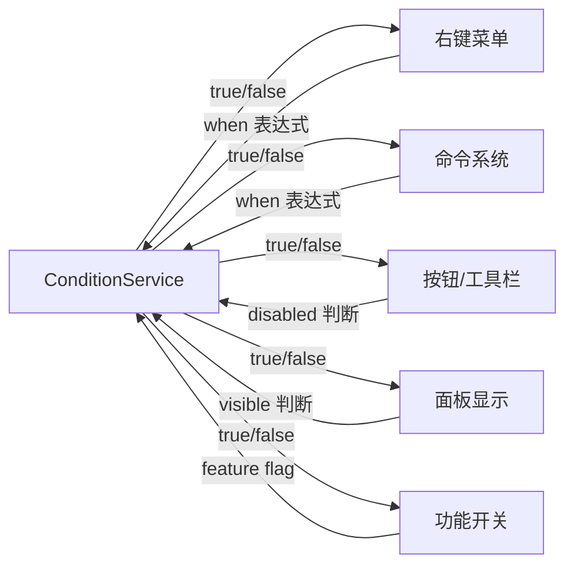
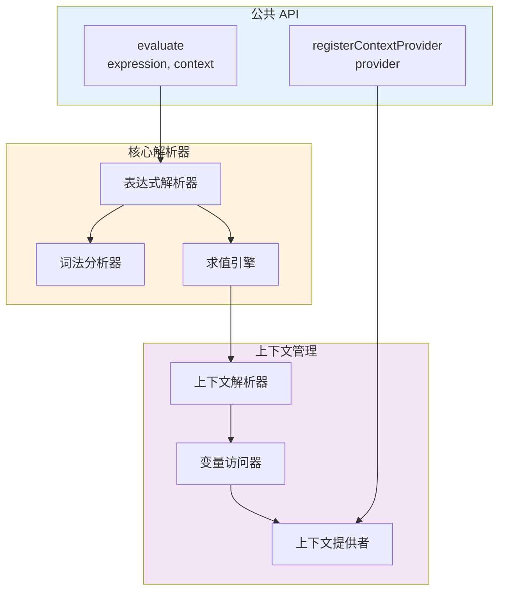
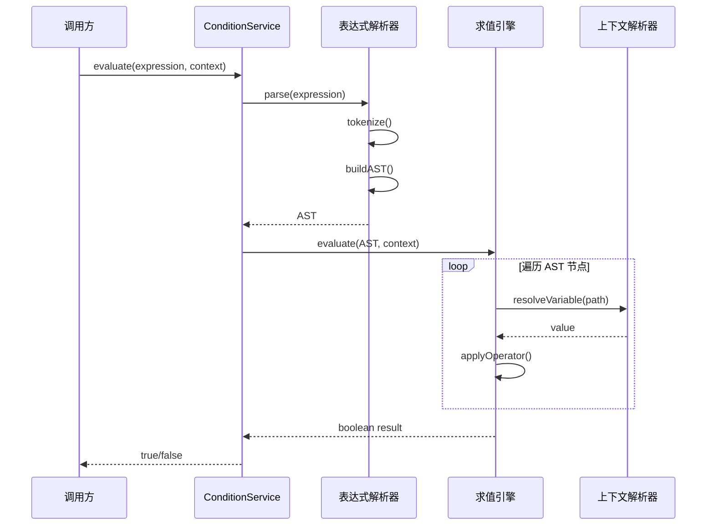

# 条件评估服务架构设计

## 📋 文档信息

- **服务名称**: Condition Service (条件评估服务)
- **版本**: 1.0.0
- **创建日期**: 2026-01-23
- **状态**: 📝 架构设计阶段
- **作者**: My-KM Team

---

## 🎯 概述

### 功能描述

Condition Service 是一个通用的条件表达式评估服务，用于动态控制 UI 元素（菜单项、命令、按钮等）的显示和启用状态。该服务支持：

- **表达式解析**: 解析类似 VSCode 的 `when` 条件表达式
- **条件评估**: 根据上下文动态评估布尔表达式
- **操作符支持**: 支持比较、逻辑、正则匹配等操作符
- **上下文变量**: 支持通过点号访问嵌套属性

### 核心价值

1. **声明式控制**: 通过表达式声明显示/启用条件，而非编程式判断
2. **可读性**: 表达式语法清晰，易于理解和维护
3. **可复用**: 同一套评估引擎可用于多个场景
4. **类型安全**: 完整的 TypeScript 类型定义

### 使用场景



---

## 📐 架构设计

### 服务架构



### 表达式处理流程



---

## 📊 类型定义

### 表达式类型

```typescript
/**
 * 支持的表达式类型
 */
export type ExpressionType =
  | 'logical'      // 逻辑运算: &&, ||, !
  | 'comparison'   // 比较运算: ==, !=, >, <, >=, <=
  | 'regex'        // 正则匹配: =~
  | 'variable'     // 变量访问: target.name
  | 'literal';     // 字面量: true, false, 'string', 123

/**
 * 抽象语法树节点
 */
export interface ASTNode {
  type: ExpressionType;
  value?: unknown;
  left?: ASTNode;
  right?: ASTNode;
  operator?: string;
  path?: string;  // 用于变量访问
}
```

### 上下文接口

```typescript
/**
 * 条件评估上下文
 * 可以是任意对象，支持嵌套属性访问
 */
export type ConditionContext = Record<string, unknown>;

/**
 * 上下文提供者
 * 用于动态注入上下文变量
 */
export interface ContextProvider {
  /** 提供者名称 */
  name: string;
  
  /** 获取上下文变量 */
  provide: () => Record<string, unknown>;
  
  /** 优先级 (数字越大优先级越高) */
  priority?: number;
}
```

### 求值结果

```typescript
/**
 * 求值结果
 */
export interface EvaluationResult {
  /** 求值结果 */
  result: boolean;
  
  /** 是否成功 */
  success: boolean;
  
  /** 错误信息 (如果失败) */
  error?: string;
  
  /** 访问的变量路径 (用于调试) */
  accessedPaths?: string[];
}
```

---

## 🔧 服务实现

### ConditionService

```typescript
/**
 * 条件评估服务
 * 单例模式
 */
class ConditionService {
  private static instance: ConditionService;
  private contextProviders: ContextProvider[] = [];
  
  static getInstance(): ConditionService {
    if (!ConditionService.instance) {
      ConditionService.instance = new ConditionService();
    }
    return ConditionService.instance;
  }
  
  /**
   * 评估条件表达式
   * 
   * @param expression 条件表达式
   * @param context 上下文对象
   * @returns 布尔值结果
   * 
   * @example
   * evaluate('target.isFolder', { target: { isFolder: true } }) // true
   * evaluate('count > 5', { count: 10 }) // true
   * evaluate('name == "README"', { name: 'README' }) // true
   */
  evaluate(
    expression: string | undefined,
    context: ConditionContext
  ): boolean {
    // 空表达式默认为 true
    if (!expression || expression.trim() === '') {
      return true;
    }
    
    try {
      // 合并上下文提供者的数据
      const mergedContext = this.mergeContext(context);
      
      // 解析并求值
      return this.parseAndEvaluate(expression, mergedContext);
    } catch (error) {
      console.warn(
        `Failed to evaluate condition: "${expression}"`,
        error
      );
      return false;
    }
  }
  
  /**
   * 详细评估 (包含错误信息)
   */
  evaluateDetailed(
    expression: string | undefined,
    context: ConditionContext
  ): EvaluationResult {
    if (!expression || expression.trim() === '') {
      return { result: true, success: true };
    }
    
    try {
      const mergedContext = this.mergeContext(context);
      const accessedPaths: string[] = [];
      
      const result = this.parseAndEvaluate(
        expression,
        mergedContext,
        accessedPaths
      );
      
      return {
        result,
        success: true,
        accessedPaths,
      };
    } catch (error) {
      return {
        result: false,
        success: false,
        error: error instanceof Error ? error.message : String(error),
      };
    }
  }
  
  /**
   * 注册上下文提供者
   */
  registerContextProvider(provider: ContextProvider): () => void {
    this.contextProviders.push(provider);
    this.contextProviders.sort((a, b) => 
      (b.priority || 0) - (a.priority || 0)
    );
    
    return () => {
      const index = this.contextProviders.indexOf(provider);
      if (index !== -1) {
        this.contextProviders.splice(index, 1);
      }
    };
  }
  
  /**
   * 合并上下文
   */
  private mergeContext(context: ConditionContext): ConditionContext {
    const merged = { ...context };
    
    // 按优先级合并提供者的数据
    for (const provider of this.contextProviders) {
      try {
        const data = provider.provide();
        Object.assign(merged, data);
      } catch (error) {
        console.warn(
          `Context provider "${provider.name}" failed:`,
          error
        );
      }
    }
    
    return merged;
  }
  
  /**
   * 解析并求值表达式
   */
  private parseAndEvaluate(
    expression: string,
    context: ConditionContext,
    accessedPaths?: string[]
  ): boolean {
    // 处理逻辑运算符 (优先级从低到高)
    
    // 1. 逻辑或 ||
    if (this.containsOperator(expression, '||')) {
      const parts = this.splitByOperator(expression, '||');
      return parts.some(part => 
        this.parseAndEvaluate(part.trim(), context, accessedPaths)
      );
    }
    
    // 2. 逻辑与 &&
    if (this.containsOperator(expression, '&&')) {
      const parts = this.splitByOperator(expression, '&&');
      return parts.every(part => 
        this.parseAndEvaluate(part.trim(), context, accessedPaths)
      );
    }
    
    // 3. 逻辑非 !
    if (expression.trim().startsWith('!')) {
      return !this.parseAndEvaluate(
        expression.trim().slice(1).trim(),
        context,
        accessedPaths
      );
    }
    
    // 4. 括号分组
    if (expression.trim().startsWith('(') && expression.trim().endsWith(')')) {
      return this.parseAndEvaluate(
        expression.trim().slice(1, -1),
        context,
        accessedPaths
      );
    }
    
    // 5. 比较运算
    return this.evaluateComparison(expression, context, accessedPaths);
  }
  
  /**
   * 评估比较表达式
   */
  private evaluateComparison(
    expression: string,
    context: ConditionContext,
    accessedPaths?: string[]
  ): boolean {
    // 支持的比较运算符 (按长度排序，先匹配长的)
    const operators = ['==', '!=', '>=', '<=', '=~', '>', '<'];
    
    for (const op of operators) {
      const index = this.findOperatorIndex(expression, op);
      if (index !== -1) {
        const left = expression.slice(0, index).trim();
        const right = expression.slice(index + op.length).trim();
        
        const leftValue = this.resolveValue(left, context, accessedPaths);
        const rightValue = this.parseValue(right);
        
        return this.applyOperator(op, leftValue, rightValue);
      }
    }
    
    // 没有比较运算符，作为布尔值
    const value = this.resolveValue(expression, context, accessedPaths);
    return Boolean(value);
  }
  
  /**
   * 应用比较运算符
   */
  private applyOperator(
    operator: string,
    left: unknown,
    right: unknown
  ): boolean {
    switch (operator) {
      case '==':
        return left === right;
      case '!=':
        return left !== right;
      case '>':
        return Number(left) > Number(right);
      case '<':
        return Number(left) < Number(right);
      case '>=':
        return Number(left) >= Number(right);
      case '<=':
        return Number(left) <= Number(right);
      case '=~':
        return new RegExp(String(right)).test(String(left));
      default:
        return false;
    }
  }
  
  /**
   * 解析值 (从表达式右侧)
   */
  private parseValue(value: string): unknown {
    const trimmed = value.trim();
    
    // 字符串
    if ((trimmed.startsWith("'") && trimmed.endsWith("'")) ||
        (trimmed.startsWith('"') && trimmed.endsWith('"'))) {
      return trimmed.slice(1, -1);
    }
    
    // 数字
    if (!isNaN(Number(trimmed))) {
      return Number(trimmed);
    }
    
    // 布尔值
    if (trimmed === 'true') return true;
    if (trimmed === 'false') return false;
    
    // null/undefined
    if (trimmed === 'null') return null;
    if (trimmed === 'undefined') return undefined;
    
    // 正则表达式 /pattern/
    if (trimmed.startsWith('/') && trimmed.lastIndexOf('/') > 0) {
      return trimmed.slice(1, trimmed.lastIndexOf('/'));
    }
    
    return trimmed;
  }
  
  /**
   * 解析变量 (从表达式左侧或单独的变量)
   */
  private resolveValue(
    path: string,
    context: ConditionContext,
    accessedPaths?: string[]
  ): unknown {
    const trimmed = path.trim();
    
    // 如果是字面量，直接解析
    if (
      trimmed.startsWith("'") || trimmed.startsWith('"') ||
      trimmed === 'true' || trimmed === 'false' ||
      trimmed === 'null' || trimmed === 'undefined' ||
      !isNaN(Number(trimmed))
    ) {
      return this.parseValue(trimmed);
    }
    
    // 变量访问
    if (accessedPaths) {
      accessedPaths.push(trimmed);
    }
    
    const parts = trimmed.split('.');
    let value: unknown = context;
    
    for (const part of parts) {
      if (value == null) {
        return undefined;
      }
      value = (value as Record<string, unknown>)[part];
    }
    
    return value;
  }
  
  /**
   * 检查是否包含运算符 (考虑括号和字符串)
   */
  private containsOperator(expression: string, operator: string): boolean {
    return this.findOperatorIndex(expression, operator) !== -1;
  }
  
  /**
   * 查找运算符位置 (考虑括号和字符串)
   */
  private findOperatorIndex(expression: string, operator: string): number {
    let depth = 0;
    let inString = false;
    let stringChar = '';
    
    for (let i = 0; i < expression.length; i++) {
      const char = expression[i];
      
      // 处理字符串
      if ((char === '"' || char === "'") && expression[i - 1] !== '\\') {
        if (inString) {
          if (char === stringChar) {
            inString = false;
          }
        } else {
          inString = true;
          stringChar = char;
        }
        continue;
      }
      
      if (inString) continue;
      
      // 处理括号
      if (char === '(') {
        depth++;
      } else if (char === ')') {
        depth--;
      }
      
      // 在顶层查找运算符
      if (depth === 0 && expression.slice(i, i + operator.length) === operator) {
        return i;
      }
    }
    
    return -1;
  }
  
  /**
   * 按运算符分割表达式 (考虑括号)
   */
  private splitByOperator(expression: string, operator: string): string[] {
    const result: string[] = [];
    let depth = 0;
    let inString = false;
    let stringChar = '';
    let start = 0;
    
    for (let i = 0; i < expression.length; i++) {
      const char = expression[i];
      
      // 处理字符串
      if ((char === '"' || char === "'") && expression[i - 1] !== '\\') {
        if (inString) {
          if (char === stringChar) {
            inString = false;
          }
        } else {
          inString = true;
          stringChar = char;
        }
        continue;
      }
      
      if (inString) continue;
      
      // 处理括号
      if (char === '(') {
        depth++;
      } else if (char === ')') {
        depth--;
      }
      
      // 在顶层分割
      if (depth === 0 && expression.slice(i, i + operator.length) === operator) {
        result.push(expression.slice(start, i));
        start = i + operator.length;
        i += operator.length - 1;
      }
    }
    
    result.push(expression.slice(start));
    return result;
  }
}

export const conditionService = ConditionService.getInstance();
```

---

## 📝 表达式语法

### 支持的操作符

| 类型 | 操作符 | 说明 | 示例 |
|------|--------|------|------|
| **比较** | `==` | 等于 | `name == "README"` |
| | `!=` | 不等于 | `type != "folder"` |
| | `>` | 大于 | `count > 5` |
| | `<` | 小于 | `age < 18` |
| | `>=` | 大于等于 | `score >= 60` |
| | `<=` | 小于等于 | `price <= 100` |
| | `=~` | 正则匹配 | `name =~ /^README/` |
| **逻辑** | `&&` | 逻辑与 | `isFolder && !isRoot` |
| | `\|\|` | 逻辑或 | `isDirty \|\| isNew` |
| | `!` | 逻辑非 | `!isHidden` |
| **分组** | `()` | 括号分组 | `(a && b) \|\| c` |

### 数据类型

| 类型 | 语法 | 示例 |
|------|------|------|
| **字符串** | `'...'` 或 `"..."` | `'hello'`, `"world"` |
| **数字** | 数字字面量 | `123`, `3.14`, `-5` |
| **布尔值** | `true` / `false` | `true`, `false` |
| **null** | `null` | `null` |
| **undefined** | `undefined` | `undefined` |
| **正则** | `/pattern/` | `/^README/`, `/\.md$/` |
| **变量** | 路径访问 | `target.name`, `selection.length` |

### 变量访问

支持点号访问嵌套属性：

```typescript
// 上下文
const context = {
  target: {
    name: 'README.md',
    isFolder: false,
    metadata: {
      size: 1024,
      author: 'John',
    },
  },
  selection: [{ id: 1 }, { id: 2 }],
};

// 表达式示例
'target.name'                    // 'README.md'
'target.isFolder'                // false
'target.metadata.size'           // 1024
'selection.length'               // 2
'selection.length > 1'           // true
```

### 表达式示例

```typescript
// 1. 简单布尔值
'isFolder'                       // 检查 isFolder 是否为 true
'!isHidden'                      // 检查 isHidden 是否为 false

// 2. 字符串比较
'name == "README.md"'            // 文件名等于 README.md
'extension == ".md"'             // 扩展名为 .md
'path != "/"'                    // 路径不是根目录

// 3. 数字比较
'size > 1024'                    // 文件大小大于 1KB
'selection.length >= 2'          // 选中项至少 2 个
'count <= 10'                    // 数量不超过 10

// 4. 正则匹配
'name =~ /^README/'              // 文件名以 README 开头
'extension =~ /\.(md|txt)$/'     // 扩展名是 .md 或 .txt

// 5. 逻辑组合
'isFolder && !isRoot'            // 是文件夹且不是根目录
'isDirty || isNew'               // 已修改或新建
'(isFile && size > 0) || isFolder' // 非空文件或文件夹

// 6. 复杂表达式
'target.isFolder && selection.length > 1'
'!target.isRoot && (target.name =~ /^\./ || target.isHidden)'
'editor.isDirty && (autoSave || !hasChanges)'
```

---

## 🎨 使用示例

### 基本使用

```typescript
import { conditionService } from '@/lib/condition-service';

// 简单条件
const result1 = conditionService.evaluate(
  'isFolder',
  { isFolder: true }
); // true

// 比较运算
const result2 = conditionService.evaluate(
  'count > 5',
  { count: 10 }
); // true

// 字符串匹配
const result3 = conditionService.evaluate(
  'name == "README.md"',
  { name: 'README.md' }
); // true

// 逻辑组合
const result4 = conditionService.evaluate(
  'isFolder && !isRoot',
  { isFolder: true, isRoot: false }
); // true

// 正则匹配
const result5 = conditionService.evaluate(
  'filename =~ /^README/',
  { filename: 'README.md' }
); // true
```

### 在菜单中使用

```typescript
// 菜单项配置
const menuItem = {
  id: 'delete',
  label: '删除',
  command: 'files.delete',
  when: 'target.isFolder && !target.isRoot',
};

// 评估是否显示
const shouldShow = conditionService.evaluate(
  menuItem.when,
  {
    target: {
      isFolder: true,
      isRoot: false,
    },
  }
); // true
```

### 在命令中使用

```typescript
// 命令定义
const command = {
  id: 'editor.closeOtherTabs',
  title: '关闭其他标签页',
  when: 'openTabsCount > 1',
  handler: async () => {
    // ...
  },
};

// 评估是否可执行
const canExecute = conditionService.evaluate(
  command.when,
  { openTabsCount: 3 }
); // true
```

### 注册上下文提供者

```typescript
// 注册全局上下文提供者
conditionService.registerContextProvider({
  name: 'editor',
  priority: 10,
  provide: () => ({
    activeEditor: getActiveEditor(),
    openTabsCount: getOpenTabsCount(),
    isDirty: hasUnsavedChanges(),
  }),
});

// 现在可以使用这些变量
conditionService.evaluate(
  'activeEditor && openTabsCount > 1',
  {} // 空上下文，会自动从提供者获取
);
```

### 详细评估 (包含调试信息)

```typescript
const result = conditionService.evaluateDetailed(
  'target.name == "README" && selection.length > 1',
  {
    target: { name: 'README' },
    selection: [1, 2, 3],
  }
);

console.log(result);
// {
//   result: true,
//   success: true,
//   accessedPaths: ['target.name', 'selection.length']
// }
```

---

## 🧪 测试用例

### 单元测试示例

```typescript
describe('ConditionService', () => {
  describe('比较运算', () => {
    it('应该正确评估等于运算符', () => {
      expect(conditionService.evaluate('name == "test"', { name: 'test' }))
        .toBe(true);
      expect(conditionService.evaluate('name == "test"', { name: 'other' }))
        .toBe(false);
    });
    
    it('应该正确评估数字比较', () => {
      expect(conditionService.evaluate('count > 5', { count: 10 }))
        .toBe(true);
      expect(conditionService.evaluate('count <= 5', { count: 3 }))
        .toBe(true);
    });
  });
  
  describe('逻辑运算', () => {
    it('应该正确评估逻辑与', () => {
      expect(conditionService.evaluate('a && b', { a: true, b: true }))
        .toBe(true);
      expect(conditionService.evaluate('a && b', { a: true, b: false }))
        .toBe(false);
    });
    
    it('应该正确评估逻辑或', () => {
      expect(conditionService.evaluate('a || b', { a: true, b: false }))
        .toBe(true);
      expect(conditionService.evaluate('a || b', { a: false, b: false }))
        .toBe(false);
    });
    
    it('应该正确评估逻辑非', () => {
      expect(conditionService.evaluate('!a', { a: false }))
        .toBe(true);
      expect(conditionService.evaluate('!a', { a: true }))
        .toBe(false);
    });
  });
  
  describe('正则匹配', () => {
    it('应该正确评估正则表达式', () => {
      expect(conditionService.evaluate('name =~ /^README/', { name: 'README.md' }))
        .toBe(true);
      expect(conditionService.evaluate('name =~ /^README/', { name: 'test.md' }))
        .toBe(false);
    });
  });
  
  describe('嵌套属性', () => {
    it('应该正确访问嵌套属性', () => {
      const context = {
        target: {
          metadata: {
            size: 1024,
          },
        },
      };
      
      expect(conditionService.evaluate('target.metadata.size > 500', context))
        .toBe(true);
    });
  });
  
  describe('复杂表达式', () => {
    it('应该正确评估复杂表达式', () => {
      const context = {
        target: { isFolder: true, isRoot: false },
        selection: { length: 2 },
      };
      
      expect(conditionService.evaluate(
        '(target.isFolder && !target.isRoot) && selection.length > 1',
        context
      )).toBe(true);
    });
  });
  
  describe('错误处理', () => {
    it('空表达式应返回 true', () => {
      expect(conditionService.evaluate('', {})).toBe(true);
      expect(conditionService.evaluate(undefined, {})).toBe(true);
    });
    
    it('访问不存在的属性应返回 undefined', () => {
      expect(conditionService.evaluate('nonexistent', {})).toBe(false);
    });
    
    it('表达式错误应返回 false', () => {
      expect(conditionService.evaluate('invalid syntax', {})).toBe(false);
    });
  });
});
```

---

## 📂 文件结构

```
apps/web/src/
├── lib/
│   └── condition-service/
│       ├── index.ts                 # 导出入口
│       ├── condition-service.ts     # 核心服务
│       ├── parser.ts                # 表达式解析器 (可选单独文件)
│       ├── evaluator.ts             # 求值引擎 (可选单独文件)
│       └── __tests__/               # 单元测试
│           └── condition-service.test.ts
│
├── types/
│   └── condition-service.ts         # 类型定义
│
└── hooks/
    └── use-condition.ts             # React Hook (可选)
```

---

## 🔍 性能优化

### 表达式缓存

```typescript
class ConditionService {
  private cache = new Map<string, ASTNode>();
  private readonly MAX_CACHE_SIZE = 100;
  
  private parseExpression(expression: string): ASTNode {
    // 检查缓存
    if (this.cache.has(expression)) {
      return this.cache.get(expression)!;
    }
    
    // 解析表达式
    const ast = this.parse(expression);
    
    // 缓存结果 (限制缓存大小)
    if (this.cache.size >= this.MAX_CACHE_SIZE) {
      const firstKey = this.cache.keys().next().value;
      this.cache.delete(firstKey);
    }
    this.cache.set(expression, ast);
    
    return ast;
  }
}
```

### 短路求值

```typescript
// 逻辑或: 第一个为 true 就返回
if (this.containsOperator(expression, '||')) {
  const parts = this.splitByOperator(expression, '||');
  for (const part of parts) {
    if (this.parseAndEvaluate(part.trim(), context)) {
      return true; // 短路
    }
  }
  return false;
}

// 逻辑与: 第一个为 false 就返回
if (this.containsOperator(expression, '&&')) {
  const parts = this.splitByOperator(expression, '&&');
  for (const part of parts) {
    if (!this.parseAndEvaluate(part.trim(), context)) {
      return false; // 短路
    }
  }
  return true;
}
```

---

## 📚 相关文档

- [右键菜单服务](./context-menu.md) - 使用 ConditionService 控制菜单显示
- [命令服务](./command-service.md) - 使用 ConditionService 控制命令可执行性
- [VSCode When Clause Contexts](https://code.visualstudio.com/api/references/when-clause-contexts) - 参考设计

---

## 📝 变更历史

| 版本 | 日期 | 变更说明 | 作者 |
|-----|------|---------|-----|
| 1.0.0 | 2026-01-23 | 初始版本，完整架构设计 | My-KM Team |

---

**文档状态**: ✅ 架构设计完成
**下一步**: 实施开发
