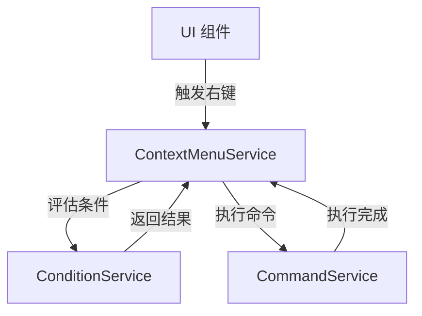
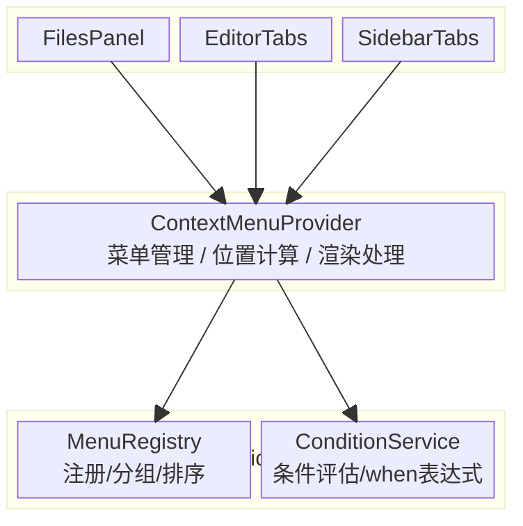
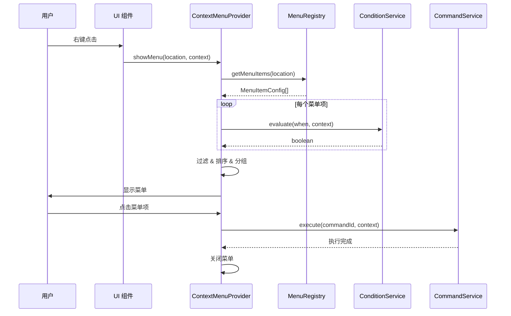

# 右键菜单服务架构设计

## 📋 文档信息

- **服务名称**: Context Menu Service (右键菜单服务)
- **版本**: 1.0.0
- **创建日期**: 2026-01-23
- **状态**: 📝 架构设计阶段
- **作者**: My-KM Team

---

## 🎯 概述

### 功能描述

Context Menu Service 是一个全局右键菜单管理服务，参考 VSCode 的 Menu Contribution Points 设计。该服务支持：

- **声明式菜单注册**: 通过配置声明菜单项，而非硬编码
- **动态菜单管理**: 运行时动态注册/注销菜单项
- **条件控制**: 通过 `when` 表达式控制菜单项的显示/禁用
- **分组排序**: 菜单项按分组和权重排序，自动添加分隔符
- **命令集成**: 与 Command Service 解耦，通过命令 ID 关联

### 核心价值

1. **可扩展性**: 任何模块都可以向任意位置贡献菜单项
2. **一致性**: 统一的菜单行为和样式
3. **可维护性**: 菜单配置集中管理，易于维护
4. **类型安全**: 完整的 TypeScript 类型定义

### 与其他服务的关系



---

## 📐 架构设计

### 整体架构



### 数据流



---

## 📊 类型定义

### 菜单位置标识符

```typescript
/**
 * 菜单位置标识符
 * 类似 VSCode 的 contribution points，定义菜单可以出现的位置
 */
export type MenuLocationId =
  // 文件面板
  | 'files-panel.background'      // 文件面板空白处
  | 'files-panel.file'            // 文件项
  | 'files-panel.folder'          // 文件夹项
  
  // 编辑器
  | 'editor.tab'                  // 编辑器 Tab
  | 'editor.content'              // 编辑器内容区
  | 'editor.title'                // 编辑器标题区
  | 'editor.gutter'               // 编辑器行号区
  
  // 侧边栏
  | 'sidebar.tab'                 // 侧边栏 Tab
  | 'sidebar.header'              // 侧边栏标题
  
  // AI 面板
  | 'ai-panel.message'            // AI 消息
  | 'ai-panel.code-block'         // AI 代码块
  
  // 可扩展
  | string;
```

### 菜单项配置

```typescript
/**
 * 菜单项配置接口
 */
export interface MenuItemConfig {
  /** 唯一标识符 */
  id: string;
  
  /** 关联的命令 ID */
  command: string;
  
  /** 显示文本 (支持 i18n key) */
  label: string;
  
  /** Lucide 图标名称 (可选) */
  icon?: string;
  
  /** 快捷键显示文本 (可选，仅用于显示) */
  shortcut?: string;
  
  /**
   * 分组标识
   * 格式: 数字_名称，如 '1_create', '2_edit', '3_delete'
   * 同一分组内的菜单项会聚在一起，不同分组之间自动添加分隔符
   */
  group?: string;
  
  /** 组内排序权重，数字越小越靠前 */
  order?: number;
  
  /**
   * 条件表达式
   * 当条件为 true 时显示菜单项，否则隐藏
   * 支持的语法见 ConditionService
   */
  when?: string;
  
  /**
   * 启用条件表达式
   * 当条件为 true 时菜单项可点击，否则禁用 (灰色)
   */
  enableWhen?: string;
  
  /** 子菜单项 (可选) */
  submenu?: MenuItemConfig[];
}
```

### 菜单上下文

```typescript
/**
 * 菜单上下文
 * 传递给条件评估器和命令执行器
 */
export interface MenuContext {
  /** 触发位置 */
  location: MenuLocationId;
  
  /** 右键点击的目标对象 */
  target?: unknown;
  
  /** 多选项 (如果有) */
  selection?: unknown[];
  
  /** 扩展属性 */
  [key: string]: unknown;
}

/**
 * 文件面板上下文
 */
export interface FilesPanelMenuContext extends MenuContext {
  location: 'files-panel.file' | 'files-panel.folder' | 'files-panel.background';
  
  /** 目标文件/文件夹信息 */
  target?: {
    id: string;
    name: string;
    path: string;
    isFolder: boolean;
    extension?: string;
  };
  
  /** 选中的文件列表 */
  selection?: Array<{
    id: string;
    path: string;
  }>;
}

/**
 * 编辑器 Tab 上下文
 */
export interface EditorTabMenuContext extends MenuContext {
  location: 'editor.tab';
  
  /** 目标 Tab 信息 */
  target?: {
    id: string;
    name: string;
    path: string;
    isDirty: boolean;
    isPinned: boolean;
  };
  
  /** 所有打开的 Tab 数量 */
  openTabsCount?: number;
}
```

### 菜单注册表状态

```typescript
/**
 * 菜单显示状态
 */
export interface MenuState {
  /** 是否显示 */
  visible: boolean;
  
  /** 菜单位置 */
  position: { x: number; y: number };
  
  /** 当前位置 ID */
  location: MenuLocationId | null;
  
  /** 当前上下文 */
  context: MenuContext | null;
  
  /** 过滤后的菜单项 */
  items: ResolvedMenuItem[];
}

/**
 * 解析后的菜单项 (包含运行时状态)
 */
export interface ResolvedMenuItem extends MenuItemConfig {
  /** 是否禁用 */
  disabled: boolean;
  
  /** 解析后的子菜单 */
  submenu?: ResolvedMenuItem[];
}
```

---

## 🔧 服务实现

### MenuRegistry

```typescript
/**
 * 菜单注册表
 * 管理所有菜单项的注册和查询
 */
class MenuRegistry {
  private static instance: MenuRegistry;
  private menus: Map<MenuLocationId, MenuItemConfig[]> = new Map();
  private listeners: Set<() => void> = new Set();
  
  static getInstance(): MenuRegistry {
    if (!MenuRegistry.instance) {
      MenuRegistry.instance = new MenuRegistry();
    }
    return MenuRegistry.instance;
  }
  
  /**
   * 注册单个菜单项
   */
  register(location: MenuLocationId, item: MenuItemConfig): () => void {
    const items = this.menus.get(location) || [];
    items.push(item);
    this.menus.set(location, items);
    this.notifyListeners();
    
    // 返回注销函数
    return () => this.unregister(location, item.id);
  }
  
  /**
   * 批量注册菜单项
   */
  registerMany(location: MenuLocationId, items: MenuItemConfig[]): () => void {
    const disposables = items.map(item => this.register(location, item));
    return () => disposables.forEach(dispose => dispose());
  }
  
  /**
   * 注销菜单项
   */
  unregister(location: MenuLocationId, itemId: string): void {
    const items = this.menus.get(location);
    if (items) {
      const filtered = items.filter(item => item.id !== itemId);
      this.menus.set(location, filtered);
      this.notifyListeners();
    }
  }
  
  /**
   * 获取指定位置的所有菜单项
   */
  getItems(location: MenuLocationId): MenuItemConfig[] {
    return this.menus.get(location) || [];
  }
  
  /**
   * 订阅变更
   */
  subscribe(listener: () => void): () => void {
    this.listeners.add(listener);
    return () => this.listeners.delete(listener);
  }
  
  private notifyListeners(): void {
    this.listeners.forEach(listener => listener());
  }
}

export const menuRegistry = MenuRegistry.getInstance();
```

### ConditionService

```typescript
/**
 * 条件评估服务
 * 解析和评估 when 表达式
 */
class ConditionService {
  private static instance: ConditionService;
  
  static getInstance(): ConditionService {
    if (!ConditionService.instance) {
      ConditionService.instance = new ConditionService();
    }
    return ConditionService.instance;
  }
  
  /**
   * 评估条件表达式
   * 
   * 支持的语法:
   * - 属性访问: target.isFolder, selection.length
   * - 比较运算: ==, !=, <, >, <=, >=
   * - 逻辑运算: &&, ||, !
   * - 括号分组: (a && b) || c
   * - 字符串匹配: =~ (正则)
   * 
   * 示例:
   * - "target.isFolder"
   * - "target.extension == '.md'"
   * - "selection.length > 1"
   * - "target.isFolder && !target.isRoot"
   * - "target.name =~ /^README/"
   */
  evaluate(expression: string | undefined, context: MenuContext): boolean {
    if (!expression) {
      return true;
    }
    
    try {
      return this.parseAndEvaluate(expression, context);
    } catch (error) {
      console.warn(`Failed to evaluate condition: ${expression}`, error);
      return false;
    }
  }
  
  private parseAndEvaluate(expression: string, context: MenuContext): boolean {
    // 处理逻辑运算符
    if (expression.includes('||')) {
      const parts = this.splitByOperator(expression, '||');
      return parts.some(part => this.parseAndEvaluate(part.trim(), context));
    }
    
    if (expression.includes('&&')) {
      const parts = this.splitByOperator(expression, '&&');
      return parts.every(part => this.parseAndEvaluate(part.trim(), context));
    }
    
    // 处理否定
    if (expression.startsWith('!')) {
      return !this.parseAndEvaluate(expression.slice(1).trim(), context);
    }
    
    // 处理括号
    if (expression.startsWith('(') && expression.endsWith(')')) {
      return this.parseAndEvaluate(expression.slice(1, -1), context);
    }
    
    // 处理比较运算
    return this.evaluateComparison(expression, context);
  }
  
  private evaluateComparison(expression: string, context: MenuContext): boolean {
    // 匹配比较运算符
    const operators = ['==', '!=', '>=', '<=', '>', '<', '=~'];
    
    for (const op of operators) {
      const index = expression.indexOf(op);
      if (index !== -1) {
        const left = expression.slice(0, index).trim();
        const right = expression.slice(index + op.length).trim();
        
        const leftValue = this.getValue(left, context);
        const rightValue = this.parseValue(right);
        
        switch (op) {
          case '==': return leftValue === rightValue;
          case '!=': return leftValue !== rightValue;
          case '>': return Number(leftValue) > Number(rightValue);
          case '<': return Number(leftValue) < Number(rightValue);
          case '>=': return Number(leftValue) >= Number(rightValue);
          case '<=': return Number(leftValue) <= Number(rightValue);
          case '=~': return new RegExp(rightValue as string).test(String(leftValue));
        }
      }
    }
    
    // 单独的属性作为布尔值
    return Boolean(this.getValue(expression, context));
  }
  
  private getValue(path: string, context: MenuContext): unknown {
    const parts = path.split('.');
    let value: unknown = context;
    
    for (const part of parts) {
      if (value == null) return undefined;
      value = (value as Record<string, unknown>)[part];
    }
    
    return value;
  }
  
  private parseValue(value: string): unknown {
    // 字符串
    if ((value.startsWith("'") && value.endsWith("'")) ||
        (value.startsWith('"') && value.endsWith('"'))) {
      return value.slice(1, -1);
    }
    
    // 数字
    if (!isNaN(Number(value))) {
      return Number(value);
    }
    
    // 布尔值
    if (value === 'true') return true;
    if (value === 'false') return false;
    if (value === 'null') return null;
    if (value === 'undefined') return undefined;
    
    // 正则表达式
    if (value.startsWith('/') && value.lastIndexOf('/') > 0) {
      return value.slice(1, value.lastIndexOf('/'));
    }
    
    return value;
  }
  
  private splitByOperator(expression: string, operator: string): string[] {
    const result: string[] = [];
    let depth = 0;
    let start = 0;
    
    for (let i = 0; i < expression.length; i++) {
      const char = expression[i];
      
      if (char === '(') depth++;
      else if (char === ')') depth--;
      else if (depth === 0 && expression.slice(i, i + operator.length) === operator) {
        result.push(expression.slice(start, i));
        start = i + operator.length;
        i += operator.length - 1;
      }
    }
    
    result.push(expression.slice(start));
    return result;
  }
}

export const conditionService = ConditionService.getInstance();
```

### 菜单排序和分组

```typescript
/**
 * 处理菜单项排序和分组
 */
function resolveMenuItems(
  items: MenuItemConfig[],
  context: MenuContext
): ResolvedMenuItem[] {
  // 1. 过滤隐藏的菜单项
  const visibleItems = items.filter(item =>
    conditionService.evaluate(item.when, context)
  );
  
  // 2. 评估启用状态
  const resolvedItems: ResolvedMenuItem[] = visibleItems.map(item => ({
    ...item,
    disabled: !conditionService.evaluate(item.enableWhen, context),
    submenu: item.submenu
      ? resolveMenuItems(item.submenu, context)
      : undefined,
  }));
  
  // 3. 按分组和顺序排序
  resolvedItems.sort((a, b) => {
    const groupA = a.group || 'z_default';
    const groupB = b.group || 'z_default';
    
    if (groupA !== groupB) {
      return groupA.localeCompare(groupB);
    }
    
    return (a.order || 0) - (b.order || 0);
  });
  
  return resolvedItems;
}

/**
 * 将菜单项按分组分割，用于渲染分隔符
 */
function groupMenuItems(items: ResolvedMenuItem[]): ResolvedMenuItem[][] {
  const groups: ResolvedMenuItem[][] = [];
  let currentGroup: ResolvedMenuItem[] = [];
  let lastGroupId: string | undefined;
  
  for (const item of items) {
    const groupId = item.group || 'z_default';
    
    if (lastGroupId && lastGroupId !== groupId) {
      if (currentGroup.length > 0) {
        groups.push(currentGroup);
        currentGroup = [];
      }
    }
    
    currentGroup.push(item);
    lastGroupId = groupId;
  }
  
  if (currentGroup.length > 0) {
    groups.push(currentGroup);
  }
  
  return groups;
}
```

---

## 🎨 React 集成

### ContextMenuProvider

```typescript
'use client';

import * as ContextMenuPrimitive from '@radix-ui/react-context-menu';
import { createContext, useContext, useState, useCallback, useMemo } from 'react';
import { menuRegistry } from '@/lib/context-menu/menu-registry';
import { conditionService } from '@/lib/context-menu/condition-service';
import { commandRegistry } from '@/lib/commands/command-registry';
import type { MenuLocationId, MenuContext, ResolvedMenuItem } from '@/types/context-menu';

interface ContextMenuContextValue {
  showMenu: (
    location: MenuLocationId,
    context: Omit<MenuContext, 'location'>,
    event: React.MouseEvent | MouseEvent
  ) => void;
  hideMenu: () => void;
}

const ContextMenuContext = createContext<ContextMenuContextValue | null>(null);

export function ContextMenuProvider({ children }: { children: React.ReactNode }) {
  const [menuState, setMenuState] = useState<{
    visible: boolean;
    position: { x: number; y: number };
    location: MenuLocationId | null;
    context: MenuContext | null;
    items: ResolvedMenuItem[][];
  }>({
    visible: false,
    position: { x: 0, y: 0 },
    location: null,
    context: null,
    items: [],
  });
  
  const showMenu = useCallback((
    location: MenuLocationId,
    context: Omit<MenuContext, 'location'>,
    event: React.MouseEvent | MouseEvent
  ) => {
    event.preventDefault();
    
    const fullContext: MenuContext = { ...context, location };
    const rawItems = menuRegistry.getItems(location);
    const resolvedItems = resolveMenuItems(rawItems, fullContext);
    const groupedItems = groupMenuItems(resolvedItems);
    
    setMenuState({
      visible: true,
      position: { x: event.clientX, y: event.clientY },
      location,
      context: fullContext,
      items: groupedItems,
    });
  }, []);
  
  const hideMenu = useCallback(() => {
    setMenuState(prev => ({ ...prev, visible: false }));
  }, []);
  
  const handleItemClick = useCallback(async (item: ResolvedMenuItem) => {
    if (item.disabled || !menuState.context) return;
    
    hideMenu();
    await commandRegistry.execute(item.command, menuState.context);
  }, [menuState.context, hideMenu]);
  
  const value = useMemo(() => ({ showMenu, hideMenu }), [showMenu, hideMenu]);
  
  return (
    <ContextMenuContext.Provider value={value}>
      {children}
      
      {/* 全局右键菜单 */}
      {menuState.visible && (
        <ContextMenuOverlay
          position={menuState.position}
          items={menuState.items}
          onItemClick={handleItemClick}
          onClose={hideMenu}
        />
      )}
    </ContextMenuContext.Provider>
  );
}

export function useContextMenu(): ContextMenuContextValue {
  const context = useContext(ContextMenuContext);
  if (!context) {
    throw new Error('useContextMenu must be used within ContextMenuProvider');
  }
  return context;
}
```

### Context Menu UI 组件

```typescript
// apps/web/src/components/ui/context-menu.tsx
'use client';

import * as ContextMenuPrimitive from '@radix-ui/react-context-menu';
import { ChevronRight } from 'lucide-react';
import * as React from 'react';
import { cn } from '@/lib/utils';

// ... Radix UI 封装组件 (类似 dropdown-menu.tsx)

export {
  ContextMenu,
  ContextMenuTrigger,
  ContextMenuContent,
  ContextMenuItem,
  ContextMenuCheckboxItem,
  ContextMenuRadioItem,
  ContextMenuLabel,
  ContextMenuSeparator,
  ContextMenuShortcut,
  ContextMenuGroup,
  ContextMenuPortal,
  ContextMenuSub,
  ContextMenuSubContent,
  ContextMenuSubTrigger,
  ContextMenuRadioGroup,
};
```

---

## 📋 预定义菜单配置

### 菜单位置清单

| 位置 ID | 说明 | 典型场景 |
|---------|------|---------|
| `files-panel.background` | 文件面板空白处 | 新建文件/文件夹、刷新、粘贴 |
| `files-panel.file` | 文件项 | 打开、重命名、删除、复制路径 |
| `files-panel.folder` | 文件夹项 | 新建文件、展开/折叠、删除 |
| `editor.tab` | 编辑器 Tab | 关闭、关闭其他、全部关闭、固定 |
| `editor.content` | 编辑器内容区 | 剪切、复制、粘贴、格式化 |
| `sidebar.tab` | 侧边栏 Tab | 删除标签页 |
| `ai-panel.message` | AI 消息 | 复制、重新生成、编辑 |
| `ai-panel.code-block` | AI 代码块 | 复制代码、插入编辑器、运行 |

### 文件面板菜单配置

```typescript
// lib/context-menu/contributions/files-panel.ts

export const filesPanelMenuItems = {
  // 空白处菜单
  'files-panel.background': [
    {
      id: 'newFile',
      command: 'files.newFile',
      label: '新建文件',
      icon: 'FilePlus',
      group: '1_create',
      order: 1,
      shortcut: 'Ctrl+N',
    },
    {
      id: 'newFolder',
      command: 'files.newFolder',
      label: '新建文件夹',
      icon: 'FolderPlus',
      group: '1_create',
      order: 2,
      shortcut: 'Ctrl+Shift+N',
    },
    {
      id: 'paste',
      command: 'files.paste',
      label: '粘贴',
      icon: 'Clipboard',
      group: '2_clipboard',
      order: 1,
      shortcut: 'Ctrl+V',
      when: 'clipboard.hasFiles',
    },
    {
      id: 'refresh',
      command: 'files.refresh',
      label: '刷新',
      icon: 'RefreshCw',
      group: '3_actions',
      order: 1,
    },
  ],
  
  // 文件菜单
  'files-panel.file': [
    {
      id: 'open',
      command: 'files.open',
      label: '打开',
      icon: 'FileText',
      group: '1_open',
      order: 1,
    },
    {
      id: 'openToSide',
      command: 'files.openToSide',
      label: '在侧边打开',
      icon: 'Columns',
      group: '1_open',
      order: 2,
    },
    {
      id: 'cut',
      command: 'files.cut',
      label: '剪切',
      icon: 'Scissors',
      group: '2_clipboard',
      order: 1,
      shortcut: 'Ctrl+X',
    },
    {
      id: 'copy',
      command: 'files.copy',
      label: '复制',
      icon: 'Copy',
      group: '2_clipboard',
      order: 2,
      shortcut: 'Ctrl+C',
    },
    {
      id: 'copyPath',
      command: 'files.copyPath',
      label: '复制路径',
      icon: 'Link',
      group: '2_clipboard',
      order: 3,
    },
    {
      id: 'copyRelativePath',
      command: 'files.copyRelativePath',
      label: '复制相对路径',
      icon: 'Link2',
      group: '2_clipboard',
      order: 4,
    },
    {
      id: 'rename',
      command: 'files.rename',
      label: '重命名',
      icon: 'Pencil',
      group: '3_edit',
      order: 1,
      shortcut: 'F2',
    },
    {
      id: 'delete',
      command: 'files.delete',
      label: '删除',
      icon: 'Trash2',
      group: '4_delete',
      order: 1,
      shortcut: 'Delete',
    },
  ],
  
  // 文件夹菜单
  'files-panel.folder': [
    {
      id: 'newFileInFolder',
      command: 'files.newFile',
      label: '新建文件',
      icon: 'FilePlus',
      group: '1_create',
      order: 1,
    },
    {
      id: 'newFolderInFolder',
      command: 'files.newFolder',
      label: '新建文件夹',
      icon: 'FolderPlus',
      group: '1_create',
      order: 2,
    },
    {
      id: 'cut',
      command: 'files.cut',
      label: '剪切',
      icon: 'Scissors',
      group: '2_clipboard',
      order: 1,
      shortcut: 'Ctrl+X',
    },
    {
      id: 'copy',
      command: 'files.copy',
      label: '复制',
      icon: 'Copy',
      group: '2_clipboard',
      order: 2,
      shortcut: 'Ctrl+C',
    },
    {
      id: 'paste',
      command: 'files.paste',
      label: '粘贴',
      icon: 'Clipboard',
      group: '2_clipboard',
      order: 3,
      shortcut: 'Ctrl+V',
      when: 'clipboard.hasFiles',
    },
    {
      id: 'rename',
      command: 'files.rename',
      label: '重命名',
      icon: 'Pencil',
      group: '3_edit',
      order: 1,
      shortcut: 'F2',
    },
    {
      id: 'delete',
      command: 'files.delete',
      label: '删除',
      icon: 'Trash2',
      group: '4_delete',
      order: 1,
      shortcut: 'Delete',
      when: '!target.isRoot',
    },
  ],
};
```

### 编辑器 Tab 菜单配置

```typescript
// lib/context-menu/contributions/editor-tab.ts

export const editorTabMenuItems = {
  'editor.tab': [
    {
      id: 'close',
      command: 'editor.closeTab',
      label: '关闭',
      icon: 'X',
      group: '1_close',
      order: 1,
      shortcut: 'Ctrl+W',
    },
    {
      id: 'closeOthers',
      command: 'editor.closeOtherTabs',
      label: '关闭其他',
      group: '1_close',
      order: 2,
      when: 'openTabsCount > 1',
    },
    {
      id: 'closeToRight',
      command: 'editor.closeTabsToRight',
      label: '关闭右侧',
      group: '1_close',
      order: 3,
      when: 'hasTabsToRight',
    },
    {
      id: 'closeAll',
      command: 'editor.closeAllTabs',
      label: '全部关闭',
      group: '1_close',
      order: 4,
    },
    {
      id: 'closeSaved',
      command: 'editor.closeSavedTabs',
      label: '关闭已保存',
      group: '1_close',
      order: 5,
    },
    {
      id: 'pin',
      command: 'editor.pinTab',
      label: '固定',
      icon: 'Pin',
      group: '2_pin',
      order: 1,
      when: '!target.isPinned',
    },
    {
      id: 'unpin',
      command: 'editor.unpinTab',
      label: '取消固定',
      icon: 'PinOff',
      group: '2_pin',
      order: 1,
      when: 'target.isPinned',
    },
    {
      id: 'copyPath',
      command: 'files.copyPath',
      label: '复制路径',
      icon: 'Link',
      group: '3_path',
      order: 1,
    },
    {
      id: 'revealInExplorer',
      command: 'files.revealInExplorer',
      label: '在文件管理器中显示',
      icon: 'FolderOpen',
      group: '3_path',
      order: 2,
    },
  ],
};
```

### 侧边栏 Tab 菜单配置

```typescript
// lib/context-menu/contributions/sidebar-tab.ts

export const sidebarTabMenuItems = {
  'sidebar.tab': [
    {
      id: 'deleteTab',
      command: 'sidebar.deleteTab',
      label: '删除标签页',
      icon: 'Trash2',
      group: '1_manage',
      order: 1,
      when: 'target.isDeletable',
    },
  ],
};
```

---

## 🚀 使用示例

### 在文件面板中使用

```tsx
// apps/web/src/components/workspace/sidebar/panels/files-panel.tsx
'use client';

import { useContextMenu } from '@/hooks/use-context-menu';
import type { FileNode } from '@/types/file-system';

export function FilesPanel() {
  const { showMenu } = useContextMenu();
  
  const handleContextMenu = (
    e: React.MouseEvent,
    target?: FileNode
  ) => {
    e.preventDefault();
    e.stopPropagation();
    
    if (!target) {
      // 空白处
      showMenu('files-panel.background', {}, e);
    } else if (target.isFolder) {
      // 文件夹
      showMenu('files-panel.folder', {
        target: {
          id: target.id,
          name: target.name,
          path: target.path,
          isFolder: true,
          isRoot: target.path === '/',
        },
      }, e);
    } else {
      // 文件
      showMenu('files-panel.file', {
        target: {
          id: target.id,
          name: target.name,
          path: target.path,
          isFolder: false,
          extension: target.extension,
        },
      }, e);
    }
  };
  
  return (
    <div 
      className="h-full"
      onContextMenu={(e) => handleContextMenu(e)}
    >
      {files.map(file => (
        <FileItem
          key={file.id}
          file={file}
          onContextMenu={(e) => handleContextMenu(e, file)}
        />
      ))}
    </div>
  );
}
```

### 在编辑器 Tab 中使用

```tsx
// apps/web/src/components/workspace/editor/editor-tabs.tsx
'use client';

import { useContextMenu } from '@/hooks/use-context-menu';
import type { EditorTab } from '@/types/editor';

export function EditorTabs() {
  const { showMenu } = useContextMenu();
  const tabs = useEditorTabs();
  
  const handleTabContextMenu = (
    e: React.MouseEvent,
    tab: EditorTab,
    index: number
  ) => {
    e.preventDefault();
    
    showMenu('editor.tab', {
      target: {
        id: tab.id,
        name: tab.name,
        path: tab.path,
        isDirty: tab.isDirty,
        isPinned: tab.isPinned,
      },
      tabIndex: index,
      openTabsCount: tabs.length,
      hasTabsToRight: index < tabs.length - 1,
    }, e);
  };
  
  return (
    <div className="flex">
      {tabs.map((tab, index) => (
        <div
          key={tab.id}
          onContextMenu={(e) => handleTabContextMenu(e, tab, index)}
        >
          {tab.name}
        </div>
      ))}
    </div>
  );
}
```

---

## 📦 依赖安装

```bash
# 安装 Radix UI Context Menu
pnpm add --filter web @radix-ui/react-context-menu
```

---

## 📂 文件结构

```
apps/web/src/
├── types/
│   └── context-menu.ts              # 类型定义
│
├── lib/
│   └── context-menu/
│       ├── index.ts                 # 导出入口
│       ├── menu-registry.ts         # 菜单注册表
│       ├── condition-service.ts     # 条件评估服务
│       ├── utils.ts                 # 工具函数 (排序、分组)
│       └── contributions/
│           ├── index.ts             # 注册所有菜单
│           ├── files-panel.ts       # 文件面板菜单
│           ├── editor-tab.ts        # 编辑器 Tab 菜单
│           └── sidebar-tab.ts       # 侧边栏 Tab 菜单
│
├── components/
│   ├── ui/
│   │   └── context-menu.tsx         # Radix UI 封装
│   └── providers/
│       └── context-menu-provider.tsx # 全局 Provider
│
└── hooks/
    └── use-context-menu.ts          # 便捷 Hook
```

---

## 📚 相关文档

- [命令服务架构](./command-service.md) - 命令注册与执行
- [Sidebar 架构](../modules/sidebar/architecture.md) - 侧边栏模块设计
- [工作视图模块](../modules/workspace-view/workspace-view.md) - 整体布局
- [Radix UI Context Menu](https://www.radix-ui.com/primitives/docs/components/context-menu) - UI 组件文档

---

## 📝 变更历史

| 版本 | 日期 | 变更说明 | 作者 |
|-----|------|---------|-----|
| 1.0.0 | 2026-01-23 | 初始版本，完整架构设计 | My-KM Team |

---

**文档状态**: ✅ 架构设计完成
**下一步**: 实施开发
