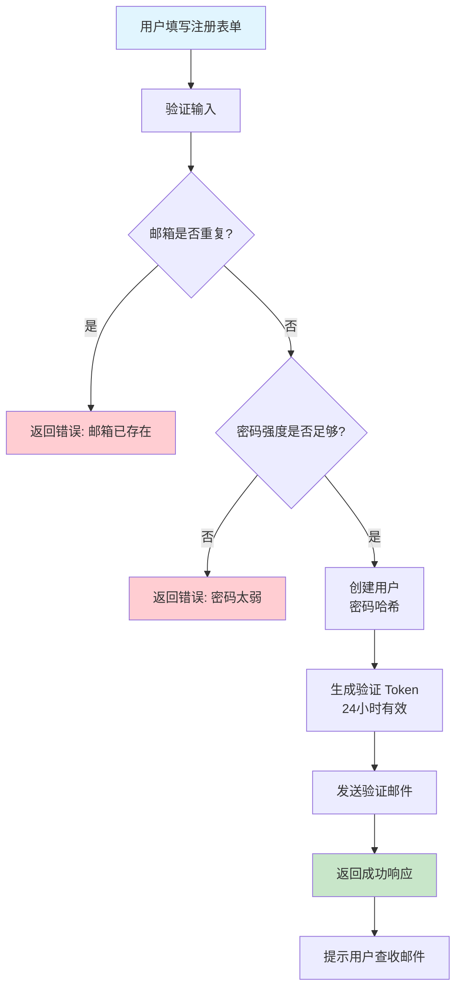
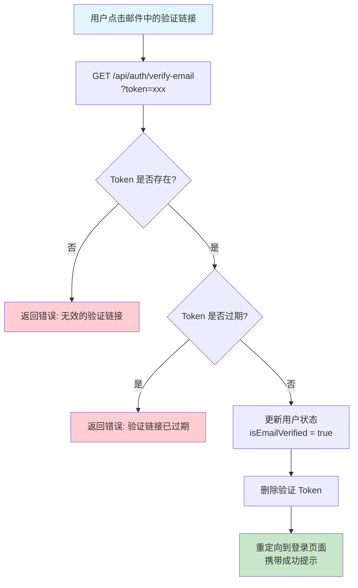
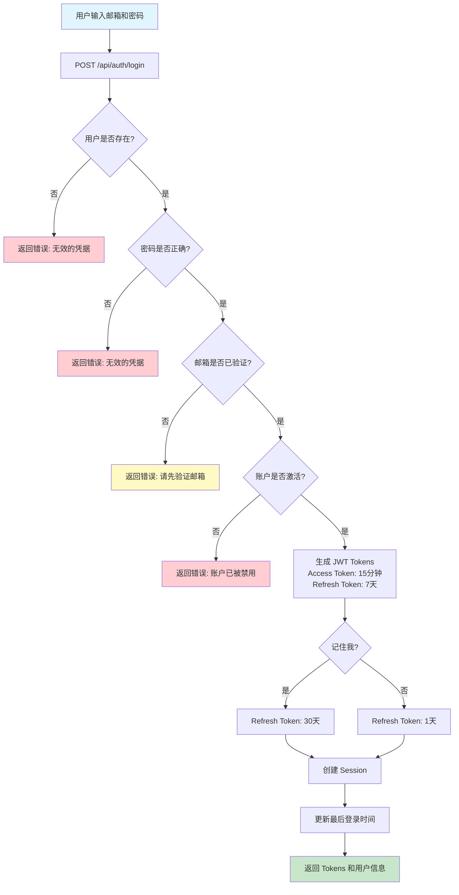
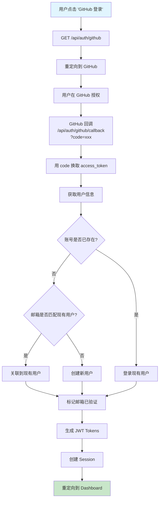
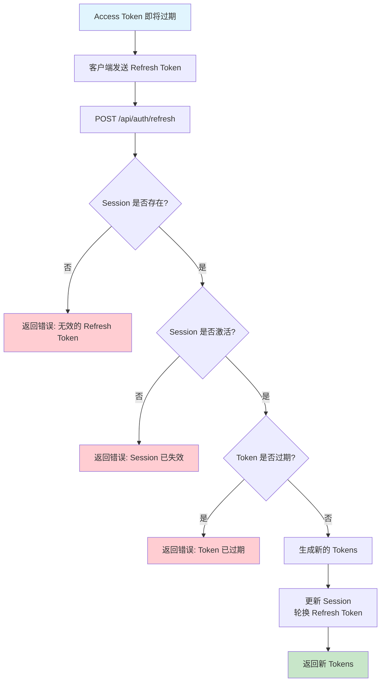
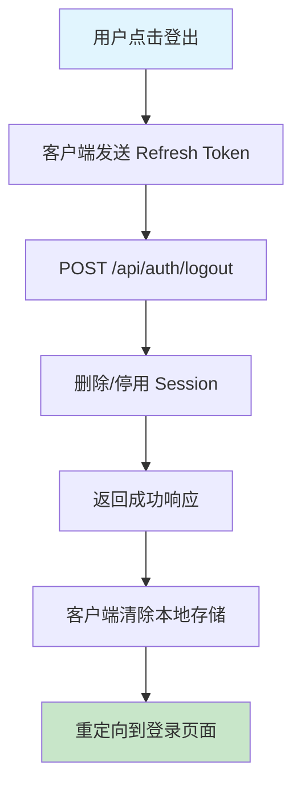
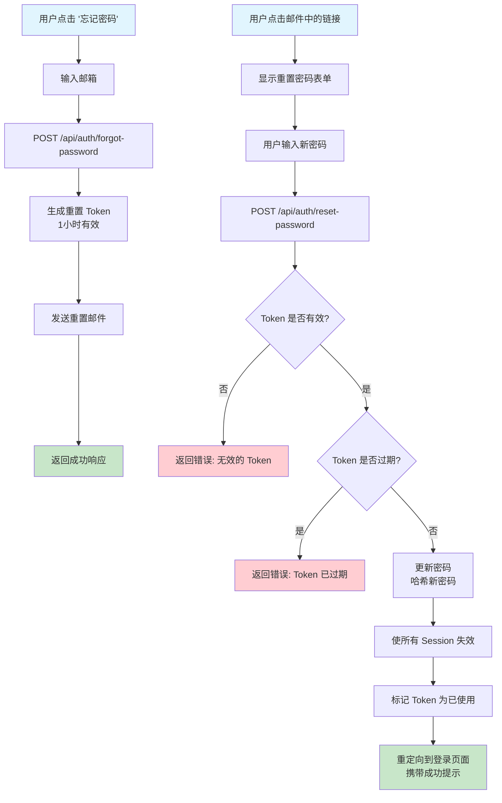
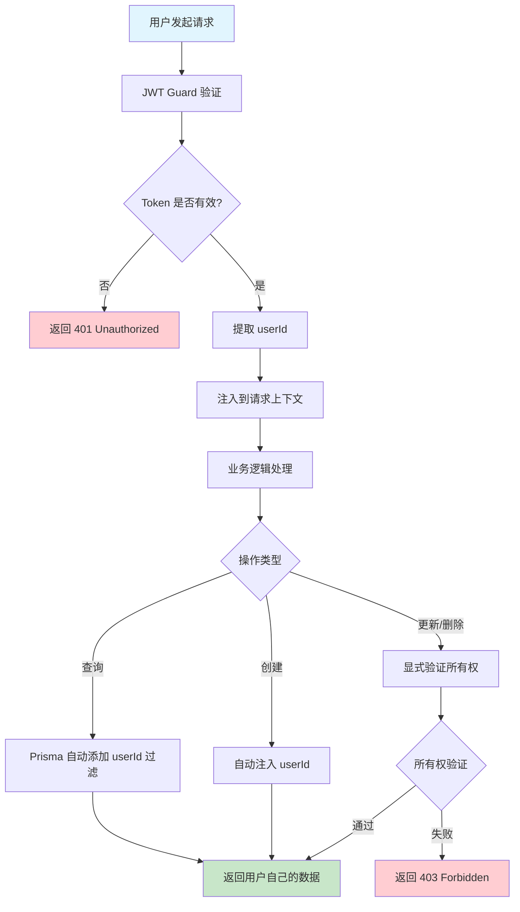

# 用户认证模块规范文档

## 📋 概述

为 My-KM 个人知识管理系统添加完整的用户认证功能，支持多用户系统，每个用户管理自己的知识库，数据相互隔离。

**文档版本**: 1.0.2
**创建日期**: 2026-01-12
**更新日期**: 2026-01-12
**状态**: 🚧 实施中（Phase 2 已完成）

---

## 🎯 核心需求

### 功能范围

- ✅ 用户注册（邮箱 + 密码）
- ✅ 用户登录（邮箱 + 密码 / OAuth）
- ✅ 用户登出
- ✅ 邮箱验证（强制要求，验证后才能登录）
- ✅ 密码重置
- ✅ 个人资料管理
- ✅ OAuth 第三方登录（GitHub、Google）

### 技术决策

| 项目 | 选择 | 说明 |
|------|------|------|
| 用户类型 | 多用户系统 | 每个用户拥有独立的知识库空间 |
| 认证方式 | 邮箱密码 + OAuth | 支持传统登录和 GitHub/Google OAuth |
| 会话管理 | JWT Token | Access Token (15分钟) + Refresh Token (7天) |
| 密码加密 | bcrypt | Salt rounds: 12 |
| 邮箱服务 | Resend | 免费 3000 封/月，开发者友好 |
| 邮箱验证 | 强制 | 必须验证邮箱后才能登录 |
| OAuth 验证 | 自动通过 | GitHub/Google 用户视为已验证邮箱 |
| 用户名 | 可选 | 未填写时使用邮箱前缀作为显示名 |
| 记住我 | 支持 | 延长 Refresh Token 至 30 天 |

---

## 🗄️ 数据库设计

### 核心表结构

#### 1. User 表（用户）

```prisma
model User {
  id                String    @id @default(cuid())
  email             String    @unique
  password          String?   // OAuth 用户可为 null
  username          String?   @unique  // 可选
  avatar            String?
  bio               String?

  // 账户状态
  isEmailVerified   Boolean   @default(false)
  isActive          Boolean   @default(true)

  // 时间戳
  createdAt         DateTime  @default(now())
  updatedAt         DateTime  @updatedAt
  lastLoginAt       DateTime?

  // 关联关系
  accounts          Account[]
  sessions          Session[]
  emailVerifications EmailVerification[]
  passwordResets    PasswordReset[]
  articles          Article[]
  categories        Category[]
  tags              Tag[]
  chatSessions      ChatSession[]

  @@index([email])
  @@index([username])
}
```

#### 2. Account 表（OAuth 账户）

```prisma
model Account {
  id                String   @id @default(cuid())
  userId            String
  provider          String   // 'github' | 'google'
  providerAccountId String
  accessToken       String?  @db.Text
  refreshToken      String?  @db.Text
  expiresAt         DateTime?

  user              User     @relation(fields: [userId], references: [id], onDelete: Cascade)

  @@unique([provider, providerAccountId])
  @@index([userId])
}
```

#### 3. Session 表（会话管理）

```prisma
model Session {
  id           String   @id @default(cuid())
  userId       String
  refreshToken String   @unique
  userAgent    String?
  ipAddress    String?
  expiresAt    DateTime
  isActive     Boolean  @default(true)

  user         User     @relation(fields: [userId], references: [id], onDelete: Cascade)

  @@index([userId])
  @@index([refreshToken])
}
```

#### 4. EmailVerification 表（邮箱验证）

```prisma
model EmailVerification {
  id        String   @id @default(cuid())
  userId    String
  token     String   @unique
  expiresAt DateTime

  user      User     @relation(fields: [userId], references: [id], onDelete: Cascade)

  @@index([token])
}
```

#### 5. PasswordReset 表（密码重置）

```prisma
model PasswordReset {
  id        String   @id @default(cuid())
  userId    String
  token     String   @unique
  expiresAt DateTime
  usedAt    DateTime?

  user      User     @relation(fields: [userId], references: [id], onDelete: Cascade)

  @@index([token])
}
```

### 现有表修改

需要在 Article、Category、Tag、ChatSession 等表中添加 `userId` 字段：

```prisma
model Article {
  // ... 现有字段 ...
  userId    String
  user      User     @relation(fields: [userId], references: [id], onDelete: Cascade)

  @@index([userId])
}
```

类似地修改 Category、Tag、ChatSession 表。

---

## 🔐 认证流程设计

### 1. 注册流程



**API 端点**: `POST /api/auth/register`

**请求体**:
```json
{
  "email": "user@example.com",
  "password": "SecurePass123!",
  "username": "johndoe"
}
```

**密码要求**:
- 最少 8 个字符
- 包含大写字母
- 包含小写字母
- 包含数字

**响应**:
```json
{
  "success": true,
  "message": "注册成功，请查收验证邮件",
  "user": {
    "id": "clx...",
    "email": "user@example.com",
    "username": "johndoe",
    "isEmailVerified": false
  }
}
```

---

### 2. 邮箱验证流程



**API 端点**: `GET /api/auth/verify-email?token=xxx`

**响应**: 重定向到 `/login?verified=true`

---

### 3. 登录流程（邮箱密码）



**API 端点**: `POST /api/auth/login`

**请求体**:
```json
{
  "email": "user@example.com",
  "password": "SecurePass123!",
  "rememberMe": false
}
```

**响应**:
```json
{
  "accessToken": "eyJhbGciOiJIUzI1NiIs...",
  "refreshToken": "eyJhbGciOiJIUzI1NiIs...",
  "expiresIn": 900,
  "user": {
    "id": "clx...",
    "email": "user@example.com",
    "username": "johndoe",
    "avatar": null,
    "isEmailVerified": true
  }
}
```

---

### 4. OAuth 登录流程（GitHub/Google）



**API 端点**:
- `GET /api/auth/github` - 发起 GitHub 登录
- `GET /api/auth/github/callback?code=xxx` - GitHub 回调
- `GET /api/auth/google` - 发起 Google 登录
- `GET /api/auth/google/callback?code=xxx` - Google 回调

---

### 5. Token 刷新流程



**API 端点**: `POST /api/auth/refresh`

**请求体**:
```json
{
  "refreshToken": "eyJhbGciOiJIUzI1NiIs..."
}
```

**响应**:
```json
{
  "accessToken": "新的 access token",
  "refreshToken": "新的 refresh token",
  "expiresIn": 900
}
```

---

### 6. 登出流程



**API 端点**: `POST /api/auth/logout`

**请求体**:
```json
{
  "refreshToken": "eyJhbGciOiJIUzI1NiIs..."
}
```

**响应**:
```json
{
  "success": true,
  "message": "登出成功"
}
```

---

### 7. 密码重置流程



**请求重置**: `POST /api/auth/forgot-password`

```json
{
  "email": "user@example.com"
}
```

**重置密码**: `POST /api/auth/reset-password`

```json
{
  "token": "reset_token_here",
  "newPassword": "NewSecurePass123!"
}
```

---

## 🔒 安全设计

### Token 配置

| Token 类型 | 有效期 | 说明 |
|-----------|--------|------|
| Access Token | 15 分钟 | 短期有效，存储在内存/localStorage |
| Refresh Token | 7 天 / 30 天（记住我） | 长期有效，存储在数据库，可撤销 |

### JWT Payload 结构

**Access Token**:
```json
{
  "sub": "user_id",
  "email": "user@example.com",
  "type": "access",
  "iat": 1234567890,
  "exp": 1234568790,
  "jti": "unique_token_id"
}
```

**Refresh Token**:
```json
{
  "sub": "user_id",
  "type": "refresh",
  "iat": 1234567890,
  "exp": 12345678900,
  "jti": "unique_token_id"
}
```

### 密码安全

- **加密算法**: bcrypt
- **Salt rounds**: 12
- **密码策略**: 8+ 字符，包含大小写、数字、特殊字符

### 防护措施

1. **速率限制**:
   - 登录: 5 次/分钟
   - 注册: 3 次/小时
   - 密码重置: 3 次/小时

2. **账户锁定**: 5 次失败登录后锁定 15 分钟

3. **Token 轮换**: 刷新 Token 时使旧的失效

4. **HTTPS**: 生产环境强制 HTTPS

5. **CORS**: 严格限制允许的源

6. **CSRF**: OAuth state 参数验证

---

## 📡 API 端点总览

### 认证端点

| 方法 | 端点 | 说明 | 是否需要认证 |
|------|------|------|-------------|
| POST | `/api/auth/register` | 注册新用户 | ❌ |
| POST | `/api/auth/login` | 登录 | ❌ |
| POST | `/api/auth/logout` | 登出 | ✅ |
| POST | `/api/auth/refresh` | 刷新 Token | ❌ |
| GET | `/api/auth/verify-email` | 验证邮箱 | ❌ |
| POST | `/api/auth/resend-verification` | 重发验证邮件 | ✅ |
| POST | `/api/auth/forgot-password` | 请求密码重置 | ❌ |
| POST | `/api/auth/reset-password` | 重置密码 | ❌ |
| GET | `/api/auth/github` | 发起 GitHub OAuth | ❌ |
| GET | `/api/auth/github/callback` | GitHub OAuth 回调 | ❌ |
| GET | `/api/auth/google` | 发起 Google OAuth | ❌ |
| GET | `/api/auth/google/callback` | Google OAuth 回调 | ❌ |

### 用户管理端点

| 方法 | 端点 | 说明 | 是否需要认证 |
|------|------|------|-------------|
| GET | `/api/users/me` | 获取当前用户信息 | ✅ |
| PATCH | `/api/users/me` | 更新个人资料 | ✅ |
| PATCH | `/api/users/me/password` | 修改密码 | ✅ |
| POST | `/api/users/me/avatar` | 上传头像 | ✅ |
| DELETE | `/api/users/me` | 删除账户 | ✅ |

---

## 🎨 前端设计

### 页面结构

```
apps/web/src/app/
├── (auth)/                    # 认证相关页面组
│   ├── login/
│   │   └── page.tsx          # 登录页面
│   ├── register/
│   │   └── page.tsx          # 注册页面
│   ├── forgot-password/
│   │   └── page.tsx          # 忘记密码
│   ├── reset-password/
│   │   └── page.tsx          # 重置密码
│   └── verify-email/
│       └── page.tsx          # 邮箱验证状态
├── dashboard/
│   ├── profile/
│   │   └── page.tsx          # 个人资料页面
│   └── ...                   # 其他需要认证的页面
```

### 组件结构

```
apps/web/src/components/
├── auth/
│   ├── LoginForm.tsx         # 登录表单
│   ├── RegisterForm.tsx      # 注册表单
│   ├── ForgotPasswordForm.tsx
│   ├── ResetPasswordForm.tsx
│   ├── OAuthButtons.tsx      # GitHub/Google 登录按钮
│   └── EmailVerificationNotice.tsx
├── profile/
│   ├── ProfileForm.tsx       # 个人资料编辑
│   ├── ChangePasswordForm.tsx
│   └── AvatarUpload.tsx
└── common/
    ├── ProtectedRoute.tsx    # 路由保护
    └── AuthProvider.tsx      # 认证 Context
```

### 状态管理

使用 React Context API：

```typescript
interface AuthContextType {
  user: User | null;
  isLoading: boolean;
  isAuthenticated: boolean;
  login: (email: string, password: string, rememberMe?: boolean) => Promise<void>;
  register: (email: string, password: string, username?: string) => Promise<void>;
  logout: () => Promise<void>;
  refreshUser: () => Promise<void>;
}
```

---

## 📧 邮件服务

### 邮件类型

1. **验证邮件** - 注册后发送
2. **密码重置邮件** - 请求重置后发送
3. **欢迎邮件** - 验证成功后发送（可选）

### 邮件提供商

**Resend** (推荐)
- 免费: 3000 封/月
- 付费: $20/月 (50,000 封)
- 优秀的 TypeScript 支持
- 现代化的 API

### 邮件模板

#### 验证邮件模板

```handlebars
<!DOCTYPE html>
<html>
<head>
  <meta charset="utf-8">
  <style>
    body { font-family: Arial, sans-serif; line-height: 1.6; color: #333; }
    .container { max-width: 600px; margin: 0 auto; padding: 20px; }
    .button { display: inline-block; padding: 12px 24px; background-color: #007bff; color: white; text-decoration: none; border-radius: 4px; }
  </style>
</head>
<body>
  <div class="container">
    <h2>验证您的邮箱地址</h2>
    <p>你好 {{username}}，</p>
    <p>感谢注册 My-KM！请点击下方按钮验证您的邮箱：</p>
    <p><a href="{{verifyUrl}}" class="button">验证邮箱</a></p>
    <p>或复制此链接到浏览器：<br>{{verifyUrl}}</p>
    <p><strong>此链接将在 24 小时后过期。</strong></p>
  </div>
</body>
</html>
```

#### 密码重置邮件模板

```handlebars
<!DOCTYPE html>
<html>
<head>
  <meta charset="utf-8">
  <style>
    body { font-family: Arial, sans-serif; line-height: 1.6; color: #333; }
    .container { max-width: 600px; margin: 0 auto; padding: 20px; }
    .button { display: inline-block; padding: 12px 24px; background-color: #dc3545; color: white; text-decoration: none; border-radius: 4px; }
  </style>
</head>
<body>
  <div class="container">
    <h2>重置您的密码</h2>
    <p>我们收到了重置密码的请求。点击下方按钮创建新密码：</p>
    <p><a href="{{resetUrl}}" class="button">重置密码</a></p>
    <p>或复制此链接到浏览器：<br>{{resetUrl}}</p>
    <p><strong>此链接将在 1 小时后过期。</strong></p>
    <p>如果您没有请求重置密码，请忽略此邮件。</p>
  </div>
</body>
</html>
```

---

## 🔄 数据隔离策略

### 实现方式

1. **应用层检查** - 在所有数据操作前验证所有权
2. **Prisma 中间件** - 自动注入 userId 过滤条件
3. **所有权检查** - 更新/删除前明确验证

### 数据隔离流程



### 示例：文章服务

```typescript
// 创建文章 - 自动注入 userId
async create(data: CreateArticleDto, userId: string) {
  return this.prisma.article.create({
    data: {
      ...data,
      userId,  // 强制关联当前用户
    },
  });
}

// 查询文章 - 只返回当前用户的
async findAll(userId: string) {
  return this.prisma.article.findMany({
    where: { userId },
  });
}

// 更新文章 - 验证所有权
async update(id: string, data: UpdateArticleDto, userId: string) {
  const article = await this.prisma.article.findUnique({ where: { id } });

  if (!article) {
    throw new NotFoundException('文章不存在');
  }

  if (article.userId !== userId) {
    throw new ForbiddenException('无权访问');
  }

  return this.prisma.article.update({
    where: { id },
    data,
  });
}
```

---

## 📦 实施步骤

### Phase 1: 数据库和基础服务 (1-2 天) ✅ 已完成

- [x] 更新 Prisma schema
- [x] 运行数据库迁移
- [x] 安装依赖包
- [x] 创建 Auth 模块结构
- [x] 实现 PasswordService (bcrypt)
- [x] 实现 JwtService

#### 已完成的工作（2026-01-12）

**1. 数据库更新**
- ✅ 更新 User 表（CUID ID，新增字段：username, avatar, bio, isEmailVerified, isActive, lastLoginAt）
- ✅ 创建 Account 表（OAuth 账户关联）
- ✅ 创建 Session 表（Refresh Token 管理）
- ✅ 创建 EmailVerification 表（邮箱验证）
- ✅ 创建 PasswordReset 表（密码重置）
- ✅ 运行数据库迁移（已清空旧数据并重建）

**2. 错误码扩展**
- ✅ 新增 7 个认证相关错误码（AUTH_EMAIL_NOT_VERIFIED, AUTH_WEAK_PASSWORD, AUTH_TOKEN_INVALID, AUTH_TOKEN_EXPIRED, AUTH_ACCOUNT_LOCKED, AUTH_EMAIL_ALREADY_EXISTS, AUTH_SESSION_NOT_FOUND）

**3. 依赖安装**
- ✅ JWT: @nestjs/jwt, @nestjs/passport, passport-jwt
- ✅ 密码加密: bcrypt
- ✅ 邮件服务: @nestjs-modules/mailer, nodemailer, handlebars
- ✅ 开发工具: maildev (本地邮件测试)
- ✅ 类型定义: @types/bcrypt, @types/passport-jwt, @types/uuid, @types/nodemailer

**4. 环境变量配置**
- ✅ JWT_SECRET, JWT_ACCESS_EXPIRATION, JWT_REFRESH_EXPIRATION
- ✅ MAILDEV_HOST, MAILDEV_PORT, MAILDEV_WEB_PORT, MAILDEV_FROM, MAILDEV_FROM_NAME
- ✅ 更新 .env.example 和 .env 文件

**5. 核心服务**
- ✅ [PasswordService](apps/server/src/auth/services/password.service.ts) - bcrypt 密码哈希（salt rounds: 12）
- ✅ [JwtTokenService](apps/server/src/auth/services/jwt-token.service.ts) - JWT Token 生成和验证
- ✅ [TokenService](apps/server/src/auth/services/token.service.ts) - Session 管理和 Token 轮换

**6. 认证基础设施**
- ✅ [JwtStrategy](apps/server/src/auth/strategies/jwt.strategy.ts) - Passport JWT 策略
- ✅ [JwtAuthGuard](apps/server/src/auth/guards/jwt-auth.guard.ts) - JWT 认证守卫
- ✅ [OptionalJwtAuthGuard](apps/server/src/auth/guards/jwt-auth.guard.ts) - 可选认证守卫
- ✅ [@CurrentUser()](apps/server/src/auth/decorators/current-user.decorator.ts) - 当前用户装饰器
- ✅ [@Public()](apps/server/src/auth/decorators/current-user.decorator.ts) - 公开路由装饰器

**7. DTO 验证**
- ✅ [RegisterDto](apps/server/src/auth/dto/register.dto.ts) - 注册 DTO（密码强度验证）
- ✅ [LoginDto](apps/server/src/auth/dto/login.dto.ts) - 登录 DTO（支持记住我）
- ✅ [RefreshTokenDto](apps/server/src/auth/dto/refresh-token.dto.ts) - Token 刷新 DTO
- ✅ [ForgotPasswordDto](apps/server/src/auth/dto/forgot-password.dto.ts) - 忘记密码 DTO
- ✅ [ResetPasswordDto](apps/server/src/auth/dto/reset-password.dto.ts) - 重置密码 DTO

### Phase 2: 核心认证功能 (2-3 天) ✅ 已完成

- [x] 实现注册接口
- [x] 实现登录接口
- [x] 实现 JWT Guard
- [x] 实现登出接口
- [x] 实现 Token 刷新接口

#### 已完成的工作（2026-01-12）

**1. 邮件服务**
- ✅ [EmailModule](apps/server/src/email/email.module.ts) - 邮件模块配置（使用 maildev）
- ✅ [EmailService](apps/server/src/email/email.service.ts) - 邮件发送服务
- ✅ [验证邮件模板](apps/server/src/email/templates/verification-email.hbs) - 精美的 HTML 邮件模板
- ✅ [密码重置邮件模板](apps/server/src/email/templates/reset-password-email.hbs) - 包含安全提示的重置邮件
- ✅ [欢迎邮件模板](apps/server/src/email/templates/welcome-email.hbs) - 用户注册成功后的欢迎邮件

**2. 认证服务**
- ✅ [AuthService](apps/server/src/auth/auth.service.ts) - 完整的认证业务逻辑
  - ✅ `register()` - 用户注册、密码哈希、发送验证邮件
  - ✅ `login()` - 验证凭据、生成 JWT Tokens、创建 Session
  - ✅ `logout()` - 撤销 Session
  - ✅ `refreshTokens()` - Token 轮换机制
  - ✅ `verifyEmail()` - 验证邮箱、发送欢迎邮件
  - ✅ `resendVerificationEmail()` - 重发验证邮件
  - ✅ `forgotPassword()` - 发送密码重置邮件
  - ✅ `resetPassword()` - 验证 Token、更新密码、撤销所有 Session

**3. 认证控制器**
- ✅ [AuthController](apps/server/src/auth/auth.controller.ts) - REST API 端点
  - ✅ `POST /auth/register` - 注册新用户
  - ✅ `POST /auth/login` - 用户登录
  - ✅ `POST /auth/logout` - 用户登出
  - ✅ `POST /auth/refresh` - 刷新 Token
  - ✅ `GET /auth/verify-email` - 验证邮箱
  - ✅ `POST /auth/resend-verification` - 重发验证邮件
  - ✅ `POST /auth/forgot-password` - 请求密码重置
  - ✅ `POST /auth/reset-password` - 重置密码

**4. 模块配置**
- ✅ [AuthModule](apps/server/src/auth/auth.module.ts) - 认证模块配置
- ✅ 集成到 [AppModule](apps/server/src/app.module.ts)

**5. 错误修复**
- ✅ 修复 TypeScript 类型错误（Request headers 类型）
- ✅ 修复错误码引用（使用正确的 ErrorCode 枚举）
- ✅ 构建成功，无编译错误

### Phase 3: 邮件功能 (1-2 天) ✅ 已完成

- [x] 配置 Maildev
- [x] 创建邮件模板
- [x] 实现邮箱验证接口
- [x] 实现密码重置接口

> **注意**: Phase 3 与 Phase 2 同步完成，邮件功能已在核心认证中实现。

### Phase 4: 前端集成 (3-4 天)

- [ ] 创建 AuthContext
- [ ] 实现登录页面
- [ ] 实现注册页面
- [ ] 实现密码重置页面
- [ ] 实现个人资料页面
- [ ] 实现路由保护

### Phase 5: OAuth 集成 (2-3 天)

- [ ] 配置 GitHub OAuth App
- [ ] 配置 Google OAuth Client
- [ ] 实现 GitHub OAuth 流程
- [ ] 实现 Google OAuth 流程
- [ ] 实现账号关联逻辑
- [ ] 集成 OAuth 登入到前端


### Phase 6: 数据隔离 (2-3 天)

- [ ] 为现有表添加 userId
- [ ] 实现数据迁移脚本
- [ ] 创建所有权检查中间件
- [ ] 更新所有服务以强制数据隔离

### Phase 7: 测试和优化 (2-3 天)

- [ ] 编写单元测试
- [ ] 编写集成测试
- [ ] 安全审计
- [ ] 性能优化
- [ ] 更新 API 文档

---

## 📁 关键文件清单

### 后端关键文件

1. **packages/prisma/prisma/schema.prisma**
   - 数据库 schema 定义
   - 所有表结构和关系

2. **apps/server/src/auth/auth.service.ts**
   - 认证业务逻辑
   - 注册、登录、Token 生成

3. **apps/server/src/auth/auth.controller.ts**
   - REST API 端点
   - 请求处理和响应

4. **apps/server/src/auth/guards/jwt-auth.guard.ts**
   - JWT 认证守卫
   - 保护需要认证的路由

5. **apps/server/src/email/email.service.ts**
   - 邮件发送服务
   - 验证邮件和密码重置邮件

### 前端关键文件

1. **apps/web/src/contexts/AuthContext.tsx**
   - 认证状态管理
   - 提供 Auth Context

2. **apps/web/src/components/common/ProtectedRoute.tsx**
   - 路由保护组件
   - 重定向未认证用户

3. **apps/web/src/app/(auth)/login/page.tsx**
   - 登录页面
   - 邮箱登录 + OAuth

4. **apps/web/src/app/(auth)/register/page.tsx**
   - 注册页面
   - 新用户注册表单

---

## 🧪 验证测试计划

### 功能测试

#### 注册流程
- [ ] 正常注册成功
- [ ] 邮箱重复时提示错误
- [ ] 弱密码被拒绝
- [ ] 验证邮件正确发送
- [ ] 验证链接可正常验证

#### 登录流程
- [ ] 正确邮箱密码可登录
- [ ] 错误密码提示错误
- [ ] 未验证邮箱无法登录
- [ ] 被禁用账户无法登录
- [ ] Token 正常生成

#### OAuth 流程
- [ ] GitHub 登录成功
- [ ] Google 登录成功
- [ ] OAuth 用户自动验证邮箱
- [ ] 账号正确关联

#### 密码重置
- [ ] 重置邮件正确发送
- [ ] Token 验证正常
- [ ] 新密码可正常使用
- [ ] 旧 Token 失效

### 安全测试
- [ ] SQL 注入防护
- [ ] XSS 防护
- [ ] 速率限制生效
- [ ] Token 过期机制
- [ ] 密码加密存储

### 数据隔离测试
- [ ] 用户只能看到自己的文章
- [ ] 用户无法修改他人数据
- [ ] 用户删除不影响其他用户
- [ ] OAuth 用户数据正确关联

---

## 📝 注意事项

### 与现有需求的调整

根据 [roadmap.md](./roadmap.md)，原计划 v3.0 才支持多用户。现在提前到 v0.1 实现，需要：

1. 更新 roadmap，将用户认证移到 v0.1
2. 更新 [requirements.md](./requirements.md)，移除"暂不考虑多用户支持"的说明
3. 所有后续功能都需要考虑用户隔离

### OAuth 配置

需要提前申请：
- [GitHub OAuth App](https://github.com/settings/developers)
- [Google OAuth Client](https://console.cloud.google.com/)

### 邮件配置

需要注册 Resend 账号并配置 API 密钥。

### 数据迁移

如果已有数据，需要编写迁移脚本为现有数据分配 userId。

---

## 🔗 参考资源

- [NestJS Authentication](https://docs.nestjs.com/security/authentication)
- [Passport.js](http://www.passportjs.org/)
- [JWT.io](https://jwt.io/)
- [Resend Documentation](https://resend.com/docs)
- [Prisma Middleware](https://www.prisma.io/docs/concepts/components/prisma-middleware)
- [Mermaid Flowchart Syntax](https://mermaid.js.org/syntax/flowchart.html)

---

## 📊 附录：错误码定义

| 错误码 | HTTP 状态 | 说明 |
|--------|----------|------|
| AUTH_INVALID_CREDENTIALS | 401 | 邮箱或密码错误 |
| AUTH_USER_NOT_FOUND | 404 | 用户不存在 |
| AUTH_EMAIL_ALREADY_EXISTS | 409 | 邮箱已被注册 |
| AUTH_EMAIL_NOT_VERIFIED | 403 | 邮箱未验证 |
| AUTH_TOKEN_INVALID | 401 | Token 无效 |
| AUTH_TOKEN_EXPIRED | 401 | Token 已过期 |
| AUTH_WEAK_PASSWORD | 400 | 密码强度不足 |
| AUTH_ACCOUNT_LOCKED | 403 | 账户已被锁定 |
| AUTH_ACCOUNT_DISABLED | 403 | 账户已被禁用 |

---

**文档版本**: 1.0.0
**最后更新**: 2026-01-12
**维护者**: My-KM 开发团队
